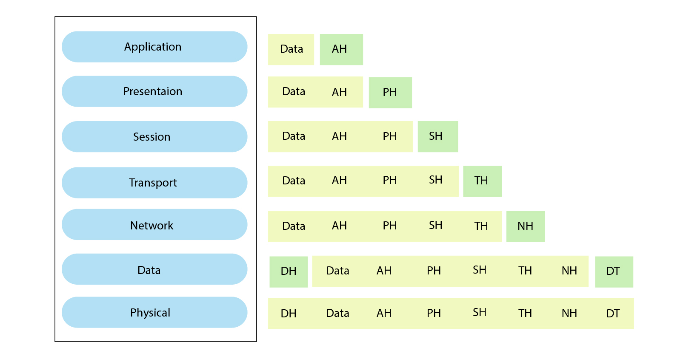
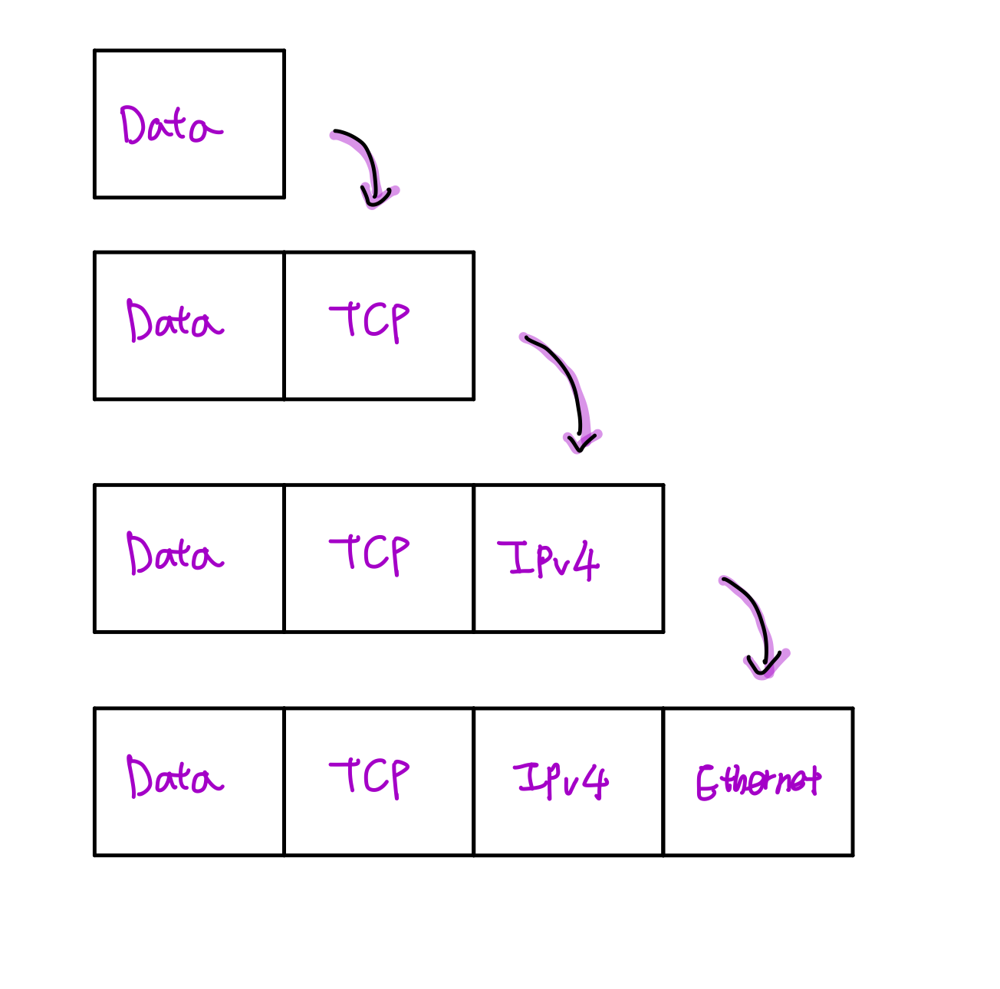
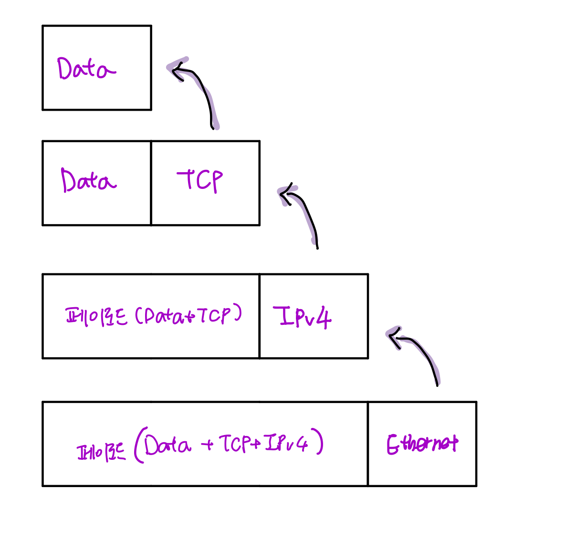

# 네트워크 계층

## ❗ OSI 7계층 

> OSI 7계층은 국제표준화기구인 ISO에서 표준으로 지정한 모델로, 컴퓨터 네트워크 프로토콜 디자인과 통신을 계층으로 나누어 설명한 것이다.

## ❗ 패킷

- 네트워크 상에서 전달되는 데이터의 형식화된 블록

- 여러 프로토콜로 캡슐화 되어있음

### 🎁 데이터 전송(캡슐화)

- 특정 프로토콜이 필요할 경우 현재 패킷에 새로운 프로토콜을 붙여주어서 캡슐화를 진행한 후 패킷을 전송한다.

- 붙는 프로토콜은 **OSI7계층 순서**를 따른다. (하위계층이 먼저 붙는 경우는 없음!)

### 🌂데이터 수신(디캡슐화)

- 패킷을 받았을 때 프로토콜들을 하나씩 확인하면서 데이터를 확인하는 과정

