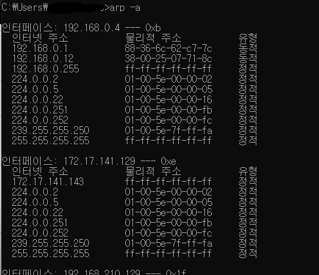

# ARP 프로토콜

같은 네트워크 대역에서 통신할 때 필요한 것은 MAC주소

ip주소를 입력했을 때 상대방의 MAC주소를 알아보게 되는데, 이 때 ARP 프로토콜을 이용하여 MAC주소를 알아온다.

## ARP 통신 과정(ARP 프로토콜로 상대방 MAC 주소 알아오기)

같은 네트워크(LAN) 대역 안에 A컴퓨터와 C컴퓨터가 있다고 하자.

A는 C의 IP주소만 알고 MAC 주소는 모르는 상태이다.

A는 ARP프로토콜에 본인 MAC주소 + 본인 IP주소 + C컴퓨터 MAC주소(모르니까 다 0처리) + C IP주소를 포함한다.

-> 이더넷 프로토콜로 인캡슐레이션한다.

-> 목적지를 FFFFFFF..로 설정하여서 같은 네트워크 대역에 있는 모든 장치들한테 보낸다(브로드캐스트)

->  모든 장치들은 받은 프로토콜을 열어본 뒤, 3계층까지 디캡슐화 한다.

-> 본인의 IP주소랑 목적지 IP주소가 일치하지 않는 경우 패킷을 버린다.

-> 일치하는 경우 출발지 MAC 주소에 본인 MAC 주소를 입력하여 보낸다

-> C MAC주소 + C IP 주소 + A MAC 주소 + A IP 주소

-> 이더넷 프로토콜로 인캡슐레이션 한 뒤 목적지 장치로 보낸다.

-> A 컴퓨터는 C가 목적지였음을 알고 `ARP 캐시 테이블`에 C컴퓨터의 IP주소와 MAC주소를 저장해놓는다.

-> **이러한 과정이 실행된 후에 통신을 시작할 수 있다.**

## ARP 캐시 테이블

- 통신했던 컴퓨터들의 주소가 ARP 테이블에 남는다.

- 일정 시간이 지나면 사라진다.