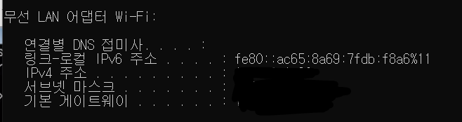
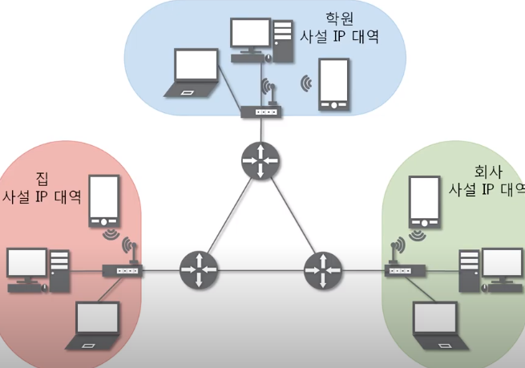

# 컴퓨터끼리는 어떻게 통신할까

## 네트워크 계층(Network Layer)

여러개의 노드를 거칠 때마다 경로를 찾아주는 역할을 하는 계층

#### 네트워크 계층 종류

- IP
- ICMP
- ARP
- RARP

## 3계층의 기능

멀리 떨어진 곳에 존재하는 네트워크까지 어떻게 데이터를 전달할지 제어하는 일을 담당한다.

- IPv4 주소: 현재 PC에 할당된 IP주소
- 서브넷 마스크
  - IP 주소에 대한 네트워크의 대역을 규정(네트워크 대역을 어디서부터 규정할건지?)
  - 어디까지가 네트워크 대역을 구분하는데 사용하고 어디서부터 호스트를 구분하는데 사용하는지 지정
  - 2진수로 표기했을 때 1로 시작, 1과 1사이에는 0이 올 수 없다는 규칙을 가지고 있음
    - ex) 11111111.11111111.11111111.11|000000
- 게이트웨이 주소: 외부와 통신할 때 사용하는 네트워크의 출입구

## 일반적인 IP 주소

#### ClassFulless IP 주소

-> 문제점: 20대의 pc를 이용하기에 적합한 서브넷 마스크를 구할 때, 16보단 커야하므로 32(00000)으로 설정이 될텐데, 그러면 10대이상의 낭비가 발생한다.

-> 사설 IP, 공인 IP

-> 사설 IP를 사용하고 있는 장비들은 네트워크와 통신할 때 무조건 공인IP로 바꿔서 통신한다.(NAT)

-> 실제 인터넷 세상에서는 공인IP로만 통신하기 때문에 외부 네트워크 대역에서는 사설IP 대역이 보이지 않는다.

-> 사설IP 패킷이 보내질 때 NAT 테이블에 IP가 기록된다.

-> 즉 패킷을 보내지 않았다면 바깥에서 해당 서버를 찾는 요청이 들어와도 공유기는 그 요청을 무시하게 된다.

-> 때문에 보통 서버들은 사설IP를 잘 사용하지 않는다.

## 특수한 IP주소

#### 0.0.0.0/0

존재하는 IP들을 제외한 나머지(?) 모든 IP

#### 127.0.0.1

자기 자신을 뜻하는 주소

#### 게이트웨이

나가는 곳의 IP(외부 네트워크와 연결되는 IP)