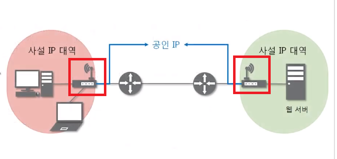
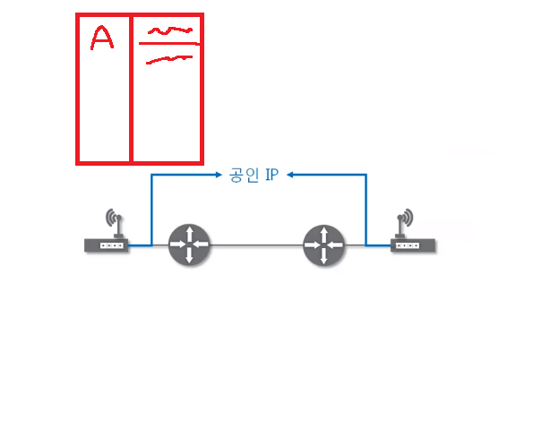

# 🐥11 NAT와 포트포워딩

## NAT(Network Address Translation)란?

- IP 패킷에 있는 출발지 및 목적지의 IP 주소와 TCP/UDP 포트 숫자 등을 바꿔 재기록하면서 네트워크 트래픽을 주고 받게 하는 기술

  -> 특정 ip주소에 특정 포트번호로 가는 패킷을 다른 ip주소에 다른 포트번호로 바꿔주는 것

- 패킷에 변화가 생기기 때문에, IP나 TCP/UDP의 체크섬도 다시 계산되어 재기록해야 한다.

- 주로 사설 네트워크에 속한 여러 개의 호스트가 하나의 공인 IP 주소를 사용하여 인터넷에 접속하기 위해 사용한다.

- 하지만, 꼭 사설IP를 공인 IP로 변환하는 데에만 사용하는 기술은 아니다.

### 🐤 NAT를 사용하는 이유?

- IP 주소 절약과 보안
  - 하나의 공인 IP 주소를 사용하여 여러 대의 호스트가 인터넷의 접속할 수 있다. 왜냐하면 인터넷 공유기에 NAT 기능이 탑재되어 있기 때문이다. 따라서 부족한 공인 IP를 절약할 수 있다.
  - NAT 동작의 특성상 IP를 숨길 수 있는 기능이 있다. 예를 들어서, 라우터(공유기) 외부로 트래픽이 나갈 때는 사설 IP가 공인 IP주소로 바뀌므로 공격자가 라우터 안 쪽에 있는 사설 IP를 모르기 때문에 최종 목적지로의 공격이 어려워져서 내부 네트워크 및 호스트들을 보호할 수 있다.

### 🐤 NAT 동작 원리

만약 외부에 있는 웹 서버로 접근하고자 할 때 해당 요청 패킷은 반드시 해당 게이트웨이(공유기)를 거치게 된다. 이 때, 게이트웨이(공유기)에 어떤 네트워크가 어디로 가는지에 대한 기록이 저장된다.

1. 패킷 헤더에 출발지와 목적지의 주소를 기록한다.(출발지는 자신의 사설망 IP주소를 기록한다.)

   > 출발지 IP 주소: 10.0.0.1
   >
   > 목적지 IP 주소: 300.0.0.1

   

2. 기본 게이트웨이(공유기) 에서는 외부로 나가는 패킷을 인식하게 되면, 출발지의 IP주소를 게이트웨이 자신의 공인 IP 주소로 변경한다. 이 때, 별도의 NAT 테이블을 보관한다.

   > 출발지 IP 주소: 10.0.0.1 -> 200.0.0.1 (재기록)
   >
   > 목적지 IP 주소: 300.0.0.1

   | 프로토콜 | 사설IP   | 출발지 IP | 목적지 IP |
   | -------- | -------- | --------- | --------- |
   | TCP      | 10.0.0.1 | 200.0.0.1 | 300.0.0.1 |

   

3. 웹 서버에서 수신한 데이터 처리 후, 응답패킷을 보내는데 다음과 같이 보내진다.

   > 출발지 IP 주소: 300.0.0.1
   >
   > 목적지 IP 주소: 200.0.0.1

   

4. 호스트의 게이트웨이에서 웹 서버가 보낸 패킷을 받으면, NAT 테이블을 참고해서 호스트의 사설 IP로 패킷을 전달한다.

   > 출발지 IP 주소: 300.0.0.1
   >
   > 목적지 IP 주소: 10.0.0.1 

   

