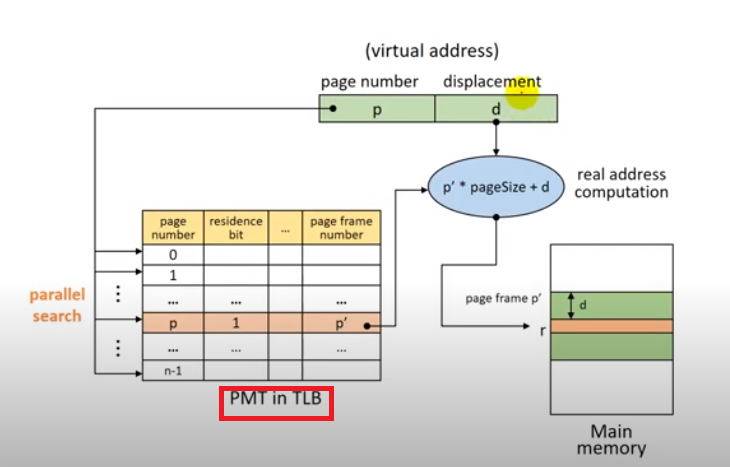

## Paging System

page => 같은 크기로 분할된 프로그램 블록

page frame => page와 같은 크기로 분할된 메모리 상의 영역

- 특징
  - 논리적 분할이 아닌 크기에 따른 분할이다.
  - external fragmentation이 발생하지 않는다. (메모리공간 충분한데 올라가지 못하는 경우 발생 x)
  - internal fragmentation은 발생할 수 있다.

#### Address Mapping (block mapping 과 비슷)

- Virtual address: v = (p,d)

  - p: page number
  - d: offser

- Address mapping

  - PMT(Page Map Table)

    | page number | residence bit                    | secondary storage address     | other fields | page frame number                            |
    | ----------- | -------------------------------- | ----------------------------- | ------------ | -------------------------------------------- |
    | 페이지 번호 | 메모리에 올라갔는지 여부(0 or 1) | swap device 어디에 위치했는지 |              | 메모리에 올라가있을 경우 어디에 위치해있는지 |

    

- Address mapping mechanism

  - Direct mapping(직접 사상)

    

    page가 메모리 안에 있는지 확인한 후, PMT를 통해 page fram number를 구해서 offset과 page 크기를 이용해 메모리 안의 실제 주소를 찾는다.

    - 문제점: 메모리 접근(PMT, main memory) 횟수가 2배가 되어 성능이 저하된다.

    

  - Associative mapping(연관 사상)

    TLB(Translation Look-aside Buffer)에 PMT를 적재한다. (HW)

    

    - 문제점: Expensive HW => 큰 PMT를 다루기가 어렵다.

    

  - Hybrid direct / associative mapping (**Direct mapping + Associative mapping**)

    - PMT는 메모리(커널 공간)에 저장한다.
    - TLB는 PMT 중 일부 entry를 적재한다. (how?)

    - Locality(지역성) 활용한다. => 한번 접근한 영역 or 인접영역은 다시 접근할 가능성이 높다. => 최근에 사용된 page들을 저장한다.
    - TLB에 해당 page에 대한 entry가 있는 경우 ok
    - TLB에 해당 page에 대한 entry가 없는 경우 main memory에 있는 PMT에 가서 직접 real address를 찾는다.

### Memory Management(메모리 관리)

- page와 같은 크기로 미리 분할하여서 관리/사용한다. (page frame)

- Frame table 로 각각 page frame을 관리한다.

  | Allocated/available field                        | PID field                          | Link field | AV                                  |
  | ------------------------------------------------ | ---------------------------------- | ---------- | ----------------------------------- |
  | 그 페이지 프레임이 할당됐는지? 사용할 수 있는지? | 실제로 어떤 페이지가 올라와있는지? |            | 비어있는 frame들에 대한 linked list |

  

### Page Sharing

- 여러 프로세스가 특정 page를 공유할 수 있다.

- 공유 가능 page

  - Procedure pages

    

    PMT의 page entry 번호가 달라서 main memory에서 찾는 실제 address 가 다른 경우가 발생한다.

    이것을 해결하기 위해서 프로세스들이 shared page에 대한 정보를 PMT의 같은 entry에 저장하도록 한다.

    

  - Data page

    

    

