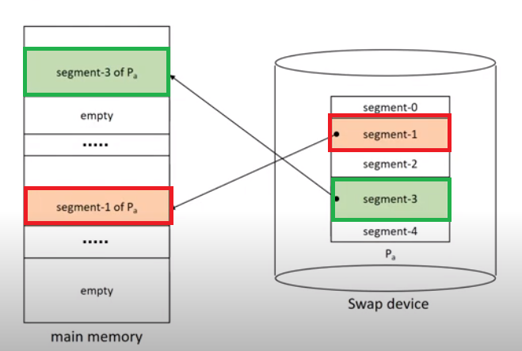

# Segmentation System

- 프로그램을 논리적 block으로 분할한다.(segment)
  - Block의 크기가 서로 다를 수 있다 => 메모리를 미리 분할하지 않는다.
- segment 공유/보호하는데 용이하다.
- 내부 단편화가 발생하지 않지만 외부 단편화가 발생할 수 있다.

swap device에 서로 다른 크기의 segment로 들어가 있는 것을 볼 수 있다.

- Address mapping

  - Virtual address: v = (s,d)

    - s: segment number
    - d: offset

  - Segment Map Table(SMT)

    | segment number | residence bit            | secondary storage address           | segment length | protection bits             | other fields | segment address in memory             |
    | -------------- | ------------------------ | ----------------------------------- | -------------- | --------------------------- | ------------ | ------------------------------------- |
    | 세그먼트 번호  | 메모리에 있는지?(0 or 1) | swap device 어디에 저장되어 있는지? | 세그먼트 길이  | 세그먼트에 대한 access 권한 |              | 메모리에 있다면, 어디에 올라가있는지? |

    

  - direct mapping

    

    1. 프로세스의 SMT가 저장되어 있는 주소 b에 접근한다.
    2. SMT에서 segment s의 entry를 찾는다.(b + s * entrysize)
    3. 찾아진 entry의 존재비트가 0인 경우(missing segment fault) => swap device로부터 해당 segment 를 메모리로 적재한 후, SMT를 갱신한다.
    4. 변위(d)가 segment 길이보다 큰 경우 => segment overflow exception 처리 모듈을 호출한다.
    5. 허가되지 않은 연산일 경우 segment protection exception 처리 모듈을 호출한다.
    6. 실제 주소 r (a + d)로 메모리에 접근한다.

- Memory management
  - VPM과 유사하다. (segment 적재 시, 크기에 맞추어 분할 후 적재한다)
- segment sharing/protection
  - 논리적으로 분할되어 있어서 공유 및 보호가 용이하다.

