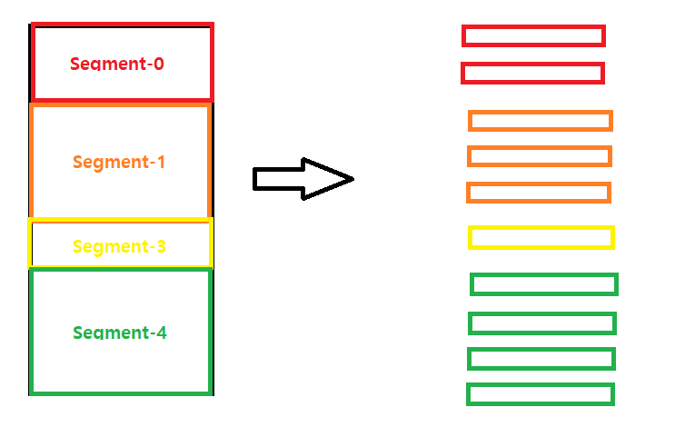

#  09 Hybrid Paging / Segmentation system

고정 크기 분할(Paging system)과 논리적 분할(Segmentation system)을 결합한 system이다.

- 장점
  - Page 공유/protection이 쉽다.
  - 메모리 할당/관리 overhead가 작다. (**overhead: 어떤 처리를 하기 위해 들어가는 간접적인 처리 시간/메모리 등을 말한다.)
  - external fragmentation이 발생하지 않는다.
- 단점
  - 전체 테이블 수가 증가하면서 메모리 수가 증가한다.
  - Direct mapping의 경우, 메모리 접근이 3배가 된다. => 성능 저하 가능성이 있다.

### 프로그램 분할

- 논리 단위의 segment로 분할한다.
- 각 segment를 고정된 크기의 page들로 분할한다. => page단위로 메모리에 적재한다.

### Address mapping

- Virtual address : v = (s, p, d)

  - s: segment number
  - p: page number
  - d: offser

- SMT && PMT 모두 사용

  - 각 프로세스마다 하나의 SMT (residence bit -> **PMT address**)

    | segment number | secondary storage address           | segment length | protection bits             | other fields | PMT address                       |
    | -------------- | ----------------------------------- | -------------- | --------------------------- | ------------ | --------------------------------- |
    | 세그먼트번호   | swap device 어디에 저장되어 있는지? | 세그먼트 길이  | 세그먼트에 대한 access 권한 |              | 각 segment의 PMT가 어디에 있는지? |

    

  - 각 segment 마다 하나의 PMT

    | page number | residence bit                    | secondary storage address           | other fields | page frame number                                |
    | ----------- | -------------------------------- | ----------------------------------- | ------------ | ------------------------------------------------ |
    | 페이지 번호 | 메모리에 올라갔는지 여부(0 or 1) | swap device 어디에 저장되어 있는지? |              | 메모리에 올라가 있을 경우,  어디에 위치해있는지? |

    

#### Direct address mapping

출처: https://www.youtube.com/watch?v=ctfTntZ-RBo&list=PLBrGAFAIyf5rby7QylRc6JxU5lzQ9c4tN&index=31

