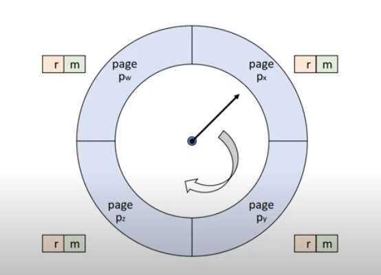

# Replacement Strategies (교체기법)

새로운 page를 어떤 page와 교체할 것인가? (빈 page frame이 없는 경우)

#### Fixed allocation을 위한 교체 기법

- Min Algorithm

  - page fault를 최소화하는 알고리즘

  - 앞으로 가장 오랫동안 참조되지 않을 page를 교체한다.

  - page reference string을 미리 알고 있어야 한다 => 실현 불가능한 기법

    - why 배워야하는가?

      교체 기법의 성능 평가 도구로 사용된다.

      어떠한 알고리즘이 나왔을 때 이 알고리즘이 과연 최적인가?를 비교할 수 있는 평가도구가 된다.

- Random Algorithm
  - 무작위로 교체할 page 선택하는 알고리즘
  - Low overhead
  - No policy
  - 교체 기법의 성능 평가 도구로 사용된다. => 어떤 알고리즘을 만들었을 때 해당 알고리즘보다 성능이 좋은지 판단

- FIFO Algorithm

  - First In First Out

  - 가장 오래된 page를 교체하는 알고리즘

  - page가 적재된 시간을 알고있어야함.

  - 자주 사용되는 page가 교체될 가능성이 높다 => Locality에 대한 고려가 없다.

  - FIFO anomaly

    더 많은 page frame을 할당받음에도 불구하고 page fault 수가 증가하는 경우(자원은 늘렸지만 성능이 줄어드는 현상)

    

- LRU Algorithm (Least Recently Used)

  - 가장 오랫동안 참조되지 않은 page를 교체하는 알고리즘

  - Locality에 기반을 둔 교체 기법이다.

  - MIN algorithm에 근접한 성능을 보여준다.

  - page 참조 시마다 시간을 기록해야한다. => **overhead**

    - 간소화된 정보 수집으로 해소 가능하다.(ex) 정확한 시간 대신 순서만 기록

  - Loop 실행에 필요한 크기보다 작은 수의 page frame이 할당된 경우, page fault 수가 급격히 증가한다. (ref string 길이가 4이고 1,2,3,4 반복되는데 page frame이 3개인 경우 계속되는 page fault) => Allocation 기법에서 해결해야한다.

    

- LFU Algorithm (Least Frequently Used)
  - 가장 참조 횟수가 적은 page 교체 => page 참조시마다 참조 횟수를 누적시켜야 한다.
  - Locality를 활용한다. -> LRU 대비 적은 overhead를 가진다.
  - 최근 적재된 참조될 가능성이 높은 page가 교체될 가능성이 있고, 여전히 참조 횟수를 누적해야 한다(overhead)는 단점이 있다.

- NUT Algorithm(Not Used Recently)
  - LRU approximation scheme: LRU보다 적은 overhead로 비슷한 성능을 달성하는 것이 목적이다.
  - Bit vector를 사용한다
    - Reference bit vector(r): 참조가 되었던 page인지?
    - Update bit vector(m): 업데이트가 발생한 page인지? => 업데이트가 발생했다면 write-back 필요
  - 교체 우선순위 (r,m)
    - (0,0)
    - (0,1) 
    - (1,0)
    - (1,1)

- Clock Algorithm
  - 
  - IBM VM/370 OS
  - Reference bit 사용 -> 주기적인 초기화가 아닌 Pointer를 돌리면서 교체 page를 결정 및 초기화한다.
    - 현재 가리키고 있는 page의 reference bit(r)를 확인한다.
    - r == 0인 경우, 교체 page로 결정한다.
    - r == 1인경우, reference bit 초기화 후 pointer를 이동한다.
  - 먼저 적재된 page가 교체될 가능성이 높다.(FIFO와 유사)
  - Reference bit를 사용하여서 교체 페이지를 결정한다. (LRU or NUR 과 유사 => locality 반영)

- Second Chance Algorithm
  - 
  - Clock algorithm과 유사하지만, Update bit도 함께 고려된다.

  - 현재 가리키고 있는 page의 (r,m)을 확인한다.

    - (0,0) => 교체 page로 결정

    - (0,1) => (0,0)로 변경, write-back list에 추가후 이동한다.
    - (1,0) => (0,0)로 변경 후 이동
    - (1,1) => (0,1)로 변경 후 이동