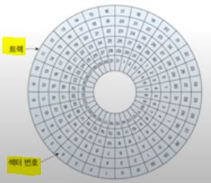

# [14] 파일 시스템

데이터는 어디에 저장되는가? => 바로 `Disk`에 저장된다.

오늘은 데이터가 저장되는 DISK에 대해 알아보자 🤗

### [14.1] Disk pack (원판모양의 디스크들의 집합)

- 데이터 영구 저장 장치이다. => 비휘발성

- 구성

  - Sector: 데이터 저장/판독의 물리적 단위이다.
  - Track: Platter 한 면의 중심에서 같은 거리에 있는 sector들의 집합
  - Cylinder: 같은 반지름을 갖는 track의 집합
  - Platter: 양면에 자성 물질을 입힌 원형 금속판이다. 데이터의 기록/판독이 가능하다.
  - Surface: Platter의 윗 면과 아랫면

  

  

### [14.2] Disk drive

- Disk pack에 데이터를 기록하거나 판독할 수 있도록 구성된 장치이다.

- 구성

  - Head: 디스크 표면에 데이터를 기록/판독한다.
  - Arm: Head를 고정/지탱해준다.
  - Positioner (boom): Arm을 지탱하고 Head를 원하는 track으로 이동한다.
  - Spindle: Disk pack을 고정한다.(회전축) => 분당회전수: RPM

  

### [14.3] Disk Address

그렇다면, 데이터를 어떻게 넣거나 찾을 수 있을까? 

그러기위해서는 "주소"가 필요하다.

#### [14.3.1] Physical disk address

- Sector(물리적 데이터 전송 단위)를 지정한다.

  | Cylinder 번호           | Surface 번호           | Sector 번호      |
  | ----------------------- | ---------------------- | ---------------- |
  | 어떤 Cylinder에 있는지? | 어떤 surface에 있는지? | 어떤 Sector인지? |

  순서는 상관없지만, 이 3가지의 값이 있어야 한다.

#### [14.3.2] Logical disk address: relative address

os가 disk 각각의 특징을 다 알 수 없기 때문에 disk에 Logical하게 접근한다.

- Disk system의 데이터 전체를 block들의 나열로 취급한다.

  - block에 번호를 부여하여서 임의의 block에 접근 가능하다.

- Block 번호 => physical address 모듈이 필요하다.

  그렇다면, block 번호를 physical address로 바꿔주는 것은 누가 하는 것일까?

  => **Disk driver**

### [14.4] Data Accerss in Disk System

- Seek time: 디스크 head를 필요한 cylinder로 이동하는 시간
- Rotational delay: cylinder로 이동한 후, 필요한 sector가 head 위치로 도착하는 시간.

- Data transmission time: 해당 sector를 읽어서 전송 or 기록하는 시간