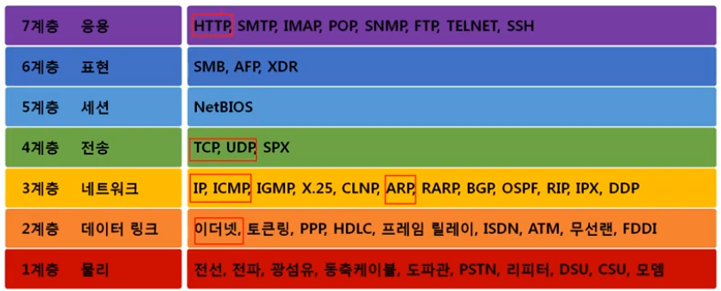

INDEX

[toc]

## 네트워크 모델

### 네트워크 모델의 종류

#### 1. TCP/IP 모델

- 1960부터 등장
- 서로 정보를 주고받는데 쓰이는 통신 규약(프로토콜) 모음

#### 2. OSI 7계층 모델📌

- 1984년 네트워크 통신을 체계적으로 다루는 ISO에서 표준으로 지정한 모델
- 데이터를 주고받을 때 데이터 자체의 흐름을 각 구간별로 나눠 놓은 것

### 두 모델 비교

#### 1. 공통점

- 네트워크를 ==**계층적**==으로 나움(계층적 네트워크 모델)
- 계층간 역할 정의

#### 2. 차이점

- 계층의 수 차이
- OSI는 ==**역할 기반**==, TCP/IP는 ==**프로토콜**== 기반(OSI는 개념적, TCP/IP는 실무적인 느낌)
  - TCP/IP의 `네트워크 인터페이스`가 OSI에서는 `물리`와 `데이터 링크`로 나눠진 것처럼, 나누지 않을 것까지 나눠논 느낌
  - 사실상 http는 `세션`, `표현`, `응용`에 다 포함되는데 OSI에서는 `응용`으로 분류
- OSI는 통신 전반에 대한 표준
- TCP/IP는 데이터 전송기술 특화

### 네트워크를 통해 전달되는 데이터, 패킷

#### 1. 패킷

- 네트워크 상에서 전달되는 데이터를 통칭
- 네트워크에서 전달하는 데이터의 형식화된 블록
- 패킷은 ==**제어 정보**==와  ==**사용자 데이터(페이로드)**==로 이루어짐

- 여러가지 프로토콜의 조합(패킷, 즉 프로토콜에 순서가 존재) cf. 여러 번 쌓인 택배를 생각하자

##### 패킷의 형태

- 페이로드: 실질적으로 내가 보내고자 하는 데이터
- 헤더
- 풋터: 일반적으로 잘 사용 안함

#### 2. 패킷을 이용한 통신과정

##### 인캡슐레이션(여러 프로토콜들로 ==**캡슐화**== 된 패킷)

- 여러 프로토콜을 이용해서 최종적으로 보낼 때 패킷을 만드는 과정
- 
  1. HTTP라는 payload에 TCP라는 헤더를 붙여 하나의 패킷으로 만듬
  2. 1번에서 만든 패킷을 payload로 해서 IPv4라는 헤더를 붙여 하나의 패킷으로 만듬
  3. 2번에서 만든 패킷을 payload로 해서 Ethernet이라는 헤더를 붙여 하나의 패킷으로 만듬

- 
  - 상위 계층에서 하위 계층으로 내려가며 프로토콜을 붙임(하위 프로토콜 앞에서 상위 프로토콜이 올 수 없음)

##### 디캡슐레이션

- 패킷을 받았을 때 프로토콜을 하나씩 확인하면서 데이터를 확인하는 과정

- 

  

  - 하위 프로토콜부터 하나씩 확인
  - 

  

#### 3. 계층별 패킷의 이름 PDU

- 각각의 계층에서 패킷을 부르는 용어가 다름
- 계층별로 이름이 다른 PDU(Protocol Data Unit)
  - cf. 위의 패킷과는 다른 의미

