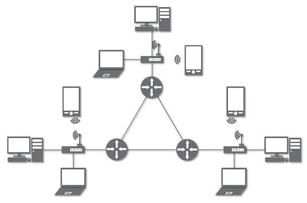

# INDEX

[toc]

## 네트워크란 무엇인가?🤔

### 네트워크

- 노드들이 데이터를 공유할 수 있게 하는 ==**디지털 전기통신망**==의 하나
  - cf. 노드: 네트워크에 속한 컴퓨터 또는 통신 장비를 뜻하는 말
- 분산되어 있는 컴퓨터를 통신망으로 연결한 것
- 네트워크에서 여러 장치들은 노드 간 연결을 사용하여 서로에게 데이터를 교환

### 인터넷

- 문서, 그림, 영상과 같은 여러가지 데이터를 공유하도록 구성된 세상에서 가장 큰 전세계를 연결하는 ==**네트워크**==
- 네트워크 안에 인터넷이 포함되는 것
- www ≠ 인터넷 => www는 인터넷을 통해 웹과 관련된 데이터를 공유하는 것

## 네트워크의 분류

### 크기에 따른 분류

#### LAN(Local Area Network)👪

- 가까운 지역끼리 묶어놓은 통신망
- 근거리 통신망(ex. 동일한 pc방)

#### WAN(Wide Area Network)🏃‍♀️

- 멀리 있는 지역을 한데 묶은 네트워크
- 가까운 지역끼리 묶인 **==LAN==**과 ==**LAN**==을 다시 하나로 묶은 것

- cf. 어떤 장비에 연결되어있는가를 통해 LAN/WAN인지 파악 가능

### 연결 형태에 따른 분류

#### Star형(선형)

- 중앙 장지벵 모든 노드가 연결
- 하나의 장비에 모든게 연결
- 네트워트 장비(ex. 공유기)가 고장나면 모든 기기가 사용 불가
- LAN 대역의 네트워크를 만들 때 사용(가까이 있는 것을 연결할 때 사용)

#### Mesh형(망형)

- 여러 노드들이 서로 그물처럼 연결
- 중간에 하나가 고장이 나도 상관없음

#### 혼합형

- 실제 인터넷은 여러 형태를 혼합한 형태(LAN과 WAN의 혼합)

  

## 네트워크의 통신 방식

### 네트워크에서 데이터는 어떻게 주고받는가?

#### 유니 캐스트

- 특정 대상이랑만 1:1 통신

#### 멀티 캐스트

- 특정한 다수랑 통신

#### 브로드 캐스트

- 특정 네트워크를 사용하는 모든 대상과 통신

## 네트워크 프로토콜🧐

### 프로토콜

> 네트워크에 있는 특정한 사용자를 어떻게 찾아낼까?
>
> 프로토콜은 일종의 약속, 양식

- 네트워크에서 노드와 노드가 통신할 때 어떤 노드가 어느 노드에게 어떤 데이터를 어떻게 보내는지 작성하기 위한 양식
- 각 프로토콜은 해당 프로토콜만의 양식 

### 여러가지 프로토콜

> 상황에 따라 사용하는 프로토콜이 달라짐

- 가까운 곳과 통신할때 : Ethernet 프로토콜 (MAC주소)
- 멀리 있는 곳과 연락할때 : ICMP, IPv4, IPv6, ARP (IP주소)
- 특정 프로그램이랑 통신할 때: TCP, UDP (포트 번호)

- cf. http

#### cf. 캡슐레이션📌

- 인캡슐레이션
  - 상위계층에서 하위계층으로 데이터를 보내면 물리 계층에서 전기 신호 형태로 네트워크를 통해 신호를 보내는 과정
  - 데이터를 데이터 플로 계층으로 내려보내면서 패킷에 데이터를 넣을 수 있도록 분할하는 과정
- 디캡슐레이션
  - 보낸 신호를 받는 쪽에서 다시 하위 계층에서 상위 계층으로 데이터를 보내는 과정

