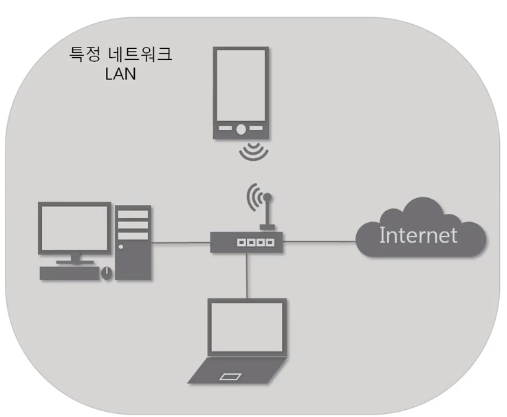
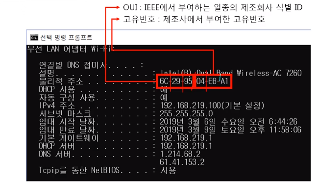
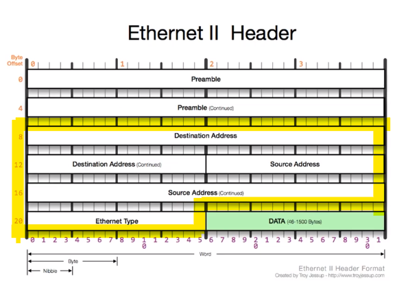
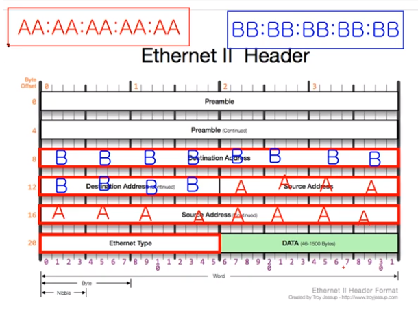

# INDEX

[toc]

> 2계층(로컬 area 네트워크)에서 통신을 어떻게 하는가

## 2계층에서 하는 일

### 2계층의 기능

- 하나의 네트워크 대역, 즉 ==**같은 네트워크 상**==에 존재하는 여러 장비들 중에 어떤 장비가 어떤 장비에게 보내는 데이터 전달
- 추가적으로 ==**오류제어**==(보내는 데이터의 오류 체크), ==**흐름제어**==(누가 누구에게 보내는가) 수행

### 2계층의 네트워크 크기

- 2계층은 ==**하나의 네트워크 대역 LAN**==에서만 통신할 때 사용
- 다른 네트워크와 통신시 3계층의 도움 필요 📌
- 3계층의 주소와 3계층의 프로토콜을 이용하여야만 다른 네트워크와 통신 가능

## 2계층에서 사용하는 주소

### 물리적인 주소(MAC주소)

- 16진수 기재(16진수 두개씩, 총 12개의 16진수로 작성)
  - 앞의 6개의 16진수 : OUI(제조사 ID)
  - 뒤의 6개의 16진수 : 고유번호(제조사에서 만든 네트워크 장비를 표기하는 값)

## 2계층 프로토콜

- 녹색 부분은 **payload**
- 형광펜 부분 중심으로 보기

### Ethernet 프로토콜

- 형광펜 부분
- 한 줄에 4바이트 => 4 + 4 + 4 + 2(반) => 14바이트 사용

#### Destination Adress

- 6바이트 == ==**목적지 MAC 주소**==(받는 사람의 MAC 주소)
  - cf. 16진수 2개당 1바이트

#### Source Adress

- 6바이트 == ==**출발지 MAC**== 주소(보내는 사람의 MAC 주소)
  - cf. 16진수 2개당 1바이트

#### Ethernet Type 📌

- 2바이트 사용
- 데이터(페이로드) 안에 상위 프로토콜 내용이 있음 => 그 정보에 대해 미리 알려주는 역할
  - IP v4 : 0 8 0 0 
  - ARP : 0 8 0 6
- 이더넷 프로토콜 뿐만 아니라 대부분의 프로토콜에서 이런 정보를 미리 알려주는 역할이 존재

##### ex. A가 B에게 데이터를 보내는 경우

