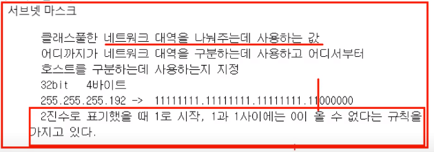

# INDEX

[toc]

> 실제로 컴퓨터끼리는 MAC주소로 통신, but 사람들이 MAC 주소를 이용하긴 어렵기에 IP주소로 통신
>
> IP주소는 3계층에서 사용하는 주소

## 3계층의 기능

### 3계층에서 하는 일

- 3계층은 ==**다른 네트워크 대역**==까지 어떻게 데이터를 전달할지 제어하는 일을 담당
- ==**서로 다른 LAN**==을 연결시켜주는 것
- 발신에서 착신까지의 패킷의 경로를 제어
- router와 같은 3계층 장비 필요

### 3계층에서 쓰는 주소 📌

- ==**MAC 주소**== 뿐만 아니라 ==**IP 주소**==도 가지고 있어야 한다.

- ipconfig를 통해 연결된 IP 주소 확인 가능(뒤에 all을 붙이면 MAC주소까지 같이 확인 가능)
- IP 주소 뿐만 아니라, 서브넷 마스크와 기본 게이트웨이도 필요

- 인터넷 사용시 우리는 IP 주소가 아닌 도메인을 통해 통신 ===> DNS 서버 주소는 도메인을 IP로 바꿔주는 역할

### 3계층 프로토콜

#### ARP 프로토콜

> IP 주소를 이용해 MAC 주소를 알아오는 ARP 프로토콜
>
> 4장에서 다룰 예정

#### IPv4 프로토콜

> WAN에서 통신할 때 사용
>
> IPv6도 존재(모양과 주소 자체가 다름) ===> IPv4와는 별개로 생각하기

#### ICMP 프로토콜

> 서로가 통신되는지 확인할 때 사용

## 일반적인 IP 주소

### classful

- IPv4가 처음에 등장했을 때 classful하게 나눠서 사용
- 클래스에 맞게, 사용할 수 있는 범위를 지정해서 사용
- 낭비가 심함
- 클래스로 나눴던 이유
  - 클래스 첫번째 필드: 네트워크 대역을 구분하는데 사용 && 뒤에는 그 네트워크 대역에 포함되는 컴퓨터의 개수(ex. A의 네트워크 대역은 0부터 127까지 128개, 컴퓨터의 수는 2^24)
  - D 클래스는 멀티캐스트를 위한 주소
  - E 클래스는 네트워크 연구를 위한 주소
- 클래스로 사용할 시 하나의 네트워크를 할당했을 때 네트워크 장비(컴퓨터)의 낭비가 심했음(낭비를 없애려면 한 사업장안에 2^24개의 네트워크 장비를 설치해야함) => 컴퓨터의 발전으로 IP주소는 부족해지짐 => classless한 주소를 사용하자

- 1byte == 8 bit
- IPv4 주소는 십진수 네자리로 표현된 것 => 각각의 자리를 이진수로 표현가능한 숫자만큼 밖에쓰지 못함(최대 255까지) => 0~255까지 사용 가능
- 이 범위를 각각 클래스로 나누서 사용

### classfulless

- 하나의 네트워크를 잘라서 사용

- classful하게 네트워크를 사용했더니 IP 주소 부족(.단위로 네트워크 대역 구분) => 서브넷 마스크로 구분
- 서브넷 마스크: 네트워크 대역을 어디서부터 지정할 것인지를 알려줌

- 1까지가 네트워크 대역을 구분하는 값
- 낭비되는 IP가 줄어듬

#### ==서브넷팅 vs. 슈퍼넷팅==

- 서브넷팅은 주어진 네트워크 주소를 작게 나눈 것
- 서브넷팅의 반대말로 네트워크를 합치는 작업

### 사설 IP와 공인 IP

### 특수한 IP 주소

### 0.0.0.0

### 127.X.X.X

