# INDEX

[toc]

> 3계층 프로토콜 중, ARP 프로토콜(통신하기 전 반드시 필요)

## ARP 프로토콜

### ARP가 하는 일

- 같은 네트워크 대역에서 통신을 하기 위해 필요한 MAC주소를 IP주소를 이용해서 알아노는 프로토콜
- 같은 네트워크 대역에서 통신을 한다고 하더라도 데이터를 보내기 위해서는 7계층부터 캡슐화를 통해 데이터를 보내기에 IP주소와 MAC 주소가 모두 필요
- ==**IP주소를 알고 MAC주소는 모르더라고 ARP를 통해 통신 가능**==
- 보안상의 이유에서도 중요한 프로토콜

### ARP 프로토콜의 구조

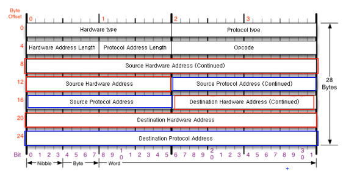

- 한 줄 == 4바이트 / 작은 한칸 == 이진수 하나(1비트) ==> 총 28바이트(7줄)
- **Source Hardware Address**(총 6바이트 사용)
  - 출발지의 물리적인 주소 == ==**MAC주소**==
- **Source Protocol Address**(총 4바이트 사용)
  - IPv4주소
- **Destination Hardware Address**(총 6바이트 사용)
  - 목적지의 물리적인 주소 ==**MAC주소**==

- **Destination Protocol Address**(총 6바이트 사용)
  - 목적지의 IP 주소 ==**MAC주소**==
- **Hardware type**
  - 이계층에서 사용하는 프로토콜 타입, 대체적으로 이더넷 프로토콜 == **0 0 0 1**(이더넷을 가르키는 말)
- **Protocol type**
  - 여기서 사용되는 프로토콜 어드레스 타입, 마찬가지로 IPv4 == **0 8 0 0**

- **Hardware Address Length**

  - MAC주소의 길이 == **0 6**

- **Protocol Address Length**

  - IPv4의 길이 == **0 4**

- **Opcode**

  - 요청인가 응답인지를 나타내는 코드(1: 요청, 2: 응답 ex. 0 0 0 1 / 0 0 0 2)

    

 cf) 보통은 출발지가 먼저오지만, 이더넷 프로토콜의 경우 목적지가 먼저 나옴

## ARP 프로토콜의 통신 과정

### IP주소로 MAC주소를 알아오는 과정

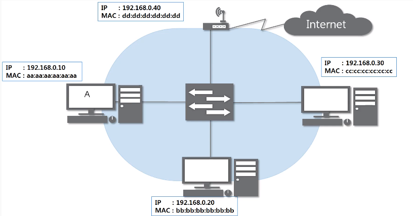

- 하나의 네트워크 대역(같은 LAN 대역)이라 가정
- 왼쪽 컴퓨터를 A, 오른쪽 컴퓨터를 C라고 가정
  - A가 C 컴퓨터와 통신을 원함, but C컴퓨터의 MAC주소는 모르고 IP 주소만 알고있음

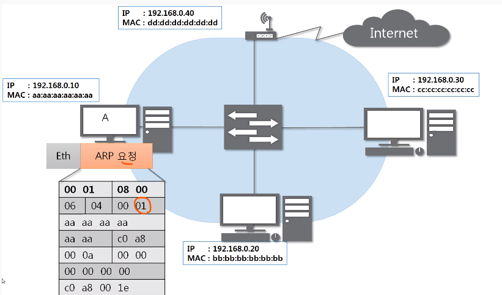

- A가 C에게 ARP 요청 프로토콜을 인캡슐레이션을 하여 보냄
  - ARP 프로토콜은 3계층이므로 앞에 이더넷 프로토콜을 붙여서 보냄
  - 목적지 MAC 주소를 **00 00 00 00 00 00**으로 비워서 보냄
  - 마지막에 IP 주소(16진수로 변환된)를 적어넣어 MAC주소를 알려달라고 요청

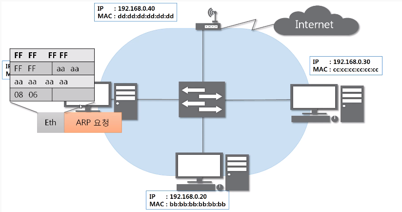

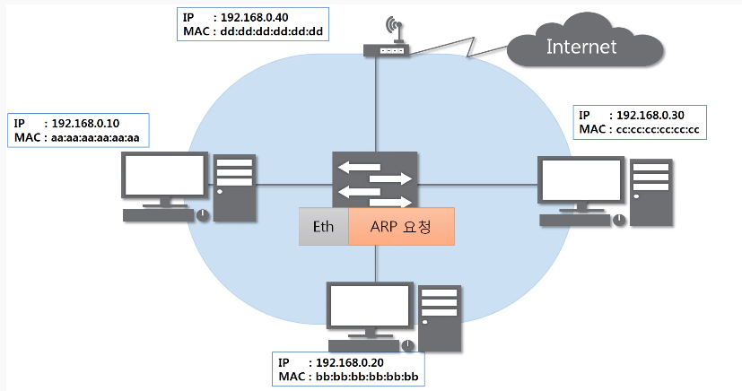

- 이더넷 프로토콜 인캡슐레이션시 목적지 MAC 주소를 **FF FF FF FF FF FF**로 작성
  - 이진수로 봤을 때 1로 채우는 것 == ==**브로드캐스트 주소**== ==> 같은 네트워크 대역에 있는 모든 기기에 요청을 보냄
  - 가운데 화살표 장치는 스위치로 대표적인 2계층 장비

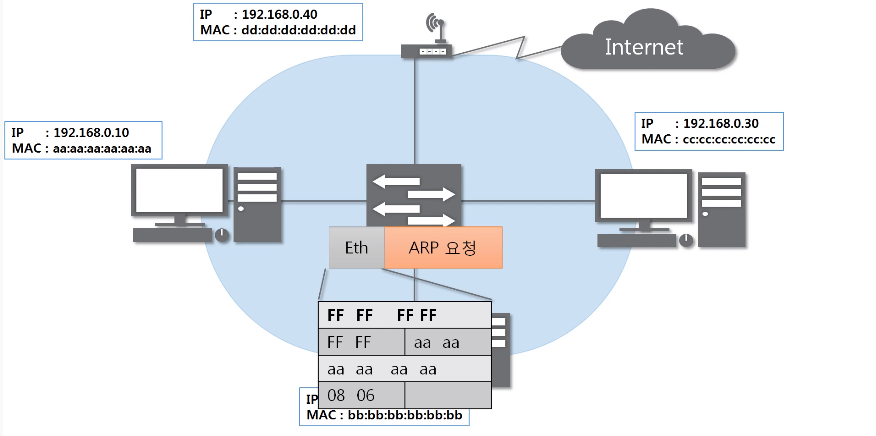

- 2계층 장비이기에 2계층까지만 프로토콜까지만 디캡슐레이션 진행
  - 목적지 MAC주소가 브로드캐스트니까 모두에게 전달

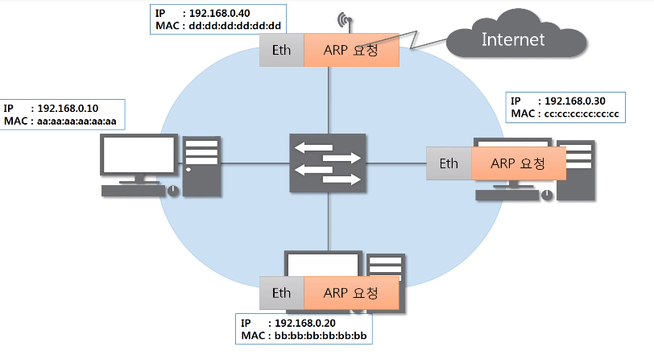

- 같은 네트워크 대역의 모두에게 요청

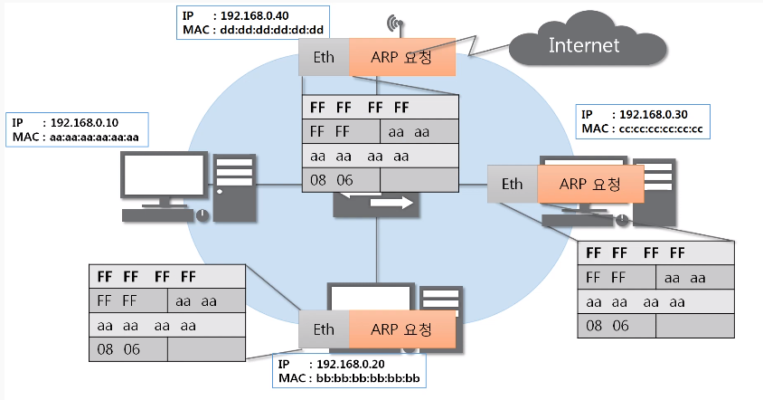

- 이더넷 프로토콜을 확인(디캡슐레이션)
  - 목적지 MAC주소가 브로드캐스팅이기에 나에게 온 것 ==> 3계층 확인

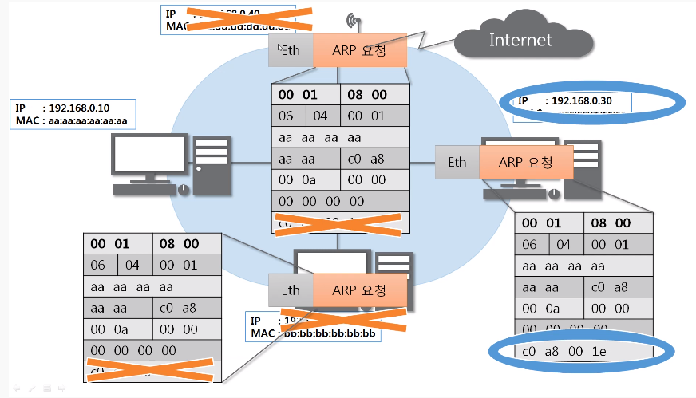

- 본인의 IP 주소와 목적지 IP 주소 일치 여부 확인
  - 일치하지 않는다면 패킷을 버림

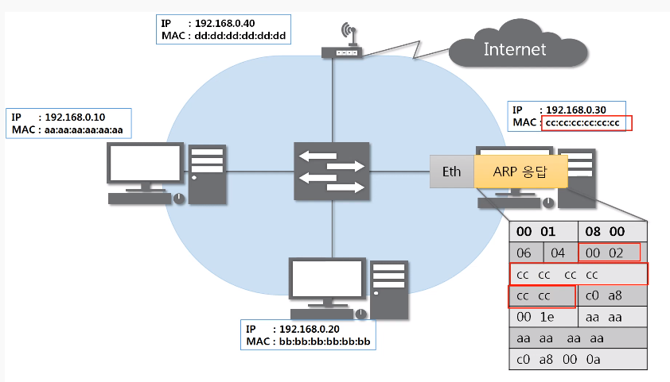

- 응답이기에 **2**로 바꾸고, 출발지에 자신의 MAC주소를 적고, 목적지 MAC주소에 A의 MAC주소를 입력해 응답

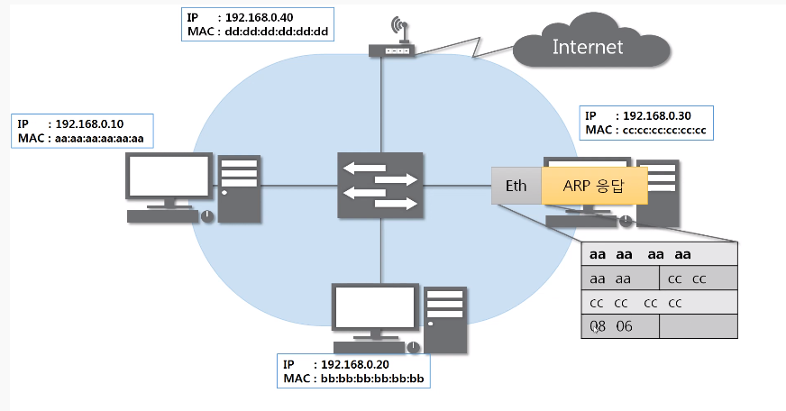

- 목적지를 알기에 브로드캐스트 X

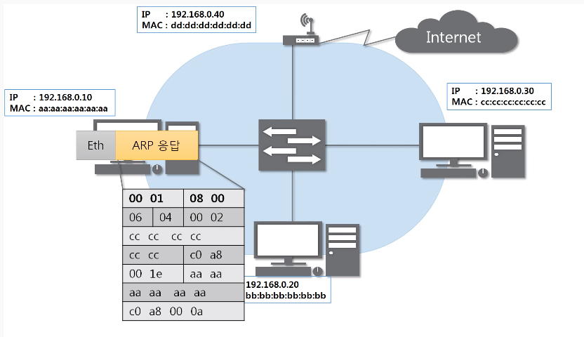

- A는 C의 MAC 주소를 알게됨

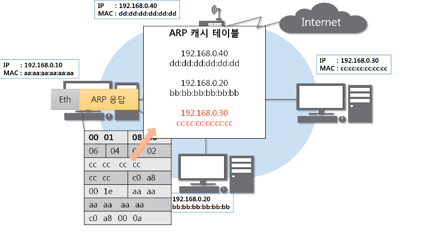

- ARP 캐시 테이블의 MAC 주소를 등록

cf) 최초의 통신에는 무조건 한 번 실행 후 진행

## ARP 테이블

### 나와 통신했던 컴퓨터들

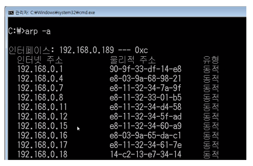

- 통신했던 컴퓨터들 IP주소와 MAC 주소를 맵핑하여 저장하는 공간
- 일정 시간이 지나면 없어짐(ARP 캐시 테이블)
