# INDEX

[toc]

## IPv4

>  멀리있는 곳과의 통신, IP는 3계층 프로토콜

### IPv4가 하는 일

- (다른) 네트워크 상에서 데이터를 교환하기 위한 프로토콜
- ==**데이터가 정확하게 전달될 것을 보장 ❌**==
- 중복된 패킷을 전달하거나 패킷의 순서를 잘못 전달할 가능성 있음
- 데이터의 정확하고 순차적인 전달을 그보다 상위 프로토콜인 TCP(4계층)에서 보장

### IPv4 프로토콜의 구조

- 한 줄 == 4바이트
- 마지막 줄(IP Option)은 붙을 수도, 안붙을 수도 있는 옵션적인 요소 == > 제외하고 20바이트
  - 최대 열개의 옵션이 붙을 수 있지만(60바이트), 거의 이렇게 사용 X

- **Source Address** : 출발지 주소(4바이트)

- **Destination Address** : 목적지 주소(4바이트)

- **Version | IHL | Type of Service | Total Length** 

  - Version : 버전(4만 온다. IPv6는 아예 구조가 다름)
  - IHL : 헤더의 길이(최소 20바이트, 최대 60바이트 '**/4**'를 하여 표시==> 4비트로 표현) 일반적으로 5가 된다.
  - Type of Service : 0 0으로 비워둔다. 옛날에 데이터의 중요성 등을 표시하는 정보
  - Total Length : 뒤의 페이로드까지 합쳐진 길이(상위 계층에서 인캡슐레이션하며 내려온 데이터와 합쳐진 전체의 길이)

- **Idenfication | Flag | Fragment Offset** : 하나의 세트(데이터를 보낼 때 최대 전송 단위가 있기에 잘게잘게 잘라서 보내는데, 그때 사용되는 것으로 쪼개진 정보 식별에 사용됨)

  - Idenfication : 쪼개진 데이터를 합쳐야 할 때, 쪼개진 네트워크들이 하나였다는 것을 알 수 있게 아이디를 같게 주는 것

    

  - Flag : 3비트로 구성(x: 사용 안함 / D(don't fragmentation) : 데이터를 안쪼개서 보내겠다고 명시(다만 용량으로 인해 전송이 안됨) / ==**M(More fragmentation)**== : 다른 패킷의 존재를 알려주는 존재(최대 전송 단위보다 큰 걸 보내면 무조건 1이 된다.))

  - Fragment Offset : 13비트 / 쪼개진 데이터를 원래대로 복구할 때 순서가 보장이 안되기에 순서를 알아볼 수 있게 시작 부분에서 얼마나 떨어져있는지에 대한 정보

- **TTL | Protocol | Header Checksum**

  - TTL(Time To Live) : 패킷이 살아있을 수 있는 시간을 지정(ex. 잘못된 경로 설정으로 순환이 생길 수 있음 ---> 이런 경우를 대비해 패킷이 살아있는 시간(거친 네트워크의 수)을 지정)
    - cf. 운영체제마다 설정하는 값이 다르기에 이를 통해 운영체제를 확인할 수 있음(윈도우는 128 / 리눅스는 64)
  - Protocol : 상위 프로토콜이 뭔지 알려주는 것(ICMP(1) -- 3계층 / TCP(6), UDP(17) -- 4계층)
  - Header Checksum : 헤더가 오류가 있는지 없는지 확인하는 값

## ICMP

### ICMP가 하는 일

- Internet Control Message Protocol, 인터넷 제어 메시지 프로토콜
- 네트워크 컴퓨터 위에서 돌아가는 운영체제에서 ==**오류 메시지**==를 전송 받는데 주로 사용
- 프로토콜 구조의 Type과 Code를 통해 오류 메시지를 전송 받음

### ICMP 프로토콜의 구조

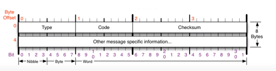

>  특정 대상과 내가 통신이 잘되는지 확인

- **Type**

  - 대분류
  - 다양하게 존재
  - 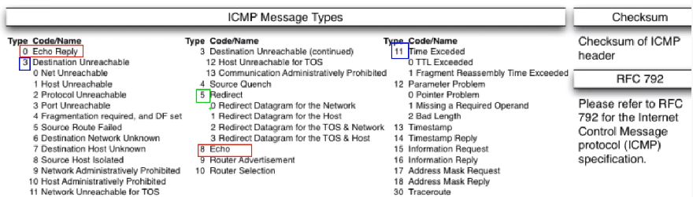

  🌞 **0, 8(기본)** : 상대방과 통신하는 것으로 8번은 요청 / 0번은 응답

  🌞 **3, 11(뭔가 잘못된것)** : 3번은 요청이 목적지에 도달하지 못함(가는 길에 문제 존재), 11번은 도착했지만 응답을 못받는 경우(상대방 문제 ex. 상대방 방화벽)

  🌞 **5(보안)** : 원격지에 있는 상대방의 테이블을 수정할 때 사용(남의 것을 수정)

- **Code**

  - 소분류

- **Checksum**

  - 헤더가 오류에 있나 없나 확인하는 값(굳이 알 필요 X)

## 라우팅 테이블

### 내가 보낸 패킷은 어디로 가는가

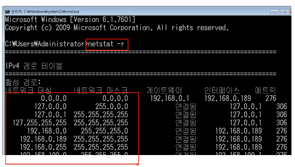

- 어디로 보내야 하는지 설정되어있는 것(다른 네트워크 대역에 대한 지도)
- 라우팅 테이블에 존재하는 네트워크 대역에만 찾아갈 수 있음
  - 기본값을 미리 넣어줌(0.0.0.0 -> 모르면 문밖으로 나감)
    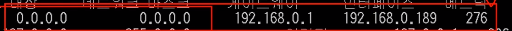

## 다른 네트워크와 통신 과정

### 다른 네트워크까지 내 패킷의 이동 과정

##### 1. 네 개의 네트워크 대역 존재 && A라는 컴퓨터가 B라는 컴퓨터에 통신 시도

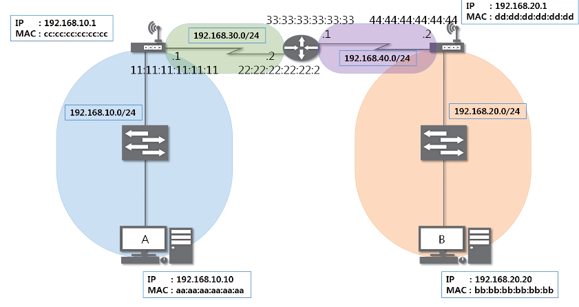

##### 2. A는 자신의 라우팅 테이블에 B의 네트워크 대역이 본인에게 있어야지만 갈 수 있음

(만일 왼쪽의 네트워크 대역을 가려면 오른쪽으로 주소로 가라는 의미)

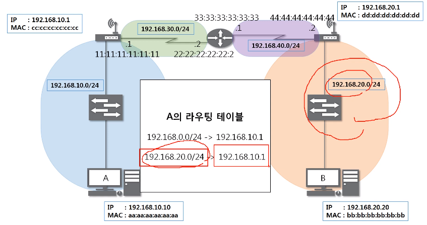

##### 3. 통신 시도

요청 == 08

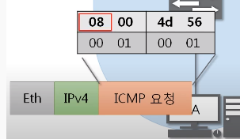

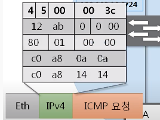

##### cf) Quiz. 이더넷 프로토콜의 목적지 MAC 주소는?

❗cc:cc:cc:cc:cc:cc❗ 목적지는 B니까 7번이라고 생각할 수 있지만, 이더넷은 가까운 곳에서 통신할 때만 사용 -> 게이트웨이의 MAC 주소로 전송

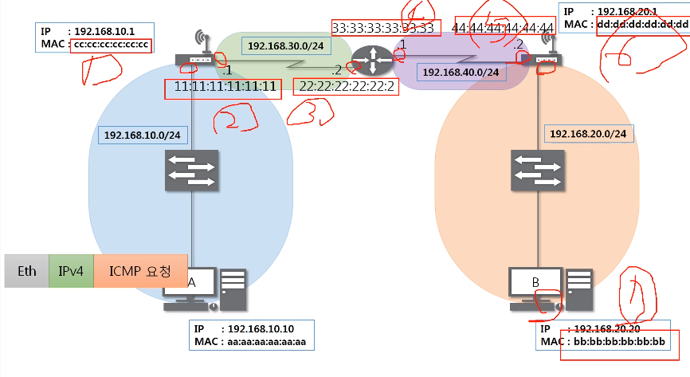

##### 4. A의 이더넷 통신 이후

2계층에서 자신에 온게 맞는다는 것을 확인 후 3계층 확인

3계층을 확인해보니 자신에게 온 요청이 아닌 것을 확인하고 자신의 아이피 테이블 확인

라우팅 테이블에 20번대 대역은 오른쪽으로 이동하도록 안내

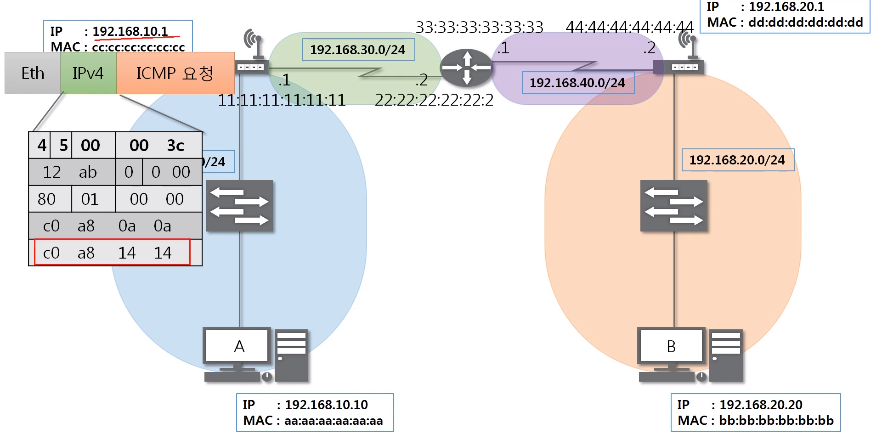

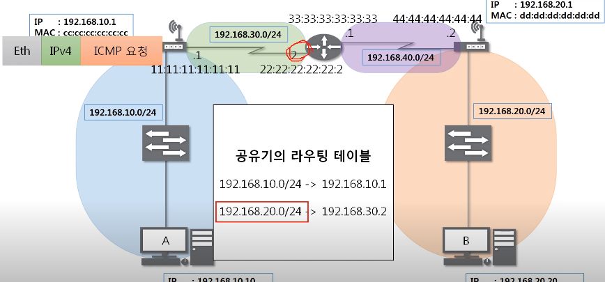

##### 위의 과정을 목적지에 도착할 때까지 반복

##### 5. 목적지에 도착 후 B컴퓨터가 🎈00🎈

도착 후 B컴퓨터가 00을 통해 응답이라는 것을 알려주며 위와 반대로 이동하며 응답을 보내줌

## IPv4의 조각화

### 조각화

- 큰 IP 패킷들이 작은 ==**MTU(Maimum Transmission Unit)**==(주로 1500바이트로 설정되어있음)를 갖는 링크를 통해 전송되려면 ==**여러 개의 작은 패킷으로 쪼개어/조각화 되어 전송**==되어야 함
- 목적지까지 패킷을 전달하는 과정에 통과하는 각 라우터마다 전송에 적합한 프레임으로 변환 필요
- 일단 조각화되면, 최종 목적지에 도달할 때까지 재조립되지 않는 것이 일반적
- IPv4에서는 발신자 뿐만 아니라 중간 라우터에서도 IP 조각화 가능
- Ipv6에서는 IP 단편화가 발신지에서만 가능
- 재조집은 항상 최종 수신지에서만 가능

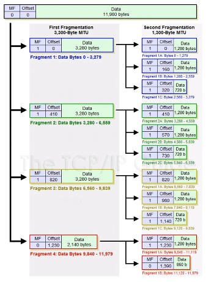

- 위 그림은 2단계의 조각화를 나타낸 그림(실제로 보통 1단계 조각화만 이루어짐)
  - MTU == 3,300byte (MTU는 IPv4 프로토콜까지 합친 값) (실제로 보낼 수 있는 값은 IPv4의 헤더값 20byte를 뺀 3,280byte)
- id, offset(첫번째 데이터에서 떨어진 위치), flag(==MF, 뒤에 패킷이 더 존재하는지 유무)는 세트
  - offset: 3280을 8로 나눠서 작성
  - 1단계의 조각화된 패킷은 id값이 모두 같음

### 조각화하는 과정

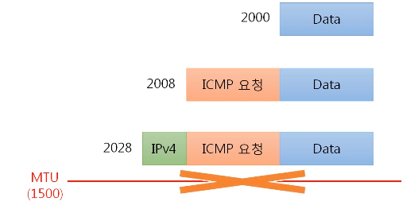

- Data: 인캡슐레이션되기 전 순수한 데이터
- ICMP 요청은 8byte를 차지 -> 1500을 넘기에 조각화 필요

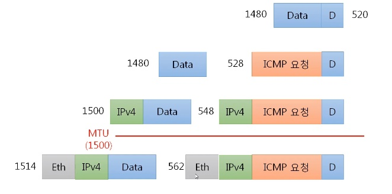

- 1500-20 == 1480
- 각각 IPv4 프로토콜이 붙음
- ICMP는 마지막 프로토콜에만 붙음
- MTU가 걸러지는 시점: ==**IPv4가 붙고 이더넷 프로토콜이 붙기 전**==📌

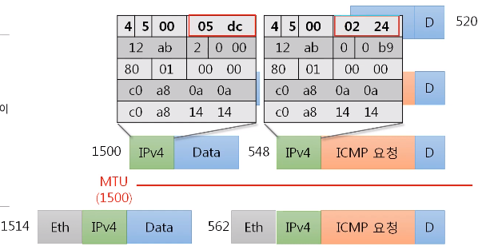

- 빨간 부분은 전체 길이를 의미
- **12 ab** == 아이디 값으로 같음
- 2(0010) or 0(0000) == MF 세팅 유무
- **0 00** / **0 b9** == offset 값(0 b9는 1480을 8로 나눈값의 16진수)
- **80**: TTL값으로 장비를 거치면 1씩 줄어듬
- **01**: 상위 프로코토콜 값
- 뒤에는 checksum 값

