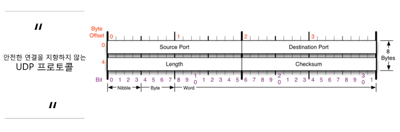
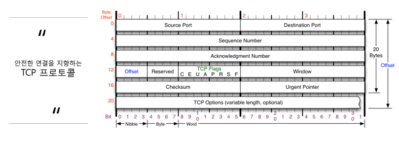
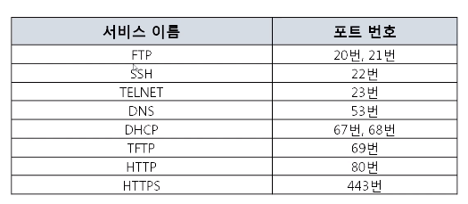
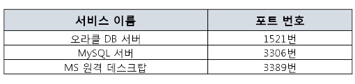
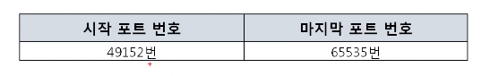
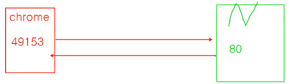
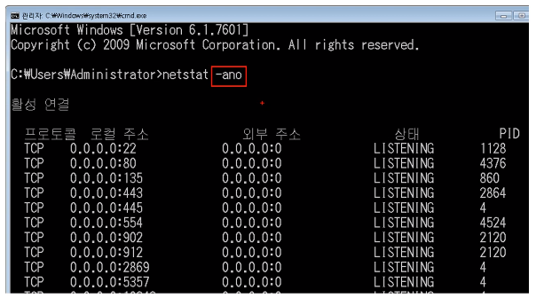

# INDEX

[toc]

## 1. 4계층 프로토콜

### 1-1. 4계층에서 하는 일

- 전송 계층(Transport layer)은 송신자의 ==**프로세스**==와 수신자의 ==**프로세스를 연결하는 통신 서비스**== 📌
  - 프로세스 : 메모리에서 동작 중인 프로그램
- 전송 계층은 연결 지향 데이터 스트림 지원, 신뢰성, 흐름 제어, 그리고 다중화와 같은 편리한 서비스를 제공
- 전송 프로토콜 중 가장 잘 알려진 것은 연결 지향 전송 방식을 사용하는 전송 제어 프로토콜(TCP)
- 단순한 전송에 사용되는 사용자 데이터 프로토콜(UDP)

### 1-2. 4계층 프로토콜의 종류

#### UDP

- 안전한 연결을 지향하지 않는 프로토콜
- 비연결지향형 프로토콜 : 연결된 상태를 별로 지향하지 않음(연결이 되든 아니든 데이터를 전송)

#### TCP

- 완전한 연결을 지향하는 프로토콜
- 연결이 되고 난 뒤 데이터를 보내고, 확인까지 진행 => 과정이 복잡

## 2. 포트 번호

### 2-1. 포트번호의 특징

- 특정 프로세스와 특정 프로세스가 통신을 하기 위해 사용
- ==**하나의 포트는 하나의 프로세스만**== 사용 가능 📌
  - A라는 프로그램이 100번 포트를 사용했다면, B라는 프로그램은 다른 포트를 사용해야 함
- 하나의 프로세스가 여러 개의 포트를 사용하는 것은 가능
- 포트 번호는 일반적으로 정해져 있지만 ==**무조건 지켜야 하는 것은 아님**==
  - ex) 일반적으로 웹 서비스는 80번 포트를 사용하지만 웹 서비스가 항상 80번 포트를 사용해야만 하는 것은 아님

- 0 ~ 65,365 => 3가지로 분류가 된다.

### 2-2. Well-Known 포트

- 전 셰계적으로 유명한 포트
- 유명한 서버들이 사용하는 포트 번호
  - HTTP : 웹 서비스
  - HTTPS : 보안 웹 통신
  - DNS : DNS 서비스
- + POP3, IMap, SNTP, SMTP 등도 알아둬야 함

### 2-3. Registered 포트

- 조금은 유명한 포트

### 2-4. Dynamic 포트

- 일반 사용자들이 사용하는 포트로 시작~마지막 포트 번호에서 하나 골라 사용
  - 프로그램 하나당 하나의 포트를 사용(15,000개 정도로 부족하지 않음)
- 서버에 접속하는 사용자들이 사용하는 포트(상대방 프로그램으로 연결할 때 사용)

## 3. 프로그램의 연결 정보

### 3-1. 어떤 프로세스와 어떤 프로세스가 연결되어 있는지 확인

- 현재 포트 활성 여부를 나타내는 활성 연결 테이블

- `netstat -ano` 명령어 사용

