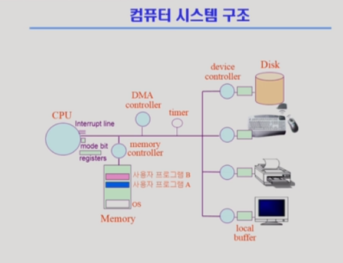

# System Structure & Program Execution Q&A

[toc]

## CPU & Memory & I/O device(컴퓨터의 3대 구성요소)

### CPU

- 중앙 처리 장치, 연산 담당

- CPU의 구성

  - (프로세스)레지스터: 연산에 필요한 데이터 저장(고속 저장 장소, 일반 메모리보다 훨씬 빠른 속도로 접근하도록 설계) (cf. 캐시 메모리는 CPU와 별도로 있는 공간)
    - 범용 레지스터: 연산과 데이터 전송에 주로 사용
    - 세그먼트 레지스터: 세그먼트라는 미리 할당된 메모리 영역의 시작 주소를 가리킴
      - CS(Code Segment): 코드 세그먼트의 시작 주소
      - SS(Stack Segment): 스택 세그먼트의 시작 주소
      - DS(Data Segment): 데이터 세그먼트의 시작 주소
      - ES(Extra Segment), FG, GS: 추가적인 데이터 세그먼트 레지스터
    - 명령어 포인터: 다음 실행할 명령의 주소
    - FLAG 레지스터: CPU 동작을 제어하거나 연산의 결과를 반영하는 개별적인 2진수 비트들로 구성
  - 제어부: 명령어의 해석과 올바른 실행을 위해 CPU 내부적으로 기계 명령어 실행 순서 제어
  - 산술 논리 연산장치: 덧셈/뺄셈 OR/AND/NOT과 같은 비교, 판단, 연산을 수행

- CPU의 동작(5단계)

  - 인출: 프로그램의 메모리에서 명령어를 불러오는 역할
  - 해독: 인출 단계에서 가져온 명령어를 해독하여 명령어 내의 데이터 정보와 연산 정보를 추출한 뒤, 중앙처리 내의 각 장치에 적절한 제어신호를 보내 연산, 처리에 대한 준비를 하는 단계
  - 실행: 명령어에서 추출한 두 데이터와 연산 정보를 이용해 실제로 연산하는 단계
  - 메모리: 연산결과가 다음 명령어에 바로 사용되지 않는다면 결과를 메모리에 저장
  - 라이트백: 이전 명령어의 연산 결과가 다음 명령어의 입력 데이터로 사용될 경우, 계산 결과를 레지스터에 다시 쓰는 것

- CPU의 성능

  - 클럭 속도
    - PU에서 클럭이라고 하는 수치는 중앙 처리 장치 내부에서 일정한 주파수를 가지는 신호로 이 신호에 동기화되어서 중앙 처리 장치의 모든 명령어가 동작
    - 클럭 주파수가 빠를수록 제한된 시간에 더 많은 명령 처리 가능
  - 코어의 수
    - 중앙 처리 장치의 역할 하는 블록
    - 종류
      - 싱글 코어: 하나의 코어로 이루어진 CPU
      - 멀티 코어: 한 개의 칩 안에 여러 개의 연산을 처리할 수 있는 장치를 병렬적으로 연결

- CPU는 메인보드에 있는 CPU 소켓에 부착된 핀을 통해 다른 부품들과 통신

  (버스 :  컴퓨터 안의 부품들 간에, 또는 컴퓨터 간에 데이터와 정보를 전송하는 통로(통신 시스템).  관련된 모든 하드웨어 부품들 및 통신 프로토콜을 포함한 소프트웨어)

  - 핀과 연결되는 부분

    (초창기의 컴퓨터는 단일 버스 구조. CPU, 메모리, 하드디스크, 주변장치들 사이의 속도 차가 점점 커져서 병목현상 심화. 이를 해결하기 위해 버스가 세분화될 필요성이 생겼고, 점점 컴퓨터의 버스는 세분화)

    - 데이터 버스: 데이터 전달
    - 제어 버스 : 제어 신호 전달
    - 주소 버스: 메모리 주소나 I/O Unit 포트 번호 전달

### Memory

- 주 기억 장치, 기억 담당
- 버스 : 데이터를 컴퓨터의 한 부분에서 다른 부분으로 전송
- 버스의 종류
  - 데이터 버스: CPU와 메모리 간에 명령어와 데이터 전송
  - 입출력(I/O) 버스: CPU와 입출력 장치 간에 데이터 전송
  - 제어 버스: 버스에 연결된 모든 장치의 동작을 동기화하기 위해 2진 신호 사용
  - 주소 버스: 현재 실행 중인 명령어가 CPU와 메모리 간에 데이터를 전송할 때에 명령어와 데이터의 주소를 가지고 있음
- 메모리 관리 기법
  - 가상 메모리 : 실제 메모리 주소가 아닌 가상 메모리 주소를 사용
    - 세그먼트 기법: 가상 메모리를 서로 크기가 다른 논리적 단위인 세그먼트로 나누는 것
    - 페이징 기법: 가상 메모리 서로 같은 크기의 블록으로 나누는 것

### I/O device 

입출력 장치(컴퓨터의 2차 부품), 컴퓨터 외부와 소통 담당

### cf. 프로세스

## System Call

## Interrupt

### Hardware Interrupt

### Trap(Software Interrupt)

## 동기식(Synchronous) 입출력과 비동기식(Asynchronous) 입출력

## 프로그램의 실행(Memory load)

## 커널 주소 공간

###### 참고

- CPU와 Memory 구조 https://d4m0n.tistory.com/12

- 중앙처리장치(위키 백과) https://ko.wikipedia.org/wiki/%EC%A4%91%EC%95%99_%EC%B2%98%EB%A6%AC_%EC%9E%A5%EC%B9%98

- 버스(컴퓨팅)(위키 백과) https://ko.wikipedia.org/wiki/%EB%B2%84%EC%8A%A4_(%EC%BB%B4%ED%93%A8%ED%8C%85)