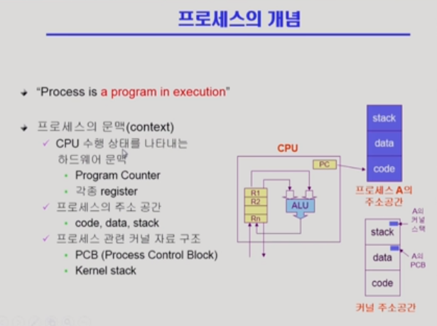
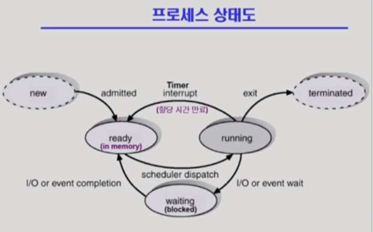
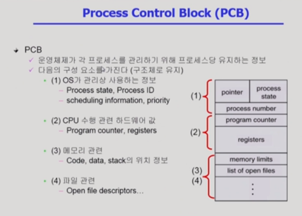
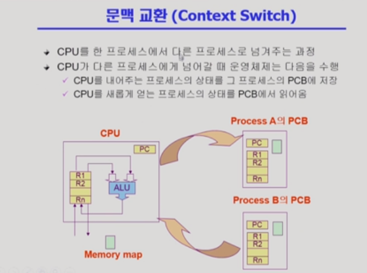
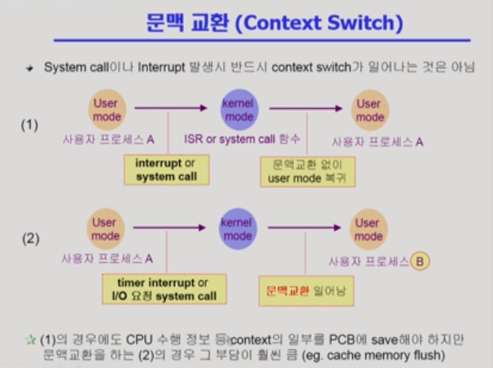
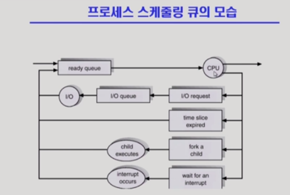
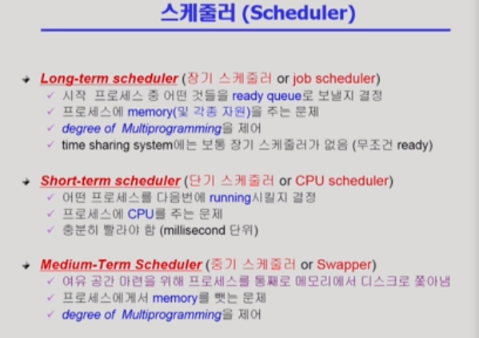
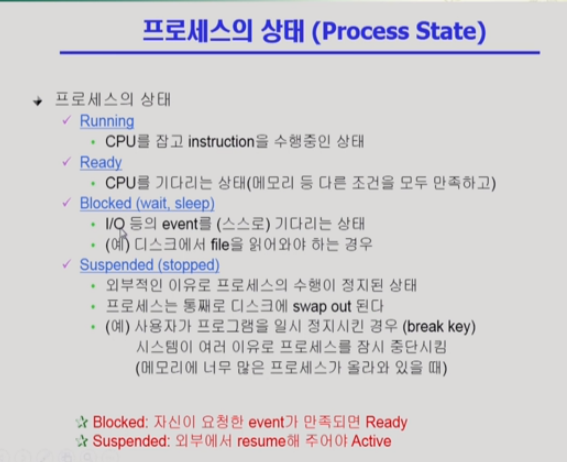
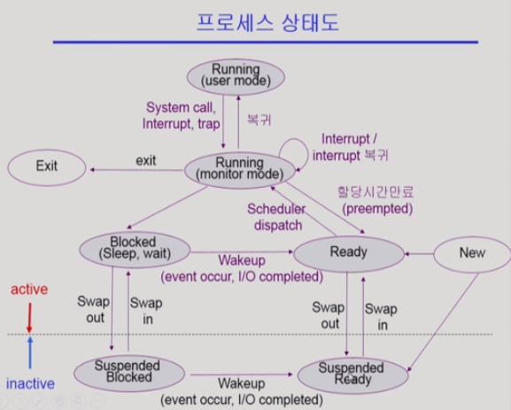

# Process

[TOC]

## 프로세스의 개념

> 프로세스 = 실행 중인 프로그램
>
> 프로세스의 현재 상태를 정확하게 이해하려면 프로세스 문맥, 즉 프로세스의 탄생부터 종료까지 무엇을, 어떻게 실행했는지를 알아야 한다.

#### 프로세스의 상태

> CPU는 매 순간 하나의 프로세스만을 잡고 있는다.

- Running: CPU를 잡고 instruction을 수행중인 상태
- Ready: CPU를 기다리는 상태(메모리 등 다른 조건을 모두 만족해야 함)
- Blocked(wait, sleep)
  - CPU를 주어도 당장 instruction을 수행할 수 없는 상태
  - Process 자신이 요청한 event(cf. I/O)가 즉시 만족되지 않아 이를 기다리는 상태

- New: 프로세스가 생성중인 상태
- Terminated: 수행(execution)이 끝난 상태

.png)

- CPU는 빠르게 그리고 공유하는 자원이기 때문에 프로세스가 돌아가며 사용함

#### PCB

> 운영체제가 각 프로세스를 관리하기 위해 프로세스당 유지하는 정보

- OS가 관리상 사용하는 정보
- CPU 수행 관련 하드웨어 값
- 메모리 관련
- 파일 관련

#### 문맥 교환(Context Switch)

> CPU는 굉장히 빠른 자원으로 프로세스들을 짧은 시간동안 CPU를 얻었다가 뺏겼다가를 하는데,
>
> 다시 CPU를 얻을 때 처음부터 시작하는 것이 아닌 뺏기는 시점을 문맥으로 기억했다가 그 시점부터 재실행한다.
>
> PCB의 레스스터 등에 정보를 저장하여 사용

- - system call: 프로세스가 본인의 필요에 의해 운영체제를 호출
  - interrupt:  컨트롤러 같은 장치가 정보 전달을 목적으로 운영체제 호출

- ==운영체제한테 넘기는 것 자체는 문맥 교환 X==

  운영체제 처리 후 다른 프로그램한테 넘기면 문맥 교환 O

- 타이머 언터럽트나 시간이 오래 걸리는 I/O 요청 시스템콜(블록처리 후 다른 프로그램한테 넘어감)은 문맥교환임

- 문맥 교환(프로세스의 이동)이 일어날 시에는 ==캐시 메모리 삭제 발생== / 유저모드 - 커널모드 - 유저모드와 같은 변경 사항에서는 캐시 메모리 삭제 불필요

#### 프로세스를 스케줄링하기 위한 큐

- Job queue : 현재 시스템 내에 있는 모든 프로세스의 집합
- Ready queue : 현재 메모리 내에 있으면서 CPU를 잡아서 실행되기를 기다리는 프로세스의 집합
- Device queue : I/O device의 처리를 기다리는 프로세스의 집합

Job queue(>Ready queue&&Device queue)가 가장 최상위 개념이며, Ready queue에 있으면Device queue에 없고 , Device queue에 있으면 Ready queue로 빠진다.

#### 스케줄러

- Long-term scheduler
  - 프로세스에게 메모리를 줄지 말지 처음에 결정
- Short-term scheduler
  - 짧은 시간 단위의 스케줄러로 잦은 실행
- Medium-term scheduler
  - 장기 스케줄러의 경우 프로그램 시작에 메모리 제공 여부를 결정하는데 요즘 프로세스들은 처음에 무조건 주도록 설계 => 중기 스케줄러가 중간에 프로세스를 뺏어 degree of Multiprogramming 제어

#### 프로세스의 상태

- Suspended : 중기 스케줄러로 인해 발생

- Blocked는 I/O가 열심히 일하고 있는 상태 vs.Suspended는 메모리에서 쫓겨나 swap out된 상태

- Blocked는 자신이 요청한 이벤트가 만족되면 Ready

  Suspended는 외부에서 도움이 필요

- 위의 running은 프로세스가 CPU를 가지고 있으면서 본인의 코드를 실행 중이며, 중간에 있는 running은 운영체제 코드가 실행 중인 상태로, 사용자 프로세스가 커널 모드에서 운영되고 있다고 표현한다.
- 점선 아래는 외부적인 요인으로 프로세스가 얼어붙은 상태(외부에서 재개 필요)
- Suspended: 메모리를 완전히 잃어버리는 상태(swap out), CPU 관점에서 아무일도 할 수 없으며, 다만 I/O와 같은 작업이 진행 중이었다면 그건 계속 진행되어 Suspended Ready로 이동 가능
