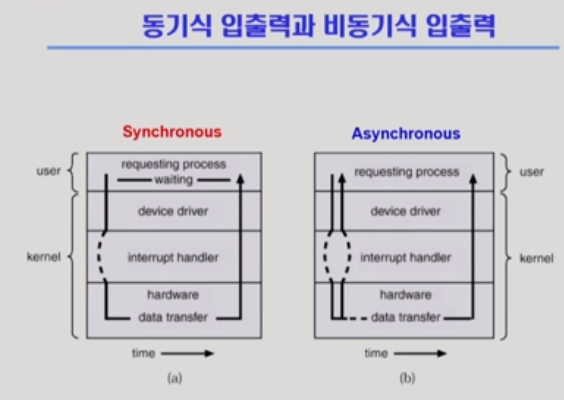

# Process

[TOC]

#### 동기식 입출력과 비동기식 입출력

- 동기식 입출력

  > 프로세스가 입출력 요청 -> 운영체제를 통해서 -> 끝날 때까지 기다림 (CPU 독차지, 낭비)

- 비동기식 입출력

  > 프로세스가 입출력 요청 -> 운영체제를 통해서 -> 오래 걸리며 CPU가 다른 instruction 실행 (CPU 필요한 자원에 분배) (효울성)

  

#### Thread

- thread : 프로세스 내부에 여러 개의 CPU 수행 단위가 있는 경우

- PCB : 프로세스 관리 목적 / 프로세스 상태, id, 프로그램 카운터(메모리의 어느 부분을 실행하고 있는가) 등

- 스레드 : 프로세스(코드, 데이터, 스택)은 하나만 띄우고 프로그램 카운터를 여러 개(하나의 프로세스에 여러 개의 CPU 수행 단위)

- 메모리 주소 공간/프로세스 상태/프로세스가 사용하는 각종 자원 공유 -> 낭비 down

  CPU 수행과 관련된 정보(프로그램 카운터, 레지스터, 스택)를 각 스레드가 별도로 가짐

- 1번 예시 : 웹브라우저에서 네트워크 요청(I/O 작업)을 통해 웹페이지를 읽어올 때 html의 요소 중 img와 같이 시간이 오래 걸리는 작업과 텍스트와 같이 시간이 얼마 안걸리는 작업을 함께 수행

  -> 사용자에게 좋은 경험(빠른 응답성)

- 마지막 병렬성은 이례적인 경우로 CPU가 여러 대인 컴퓨터에서의 이점

- 프로세스는 하나 / PCB 하나 / 스레드 여러개(CPU 관련 정보만 여러개)

- 응답성: 사용자 입장에서 더 빠른 결과를 볼 수 있음(위의 웹브라우저 예시) (비동기식 입출력 개념과 이어서 생각하기)
- 자원 공유
- 경제성(속도적 의미): 프로세스 하나를 만드는 것보다 overhead와 문맥 교환이 작게 발생
- 이례적인 경우:  CPU가 여러 대인 경우 병렬적인 일처리 가능 -> 빠른 결과

- Kernel Threads : 스레드가 여러개 있다는 것을 운영체제가 알고있음
- User Threads(라이브러리 기반): 프로세스 안에 스레가 여러 개 있다는 것을 운영체제는 모름, 유저 프로그램이 스스로 라이브러리의 도움을 받아 관리
- cf.  real-time threads