# Process Management 1&2

[TOC]

#### 프로세스 생성 

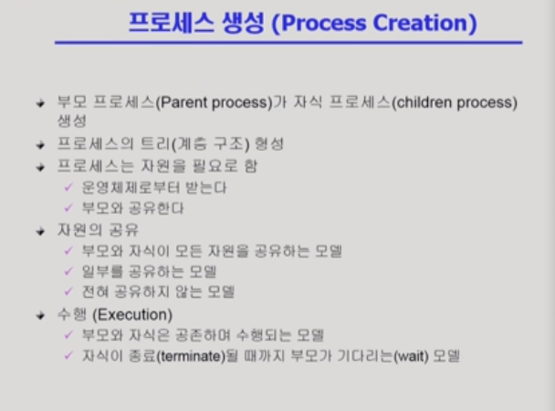

- 부모 프로세스가 복제 형태를 통해 자식 프로세스 생성
- 부모 프로세스는 여러 명의 자식 프로세스를 생성할 수 있음 => 트리 형태로 발전
- 자원의 공유와 관련해서 보통은 공유 X <= 부모와 자식은 CPU를 서로 얻으려는 경쟁 관계

.png)

- 자식 프로세스는 부모 프로세스의 주소 공간과 운영 체제 데이터(PCB 혹은 자원), CPU 문맥((프로그램 카운터) 등을 똑같이 복제한다(fork() 시스템 콜)
- 리눅스나 효울적인 운영체제에서는 카피 전에 공유할 수 있는 주소 공간과 자원같은 경우는 공유하고 프로그램 카운터만 카피하여 내용이 바뀔 때 복제하는 방식을 사용
- 복제된 곳에 새로운 것을 덮어 씌우는 exec() 시스템 콜
- fork()와 exec()는 독립적인 관계로 각각 실행 가능

#### 프로세스 종료

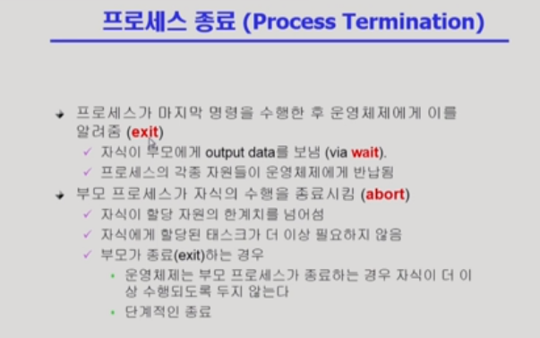

- exit()은 프로세스의 종료로 자식의 경우 부모한테 데이터를 보냄
- 프로세스에서는 자식이 부모보다 우선적으로 죽어야 함
- 부모가 먼저 종료되는 경우 자손부터 다 죽이고 종료

#### fork() 시스템 콜

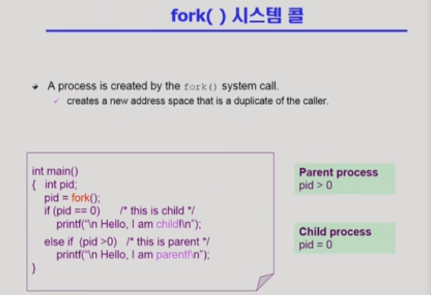

- 위는 C언어 코드
- 원본 구분을 위해  pid를 사용해 부모(양수) / 자식(0)을 사용

.png)

- 부모가 포크해서 자식이 생기면 자식은 ==메인부터가 아닌 포크 시점부터 실행==(처음부터 X, 문맥 복제)

- 현재 예시와 같은 경우 자식 프로세스에서는 맨 위의 프린트문 실행 X

#### exec()시스템 콜

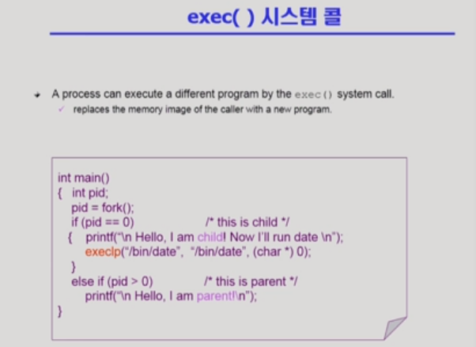

- exec() : 새로운 프로세스로 태어나게 해줌

- exec() 시스템 콜 실행 시 , 메인 즉 처음부터 다시 시작

- exec()을 하면 다시 돌아갈 수 없음

- fork()없이 exec()가능 => 부모 프로세스 자체를 새로운 프로세스로 만들어줌(exec()) 이후 코드 실행 불가 (아래 예시의 경우 1 -> hello 3 출력 후 종료)

  cf) echo는 뒤에 나오는 arguments를 그대로 출력해주는 리눅스 커맨드로 

  execip("`프로그램 이름` ", "`프로그램 이름`",  arguments, (char*) 0 ) 구조

  .png)

#### wait() 시스템 콜

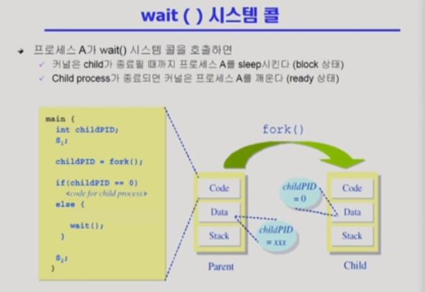

- wait() : 시스템을 잠들게 하는 것(block 상태)
- 자식 프로세스의 종료를 기다리며 block 상태가 된다. -> 자식 프로세스 종료 후에는 ready 상태

- ex) 리눅스 명령어 (셸)프롬포트(실행 후 완료될때까지 기다려야 함)

  

#### exit() 시스템 콜

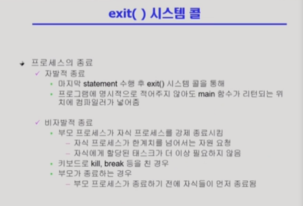

- exit() 시스템 콜은 종료 시스템 콜
- 자발적 종료에 주로 호출
- 비자발적 종료 예시 확인

#### 프로세스 관련 시스템 콜 정리

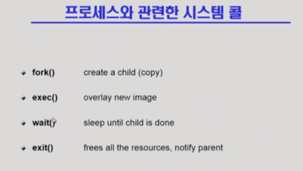

- fork() : 복제 생성
- exec() : 새로운 프로그램으로 덮어씌움
- wait() : 자식 프로세스가 끝날 때까지 기다림
- exit() : 프로그램 종료 및 부모 프로세스에게 소식 전달 

#### 프로세스 간 협력

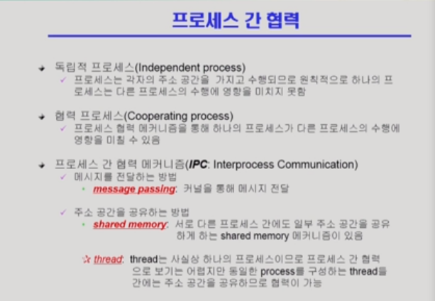

- 원칙적으로 프로세스는 독립적인 존재로 다른 프로세스 수행에 영향을 미치지 못함

- 때때로 협력(정보를 주고 받으며 실행)이 효율적인 경우가 있음

- IPC(프로세스 간 협력 메커니즘)

  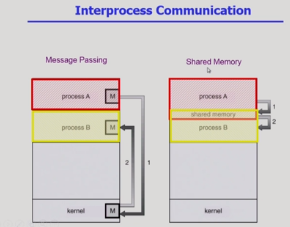

  - message passing : 커널을 통해(직접 전달 불가) 서로 메시지를 주고 받으며 실행

    - Direct Communication: 상대 프로세스 명시
    - Indirect Communication: 상대 프로세스 명시 X (조건을 만족하는 아무 프로세스도 받는 경우도 있음)

  - shared memory : 일부 주소 공간 공유를 하도록 맵핑하여 협력 -> A 프로세스가 변화할 시 B 프로세스가 바로 알아챌 수 있음(주소 공간 공유는 커널에게 시스템 콜 요청을 통해 진행하며, 그 후에는 커널없이 둘이 작업하기에 신중한 작업 Need)

  - thread(스레드간의 협력) : 프로세스간의 협력은 아니지만, 스레드간 협력할 경우 주소 공간을 완전히 공유하기 때문에 완전한 협력 / 공유가 쉬움

    

## CPU 스케줄링

#### 프로세스 실행 과정

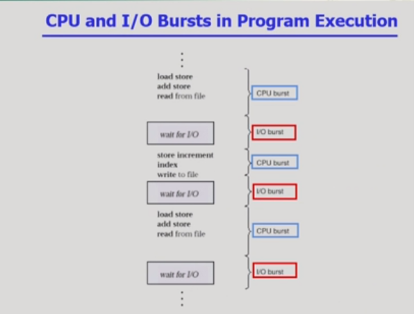

- 프로세스는 위와 같은 path를 따라 실행
- 프로세스(프로그램)은 CPU burst와 I/) burst의 연속
- 사람이 작업하는 일은 burst가 빈번히 발생(cf. 화면에 출력하고 작업하고 반복)

#### I/O bound job vs. CPU bound job

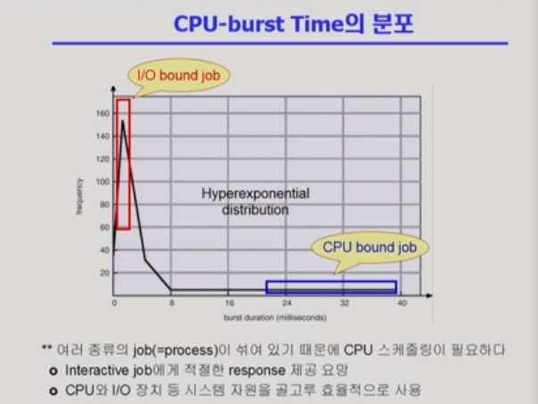

- I/O bound job : CPU를 짧게 쓰고 I/O가 끼어드는 작업(사람과 함께하는 작업)
- CPU bound job : CPU만 오래 쓰는 작업(연산)
- CPU 스케줄링 필요성 : I/O bound job의 경우 사람과 interaction하는 job으로 사용자 경험을 위해 CPU를 우선적으로 할당할 필요가 있음

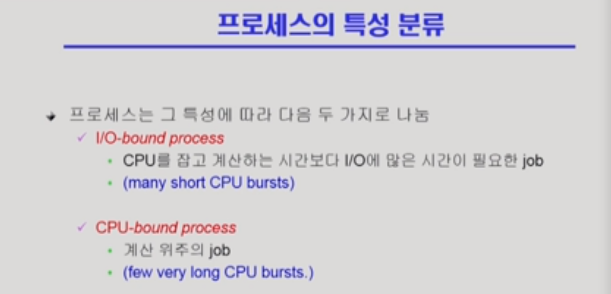

#### CPU Scheduler & Dispatcher

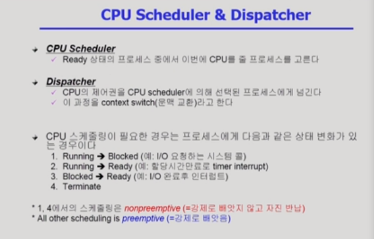

- CPU Scheduler : 누구한테 CPU를 줄 것인가

- Dispatcher: CPU를 넘겨주는 역할로, 이전 프로세스의 문맥 저장과 새로 실행될 프로세스의 문맥 호출 진행

- CPU 스케줄링이 필요한 경우

  1. Running -> Blocked : CPU를 어떤 프로세스가 잡고 있다가 I/O 작업처럼 시간이 긴 작업이 필요한 경우
  2. Running -> Ready : timer interrupt와 같이 프로세스는 CPU를 쓰고 싶지만, 빼앗긴 경우 
  3. Blocked-> Ready : I/O 요청을 보낸 프로세스가 끝난 경우(cf.  우선 순위가 제일 높은 경우, 앞에 프로세스의 타임이 아직 남아있더라도 바로 넘겨줌)
  4. Terminate : 프로세스 종료로 새로운 프로세스에게 CPU를 넘기는 경우

  1, 4 => CPU를 가져도 instruction을 실행할 수 없어서 스스로 반납하는 경우

  2, 3 => 프로세스는 CPU 작업을 원하지만 뺏기는 경우

- preemptive : 강제로 빼앗는 것

- nonpreemptive : 자진 반납