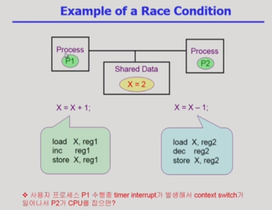

# CPU Scheduling 2 & Process Synchronization 1

[toc]

### 지난 시간 리뷰

#### 컴퓨터 스케줄링의 필요성

- 컴퓨터 시스템 안의 job들은 호모 지니어스 하지 않고, I/O bound와 CPU bound job이 섞여있기 때문

#### Scheduling Algorithm

##### FCFS 

- 오래 걸리는 CPU 선점할 경우 대화형 프로세스(I/O bound job)가 오래 기다려야 함

##### RR 

- heterogeneous job들에게 효율적이며 공평함(할당된 시간을 번갈아가며 사용 -> 대기 시간이 프로세스가 cpu를 사용해야하는 시간과 비례)

- cf. RR은 프로세가 CPU를 빼앗길 때 context를 저장하고 다시 얻는 시점에 저장된 지점부터 재개할 수 있는 매커니즘 덕분에 가능

##### Multilevel Queue

- ready queue를 여러 줄로 분할

.png)

- 위에 있을 수록 우선순위가 높음(계급제)

- 태어난 계급(순위)에 따라 결정되며 우선 순위를 극복할 수 없음

- issue

  - 프로세스를 어떤 줄에 할당할 것인가?

  - 우선 순위가 높은 줄이 비어있지 않다면 무조건적으로 높은 계급에게만 CPU를 할당할 것인가?(starvation 발생 가능)

  - 

    - ready queue를 여러 개로 분할

      - foreground : RR
      - background : FCFP(context switch overhead 줄이기)

      => queue에 대한 스케줄링 필요

      - fixed priority scheduling : 무조건 우선 순위에 따라 할당
      - Time slice : starvation 방지 (ex. 80%는 우선 순위가 높은 큐 / 20%는 낮은 큐에 cpu 할당)

- 공정하지 않고 차별적인 방법

- 우선순위가 중요하지만 이와 같은 방식은 신분 변경 불가능

  => Multilevel Feedback Queue 등장

#####  Multilevel Feedback Queue

.png)

.png)

- Multilevel Queu와 마찬가지로 ready queue가 여러 줄로 분할되지만, 출신 변경이 가능

- issue

  - queue를 몇개를 둘 것인가
  - 각 큐에 대한 스케줄링은 어떻게 할 것인가
  - 우선순위 변동의 기준으로 무엇으로 할 것인가
  - 처음 프로세스가 들어올 때 어느 큐로 들어갈 것인가

  cf. 주로 처음 들어오는 프로세스의 경우 우선 순위가 가장 높은 큐에 넣음.

  ​	우선 순위가 높을 수록 quantum을 짧게 주고, 우선 순위가 가장 낮은 큐는 FCFS 방식 사용

  ​	CPU burst가 짧은 프로세스는 바로 끝낼 수 있고, 반대의 경우 시간은 점점 더 받게 되지만, 우선순위가 떨어지게 된다.

- CPU 사용 시간이 짧은 프로세스에게 우선 순위 부여

- 프로세스들의 CPU 사용 시간에 대한 예측이 불필요

지금까지는 CPU가 하나 뿐인 시스템의 경우, 아래는 CPU가 여러 개 있거나 혹은 deadline/thread가 있는 등의 상황에서의 스케줄링

##### Multi-Processor Scheduling(CPU가 여러개 있는 경우)

- Homogenous processor : 한 줄로 세워 처리
  - 특정 job이 특정 CPU에서 수행되어야 할 경우에는 주로 먼저 할당한 다음 스케줄링 진행
- Load sharing
  - 한 줄 서기 vs. 각각의 CPU마다 줄 서게 하기
- Symmetric Multiprocessing
  - 모든 CPU들이 대등
- Asymmetric multiprocessing
  - 하나의 CPU가 전체적인 컨트롤 담당(데이터 접근과 공유를 책임지고 나머지는 거기에 따름)

##### Real-Time Scheduling

- real time job : deadline이 정해져있는 잡(정해진 시간 내에 반드시 실행되어야 함)
- CPU 스케줄링 시 데드라인 보장 Need
- real-time scheduling은 그때 그때 스케줄링하기보다는 미리 스케줄링을 하여 데드라인이 보장되도록 적재적소에 배치
- cf. 이런 경우는 주기적인 성격을 가진 job이 많음
- Hard real-time systems : 반드시 데드라인이 보장되어야 함
- Soft real-time scheduling : 데드라인을 지켜야 하지만, 그 강도가 hard 리얼 타임 잡보다 강하지 않음

##### Tread Sceduling

- cf. 스레드: 프로세스 하나에 여러 개의 CPU 수행 단위가 있는 것
- Local Scheduling
  - 유저 레벨 스레드(운영 체제가 스레드의 존재를 모름, 사용자가 직접 관리)에서 운영체제는 프로세스에게 CPU를 줄 지 말지만 결정하고, 그 프로세스에 CPU가 갔을 때 어떤 thread에게  CPU를 줄 지는 로컬에서 결정(os가 아니라 사용자 프로세스가 직접 결정)
- Global Scheduling
  - 커널 스레드(운영 체제가 스레드의 존재를 알고 있음)에서 운영 체제가 프로세스 스케줄링 하듯 어떤 스레드에게 CPU를 줄지 결정

### Algorithm Evaluation

어떤 알고리즘이 좋은지 평가할 수 있는 방법

1. Queueing models(이론적인 방법)

   - 이론적인 방법
   - arrival rate(도착률) && service rate(처리율) 등을 계산하여 throughput(처리율, 단위시간당 몇개 처리했는지), 평균적으로 얼마나 기다렸는지를 계산
2. Implementation(구현) & Measurement(성능 측정)
   - 1번과 상반된 개념으로 실제 시스템에다 구현해보고 측정(실측)
   - 쉽게 하기 어려운 일(리눅스 커널 수정 등)
3. Simulation(모의 실험)
   - 위의 경우를 직접해보기 어려운 경우
   - 모의 프로그램(예제)를 만들어서 돌려보기
   - 단, 하나의 예제로 결과를 예측하는 것은 섣부른 행동
   - trace: input 데이터(실제 프로그램을 돌리며 패턴을 분석해 데이터를 뽑아볼 수도 있음 or 가정)

### Process Synchronization

##### 데이터의 접근

- 데이터는 자신이 저장된 곳에서 값을 가져와 연산하고 다시 결과를 저장하는 등의 과정 수행
- 데이터에 대해 연산, 수정, 결과 저장 등을 진행하는데 프로세스에 따라 그 결과값들이 달라질 수 있음 => system Synchronization

-  cpu가 여러 개인 경우 각  CPU가 다른 연산을 진행하여 원치 않는 결과가 발생할 수 있음
-  원래는 갑시 +1 -1 => 그대로여야 하는 경우에서 +1(살짝 먼저 진행) / -1(살짝 후에 진행)이 각각 수행되서 마지막에 수행된 -1만 결과로 남을 수 있음
-  공유메모리를 사용하는 경우
-  ❗커널과 관련된 문제들 -> 여러 프로세스가 시스템콜을 하여 시스템 콜에 중복 접근할 경우 공유 데이터인 커널이 수행을 제대로 못할 수 있다.❗

##### race condition

여러 주체가 하나의 데이터에 접근하는 것

##### 해결 방법

1. 운영체제 커널이 실행 중일 경우 interrupt를 disabled 처리(커널 명령어가 끝날 때까지 보장)(순서를 정해준다)

.png)

2. 커널 모드 중에는 CPU를 preempt하지 않음(시간을 조금 더 쓰더라도 빼앗지 않는다.)

.png)

.png)

- 위의 예시에서는 원래 경우라면 앞의 count를 저장해 이전의 한 번 count에 ++한 값만 남는다

3. CPU가 여러 개 있는 경우에는 lock 사용 

   .png)

   - interrupt를 막을 수 없음(근본적으로 작업 주체가 많이 있기 때문에)
   - CPU 전체(커널 자체)에 대한 lock 걸기(비효율적)
   - 개별 데이터에 대해 lock 걸기

### Process Synchronization 문제

- 여럿이서 동시에 접근해서 발생하는 불일치적 문제
- 순서를 정하는 매커니즘 필요
- 동시에 접근하려는 race condition을 막기 위해 Synchronization이 필요

##### Critical-section(인계 구역)❗📑(공부 더 필요!)

공유 데이터를 접근하는 코드

- 공유데이터를 접근하는 코드 자체를 crtical section으로 한다.
- 하나의 프로세스가 여러 crtical section에 들어가는 것을 막아야한다.

- crtical section인가 아닌가를 판단하는 코드를 통해 다른 접근을 막아야 함