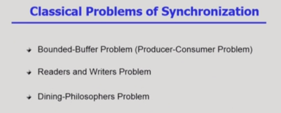
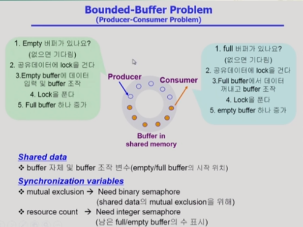
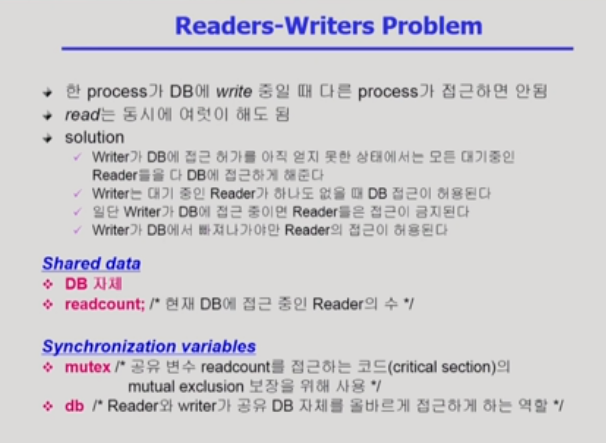
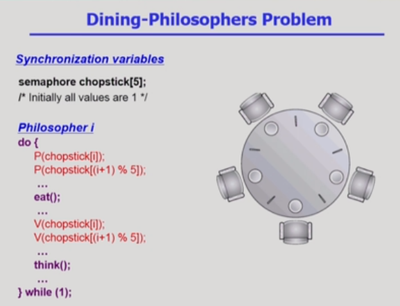
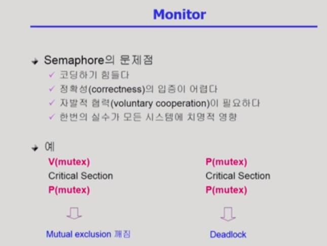
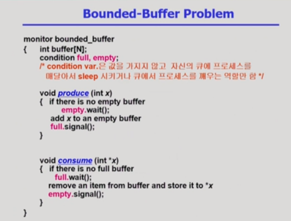

# process synchronization 3

[toc]

## Classical Problems of Synchronization

> Synchronization의 3가지 문제점

### Bounded-Buffer Problem(Producer-Consumer Problem)

- 생산자-소비자 문제(producer-consumer problem)
  - 생산자: 공유 버퍼에 데이터를 만들어 넣는 역할(여러개)
  - 소비자: 생산자가 만든 데이터를 사용하는 역할(여러개)
- Buffer: 임시로 데이터를 저장하는 공간 => Buffer의 크기가 유한해 문제가 발생
  - 생산자 입장에서 - 동시에 데이터를 만들어 넣을 때
  - 소비자 입장에서 - 동시에 같이 데이터에 접근할 경우
  - 버퍼가 다 찬 상태(버퍼의 유한성)
    - 더 생산하고 싶을 경우(생산자 입장에서 더 이상 사용할 수 있는 자원이 없는 상태)
    - 소비자 입장에서 더 이상 사용할 수 있는 데이터가 없는 경우

.png)

- semaphore 변수(3가지)
  - mutex: lock을 걸기 위한 변수
  - semaphore full: 내용이 들어가있는 버퍼의 수
  - empty: 배용이 비어있는 버퍼의 수

### Readers-Writers Problem

- 프로세스의 2종류
  - Read
  - Write
  - cf. DB == 공유 데이터를 의미
- 공유데이터(DB)에 동시에 접근하면 안된다.
- write는 동시에 하면 안되지만, read는 동시에 가능
- read시 write는 막아야 하지만, 동시에 read를 하는 것은 가능
- db: DB에 대한 락을 거는 바이너리 세마포어

.png)

- readcount변수(read하는 프로세스의 수) : 1일 때 락을 걸어줌 -> 그 후에 필요 X
- readcount에 lock을 걸 변수 mutex
- writer들은 reader들이 다 빠져나가야할 때 까지 기다려야 함(현재의 케이스)
  - starvation 문제 발생 가능
  - queue에 우선 순위를 부여해서 문제를 해결할 수 있음(cf. 신호등)

### Dining-Philosophers Problem

- 각각의 철학자 i는 먹거나 / 생각하는 액션을 취함
- 먹을 때는 왼쪽에서 왼쪽 젓가락을 그리고 오른쪽에서 오른쪽 젓가락을 가져와야 밥을 먹을 수 있음
- 다른 철학자가 젓가락을 사용 중이면 기다려야 함

.png)

- Deadlock이 발생 가능: 더 이상 진전되지 않고, 막혀있는 상태 (모두 배고프고, 왼쪽 젓가락을 모두 잡은 상태로 오른쪽 젓가락을 기다리고 있음)

.png)

- 세마포어를 쓰더라도 불편한 점이 존재하기 때문에 모니터 코드로 바꿀 수 있음
- 위의 코드는 세마코어 코드
- self 변수: 젓가락 두짝을 모두 잡을 수 있는 권한이 있는가를 의미
- mutex: 공유 변수에 대한 동시 접근을 막는 변수 

#### cf. Monitor

- 세마포어의 경우 버그를 잡기 어려움(한 번의 실수가 큰 영향을 미침) -> 모니터 사용

.png)

- 모니터는 프로그래밍 언어 차원에서 synchronization 문제를 해결하는 high-level synchronization constructor
- 공유 데이터 접근을 위해서는 내부의 procedure을 통해 접근해야 함

.png)

- 각각의 공유 데이터에 접근 가능한 procedure의 정의
- 동시에 여러 procedure의 실행을 막음(모니터에 대한 동시 접근을 막음)
- 모니터가 알아서 하나의 프로세스만 접근 가능하게 함 -> 따로 lock 필요 X

.png)

