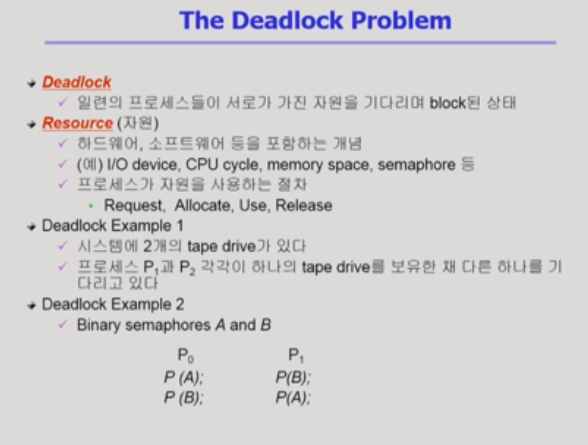
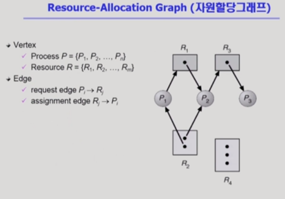
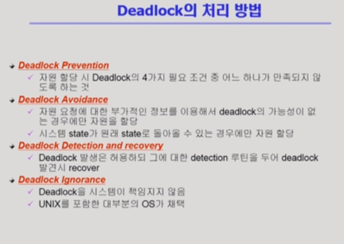
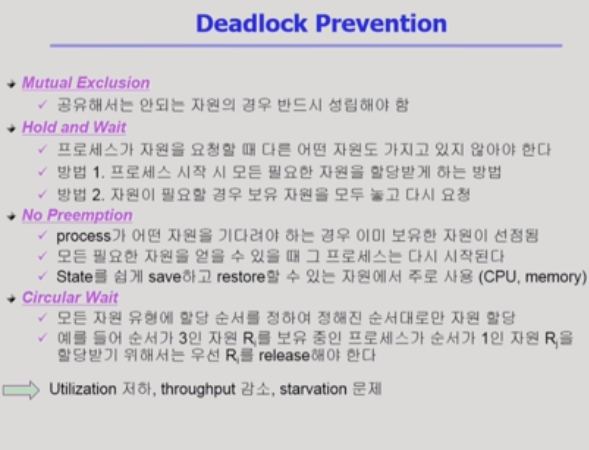
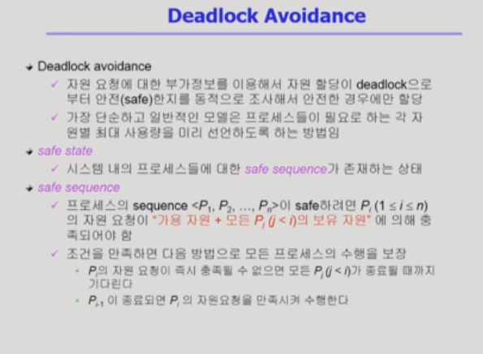
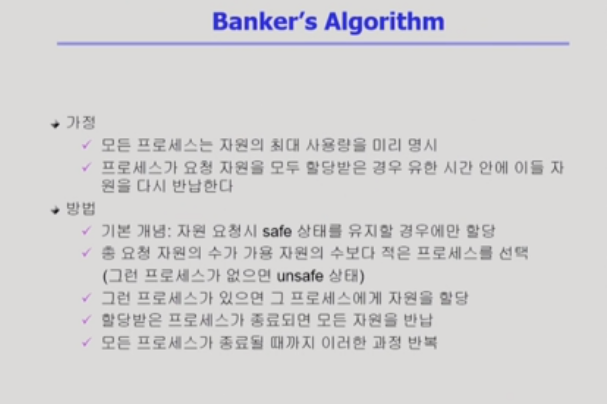

# Deadlock

[toc]

## Deadlock이란

deadlock은 `교착상태`를 의미하며, 서로(프로세스)가 양보 없이 자신이 가진 일부 자원을 내놓지 않고 상대방이 가진 자원을 요구하는 상태

- 프로세스가 자원을 사용하는 절차
  1. Request: 자원 요청
  2. Allocate: 자원 획득
  3. Use: 자원 사용
  4. Release: 자원 반납

## Deadlock 발생의 4가지 조건

.png)

#### Mutual exclusion(상호 배제)

- 자원을 동시에 함께 사용할 수 없음

#### No preemption(비선점, 빼앗기지 않음)

- 가지고 있는 자원은 빼앗기지 않음

#### Hold and wait(보유 대기)

- 내 자원은 빼앗기지 않은(돌려주지 않은) 채로, 다른 필요 자원을 기다임

#### Circular wait(순환 대기)

- 필요로 하는 자원들이 서로 꼬리를 물어 사이클을 생성하는 경우

## Resource-Allocation Graph(자원할당그래프)

Deadlock이 발생했는지를 확인하기 위해 그리는 그래프

- 동그라미 : 프로세스 / 사각형 : 자원
- 화살표
  - P ---> R : P라는 프로세스가 자원 R을 필요로 하고 요청을 보내고 있다
  - R ---> P : P라는 프로세스에 자원 R이 할당되어 있다.
- 사이클이 없다면 deadlock이 아니다. (위의 경우는 deadlock X)

.png)

- 사이클이 생겼다고 해도, 무조건 deadlock이라고 단정지을 수 없고, 자원의 인스턴스 수를 확인해봐야 함
  - 자원 인스턴스가 1인 경우 : deadlock
  - 자원 인스턴스가 여러 개인 경우 : deadlock일 수도 있고 아닐 수도 있음
- 왼쪽
  - 사이클 두 개 생성(r2-p1-r1-p2-r3-p3-r2 / r2-p2-r3-p3-r2)
  - 데드락
  - R2를 나누어가질 수 있지만, R1과 R3가 순환이 안되기 때문에, 데드락에 해당한다.
- 오른쪽
  - 사이클 형성
  - 데드락 X
  - 자원의 인스턴스가 여러개이기 때문에 P2 or P4가 자원을 반납하면 해결

## Deadlock의 처리 방법

위로 갈 수록 강한 대응이며, 현대에서는 주로 `Deadlock Ignorance`가 채택된다.

빈번히 발생하는 이벤트가 아니기에 deadlock 처리 예방에 대한 overhead를 줄이기 위한 것

#### Deadlock Prevetion(예방적 방법)

- 데드락이 발생하는 조건 중 하나를 원척적으로 막는 방법

  - mutual exclusion: 막을 수 있는 조건이 아님

  - hold and wait : 방법 1의 경우 자원에 대한 비효율성이 높아질 수 있음

  - no preemption : CPU의 timer interrupt처럼 빼앗을 수 있게 만듬. CPU나 메모리처럼 상태를 저장할 수 있는 경우가 아니라면 문제가 발생할 수 있음

  - circular wait : 자원의 순서를 미리 정해놓음

    

#### Deadlock Avoidance(예방적 방법)

프로세스가 시작될 때 평생 쓸 자원을 미리 알고 있다고 가정하고 deadlock을 방지

.png)

자원 인스턴스의 개수에 따라 달라짐

##### Single instance - Resource Allocation Graph algorithm

.png)

- 프로세스가 사용할 자원에 대해 실선(프로세스에서 자원으로만 향함)과 점선으로 표시
  - 점선 : 프로세스가 평생 한 번은 이 자원을 사용할 것이라는 것을 의미
- 최악의 경우를 가정해, 데드락의 가능성이 있다면 자원을 주지 않는 것
- 마지막 그림에서 P1이 R1을 반납해야 P1->R2를 실선으로 바꿀 수 있음

##### Multiple instances - Banker's Algorithm

.png)

- 평생 사용할 자원을 미리 명시
- 가용 자원(Available)과 Need를 비교해 Deadlock이 발생하지 않을 때만 자원 제공

#### Deadlock Detection and recovery(deadlock 발생 후 처리)

#### Deadlock Ignorance(deadlock 발생 후 처리)

