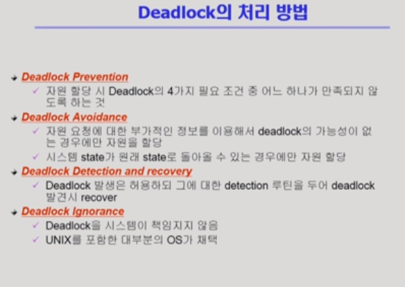
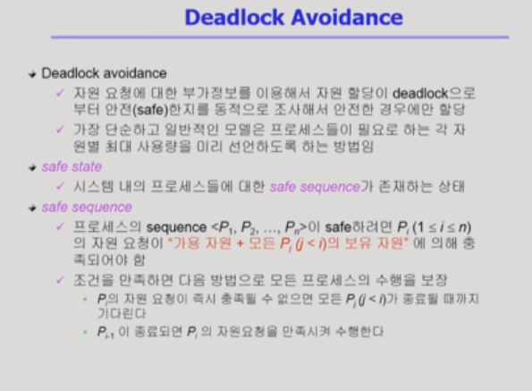
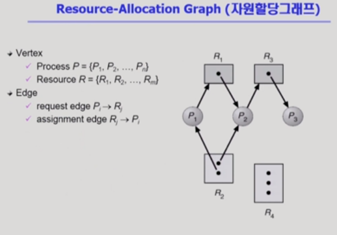
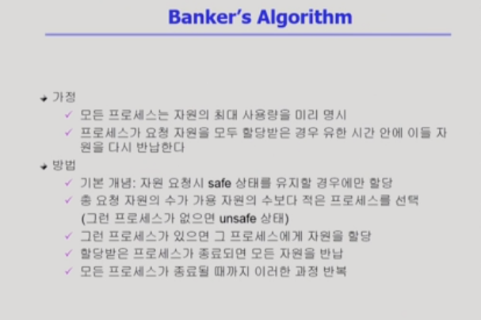
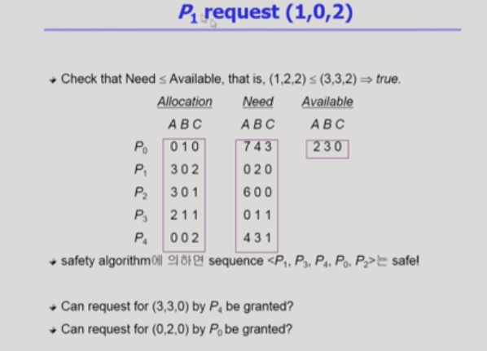
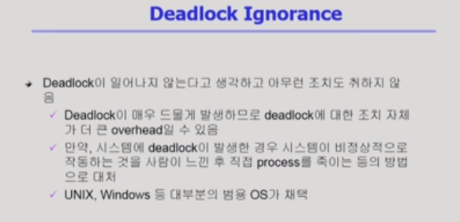
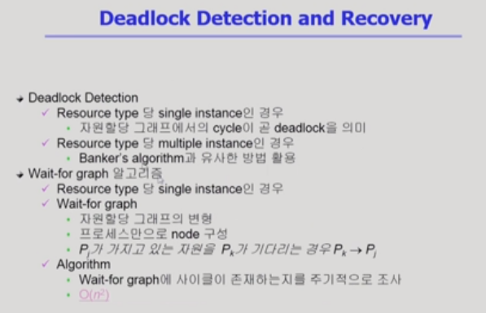
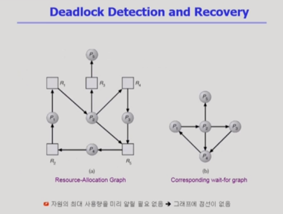
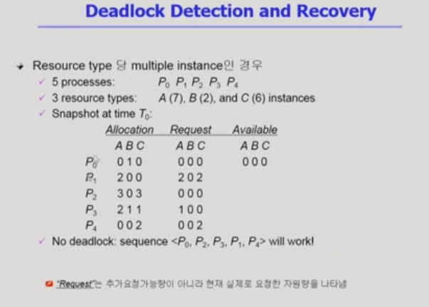
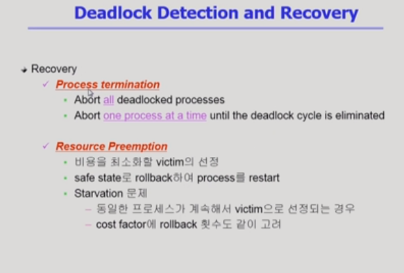

# Deadlock

[toc]

### Deadlock Avoidance(예방적 방법)

- 최대로 사용할 자원을 미리 선언 => deadlock 가능성 판단하여 자원 할당 결정

#### 자원이 하나일 때

#### 자원이 여러개 일때

.png)

- 위의 예제
  - 다섯 개의 프로세스
  - 세 개의 자원
  - Allocation: 현재 할당된 개수
  - Max: 자원을 최대로 쓸 때의 수
  - Available: 남아있는 자원의 수
- ⭐Need와 Available을 비교해서 자원 할당 결정⭐
- 최악의 경우를 가정하는 것(최대 요청을 가정하고, 가용 자원으로 처리가 가능한지를 확인)
- P0의 요청은 무조건 거절 / P1의 요청은 무조건 수락
- 데드락이 생기지 않는 상태  = safe state
- deadlock은 발생하지 않지만, 비효율적
- 가용 자원만 가지고 처리가 안되는 요청이 있다고해서 deadlock은 아니라는 것!

.png)

### Deadlock Ignorance

- deadlock를 미연에 방지하기 위해 비효율적인 방법을 쓰느니, 상황이 이상해지면 deadlock을 확인하고 해결하는 법

- 사이클을 찾는데 걸리는 시간 : O(n^2)	 cf. dfs/bfs

#### Deadlock Detection

##### 자원이 하나인 경우

- 프로세스끼리 연결하여 간결하게 작성 후 사이클 확인
  - P1 <- P4 : P4는 P1이 가진 자원을 기다리고 있다

##### 자원이 여러개인 경우

- 설명
  - 프로세스 5개
  - 자원은 3종류 : A(7) / B(2) / C(6)
  - Request: 요청
- deadlock인지 확인하는 법
  - 낙관적으로 확인하기 : P0와 P2는 요청이 없기 때문에 자원을 반납할 것이다.
  - Available => A(3) / B(1) / C(3)
  - 현재는 Deadlock이 없음

##### 자원이 여러개인 경우2. if P2의 request가 있다면?

.png)

- Deadlock
- 가용자원으로 요청 처리가 가능한게 있는지를 확인

#### Deadlock Recovery

##### Process termination

데드락에 연관된 모든 프로세스를 죽임(프로세스를 종료시키는 것🚧)

##### Resource Preemption

데드락과 관련된 프로세스를 하나씩 죽여봄(자원을 빼앗는 것🎈)

- A라는 프로세스에서 자원을 뺏어 deadlock을 없앴는데 A가 자원을 재요청한다면 같은 문제 반복 가능 => 자원을 빼앗는 패턴을 조금씩 다르게 함