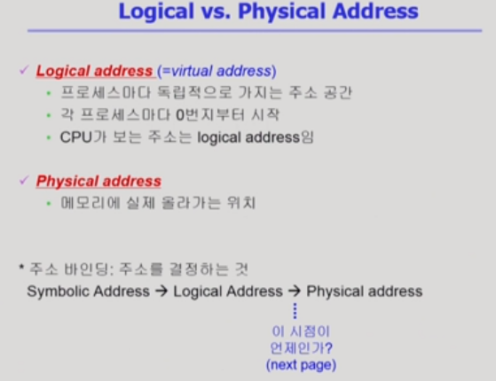
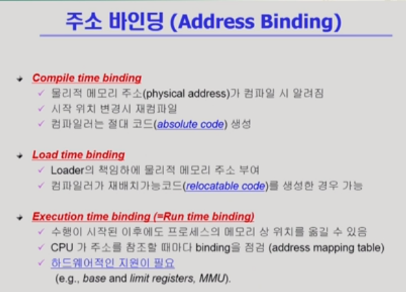
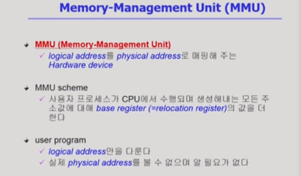
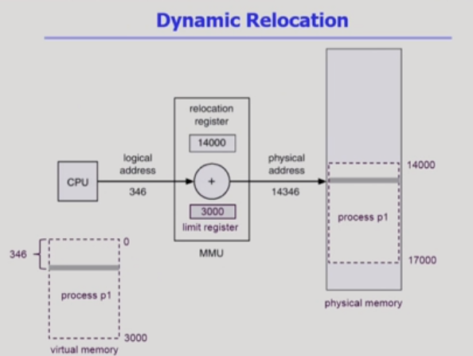
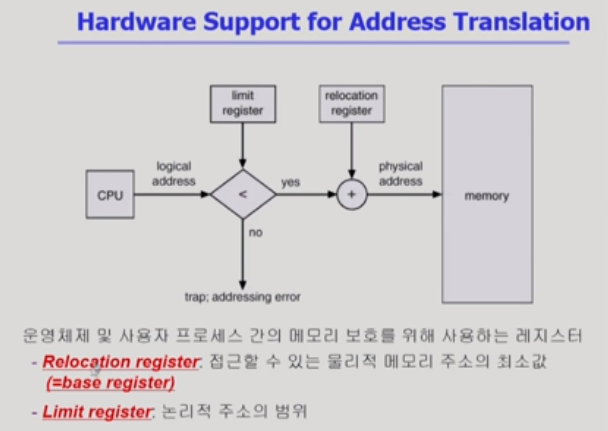
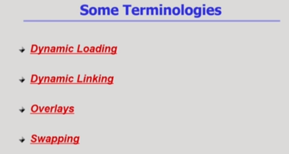
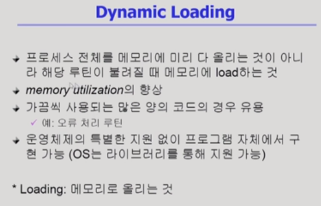
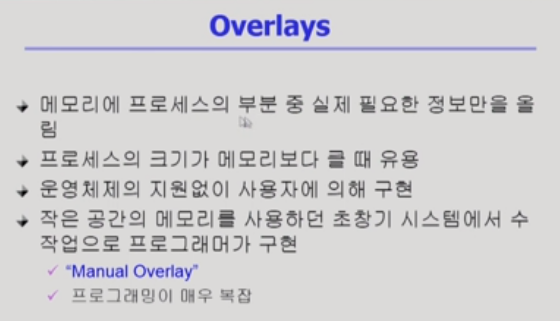
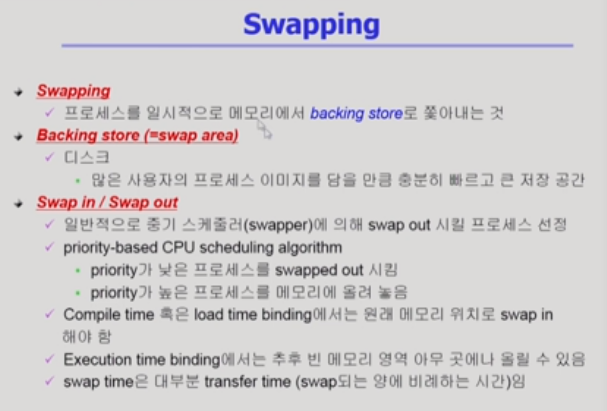

# Memory Management 1

[toc]

## 메모리 주소

- Logical address
  - 가상 주소
  - 프로그램이 시작되면 가지게 되는 주소
  - CPU가 바라보는 주소
    - 시작 주소는 바뀌어도 instruction code안의 주소는 바뀌지 않는다.
- Physical address
  - 실제 메모리의 주소
  - 아래에는 운영 체제 커널, 상위에는 여러 프로그램이 존재
- 주소 바인딩(주소 결정)
  - 어떤 프로그램이 어떤 주소로 갈지 정해지는 것
- Symbolic Address
  - 프로그래머 입장에서 숫자가 아닌 심볼(네임)로 사용하는 것

## 주소 바인딩의 시점

- Compile time binding
  - absolute code(주소 변경 시 컴파일을 새로 해야함)
- Load time binding : 실행 시작될 때
  - 위와 마찬가지로 처음에 주소 결정
- Execution time binding : 실행 중에도 가능
  - 하드웨어적 지원 필요

.png)

- Compile time binding
  - 이미 컴파일 시점에 주소가 결정되어 있음(앞의 녹색 부분)
- Load time binding
  - 500번대가 비어있으므로 논리적인 주소 0번지를 물리적인 주소 500번대로 올린다
- Execution time binding 
  - 주소가 실행 도중에 바뀔 수 있음(300번지 -> 700번지)

#### MMU(주소 변환을 위한 하드웨어 디바이스)

주소 변환을 위한 하드웨어

- 사용자 프로그램은logical address만 다룸

- relocation register(base register) : 시작 위치
- limit register : 논리적 주소 범위(최대 크기)

- limit register를 넘어가면 trap에 걸리게 된다.

## 참고 용어

### Dynamic Loading

- 해당 루틴이 불릴 때마다 loading되는 것(필요할 때 마다)
- 일반적으로 사용되지 않는 루틴을 올리는 것은 비효율적
- 페이징 시스템(운영체제가 지원)과 구분해서 생각할 것(dynamic loading은 프로그래머가 라이브러리를 통해 구현)

### Dynamic Linking

### Overlays

- 첫번째 문장은 dynamic loading과 동일
- 운영체제의 지원이 없음
- 라이브러리 없이 수작업으로 프로그래머가 구현

### Swapping

- 프로세스를 메모리에서 하드디스크로 쫓아내는 것
  - 최근에는 일부만을 쫓겨나는 것도 스와핑되었다라고 표현
- binding과 연관지어 생각(효율적 사용을 위해서는 runtime binding이 지원되어야 함)

.png)

- swap out : 메모리에서 쫓겨나서 backing store로 가는 것	cf. 중기 스케줄러
- swap in : backing store에서 메모리로 올라오는 것