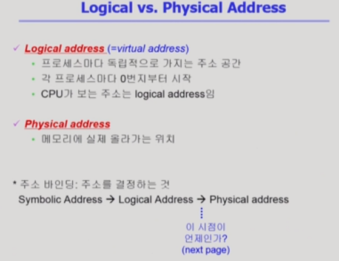
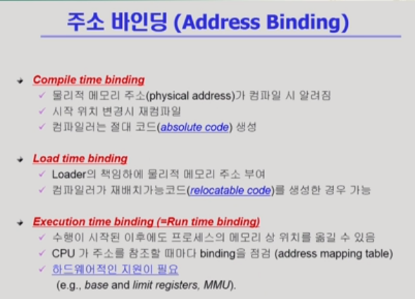
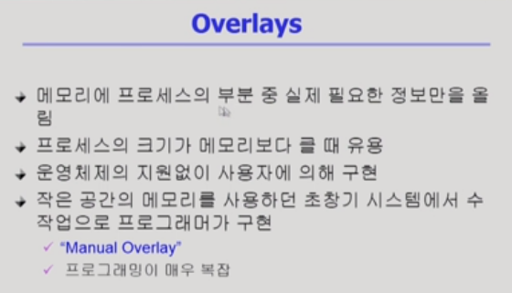
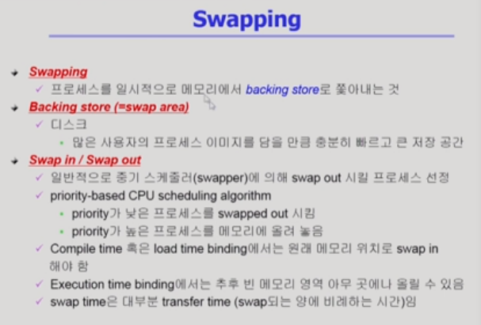
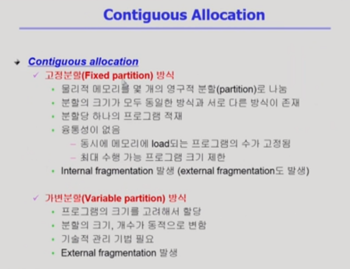
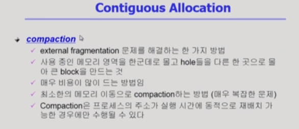
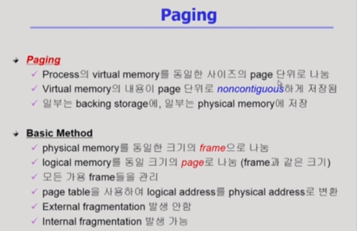

# Memory Management 1

[toc]

## 메모리 주소

- Logical address
  - 가상 주소
  - 프로그램이 시작되면 가지게 되는 주소
  - CPU가 바라보는 주소
    - 시작 주소는 바뀌어도 instruction code안의 주소는 바뀌지 않는다.
- Physical address
  - 실제 메모리의 주소
  - 아래에는 운영 체제 커널, 상위에는 여러 프로그램이 존재
- 주소 바인딩(주소 결정)
  - 어떤 프로그램이 어떤 주소로 갈지 정해지는 것
- Symbolic Address
  - 프로그래머 입장에서 숫자가 아닌 심볼(네임)로 사용하는 것

## 주소 바인딩의 시점

- Compile time binding
  - absolute code(주소 변경 시 컴파일을 새로 해야함)
- Load time binding : 실행 시작될 때
  - 위와 마찬가지로 처음에 주소 결정
- Execution time binding : 실행 중에도 가능
  - 하드웨어적 지원 필요

.png)

- Compile time binding
  - 이미 컴파일 시점에 주소가 결정되어 있음(앞의 녹색 부분)
- Load time binding
  - 500번대가 비어있으므로 논리적인 주소 0번지를 물리적인 주소 500번대로 올린다
- Execution time binding 
  - 주소가 실행 도중에 바뀔 수 있음(300번지 -> 700번지)

#### MMU(주소 변환을 위한 하드웨어 디바이스)

주소 변환을 위한 하드웨어

- 사용자 프로그램은logical address만 다룸

- relocation register(base register) : 시작 위치
- limit register : 논리적 주소 범위(최대 크기)

- limit register를 넘어가면 trap에 걸리게 된다.

## 참고 용어

### Dynamic Loading

- 해당 루틴이 불릴 때마다 loading되는 것(필요할 때 마다)
- 일반적으로 사용되지 않는 루틴을 올리는 것은 비효율적
- 페이징 시스템(운영체제가 지원)과 구분해서 생각할 것(dynamic loading은 프로그래머가 라이브러리를 통해 구현)

### Overlays

- 첫번째 문장은 dynamic loading과 동일
- 운영체제의 지원이 없음
- 라이브러리 없이 수작업으로 프로그래머가 구현

### Swapping

- 프로세스를 메모리에서 하드디스크로 쫓아내는 것
  - 최근에는 일부만을 쫓겨나는 것도 swap out되었다라고 표현
- binding과 연관지어 생각(효율적 사용을 위해서는 runtime binding이 지원되어야 함)

.png)

- swap out : 메모리에서 쫓겨나서 backing store로 가는 것	cf. 중기 스케줄러
- swap in : backing store에서 메모리로 올라오는 것

### Dynamic Linking ⭐⭐⭐

.png)

- Linking : 링크를 통해 실행 파일을 만듬. 여러 군데 존재하던 컴파일 파일을 묶어서 하나의 실행 파일을 만드는 것.
- Static linking : 라이브러리가 프로그램의 실행 파일 코드 안에 포함되는 경우
  - 동일한 라이브러리 코드가 계속 메모리에 올라감(별도의 프로그램에 속한거기 때문)
- Dynamic linking : 라이브러리 코드가 컴파일(실행 파일) 안에 포함되지 않고, 실행 파일에는 라이브러리가 별도로 존재하고 그 라이브러리를 위치를 찾을 수 있는 포인터인 **stub**만이 존재
  - shared 라이브러리
  - 라이브러리 코드가 이미 존재한다면 다시 메모리에 올리지 않음

## Allocation of Physical Memory

물리적인 메모리를 어떻게 관리할 것인가

- 메모리의 두 영역
  - 낮은 주소 영역 : OS 상주 영역
  - 높은 주소 영역 : 사용자 프로세스 영역
    - 사용자 프로세스 영역의 할당 방법
      - Contiguous allocation(연속 할당)
      - Noncontuguous allocation(비연속 할당)

### Contiguous allocation

.png)

#### 고정분할 방식

프로그램이 들어갈 사용자 영역을 미리 분할해 놓는 것

.png)

- 낭비 조각 발생
  - 외부 조각 : 올리려는 프로그램보다 메모리 크기가 작은 경우
  - 내부 조각 : 프로그램의 크기가 분할된 메모리 크가보다 작은 경우. 할당은 되지만 사용 X

#### 가변 분할 방식

사용자 프로그램이 들어갈 영역을 미리 나누어 놓지 않는 것

.png)

- 가변 분할 방식을 사용하더라도 프로그램 크기가 동일하지 않기 때문에 **외부 조각**이 생길 수 있음
- hole : 가용 메모리 공간(비어있는 메모리 공간)

##### Dynamic Stroage-Allocation Problem

.png)

- 어느 hole(Size n)에 프로그램을 넣어야 하는가
- First-fit
  - Size n 이상의 것 충 최초로 찾아지는 hole
  - overhead가 상대적으로 적음
- Best-fit
  - hole을 다 살펴본 후 가장 잘 맞는 hole에 할당
  - 미래를 위해 좋음
- Worst-fit
  - 가장 큰 hole에 할당
  - 차후 더 큰 사이즈의 프로그램이 발생할 경우에는 좋지 않은 결정

##### Compaction

- hole을 한 곳으로 몰아 큰 block을 만드는 것
- 비용이 많이 든다.
- runtime binding이 지원되어야 한다.

- 최소한의 이동을 통해서 큰 hole을 만들 수 있다면?

### Noncontiguous allocation

#### Paging

프로그램을 구성하는 주소 공간을 같은 크기의 페이지로 분할

페이지 단위로 물리적인 메모리에 올리거나 baking store에 내리거나 하는 것

cf. page frame(물리적 공간)

- hole, dynamic allocation과 같은 문제가 발생하지 않음
- 주소 변환이 복잡해짐
- page table : 주소 변환을 관리하는 배열
- internal fragmentation : 프로그램의 크기가 페이지 크기의 배수가 될 것이라는 보장이 없기 때문

#### Segementation

프로그램의 주소 공간을 의미 있는 단위로 분할하는 것

코드 / 데이터 / 스택를 구역으로 나눠서 진행

크기가 균일하지 않음

- hole과 같은 문제는 동일하게 발생(크기가 각각 다르기 때문)

#### Paged Sementation
