# Memory Management 2

[toc]

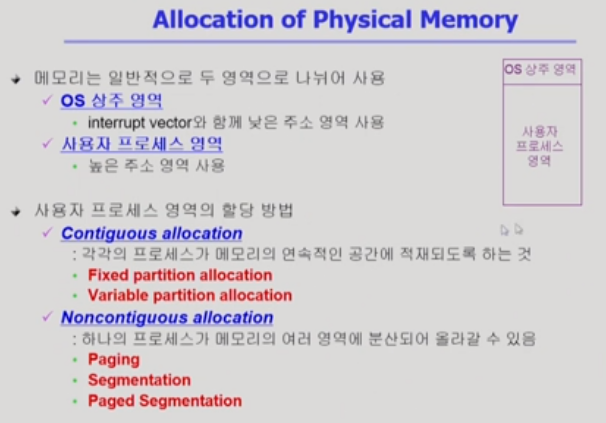

## Review

- 지난 시간에는 물리적인 메모리 관리 기법 중, 사용자 프로세스를 연속적으로 할당하는(즉, 통째로 올리는) 방법을 배움
- 위의 방법은 각 프로그램의 주소 체계를 물리적인 메모리 주소 체계로 바꾸는 것이 쉽게 바뀜(register를 이용해 변환)

## TIL

### Paging

- 페이지별 주소 변환이 필요

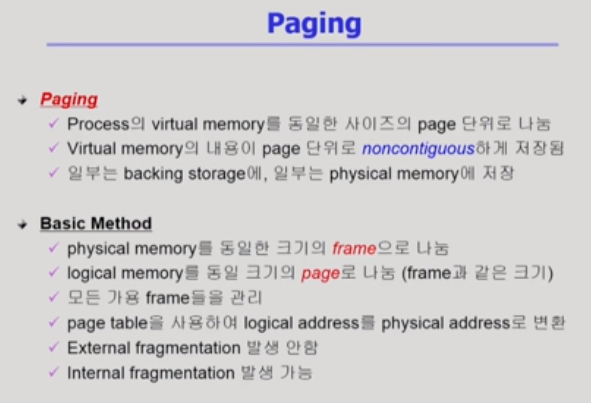

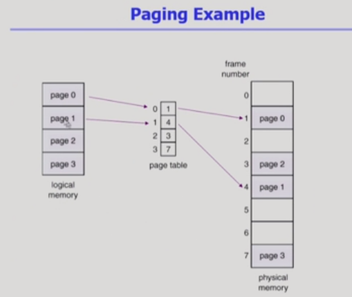

- 프로그램을 구성하는 논리적인 메모리를 동일한 크기의 페이지로 잘라서 페이지별로 물리적인 메모리의 비어있는 위치에 적절히 할당
- page table 
  - paging에서 주소 변환을 위해 사용
  - 논리적인 페이지들이 물리적인 메모리 어디에 위치하는가
  - page frame : 물리적인 메모리에서 페이지가 들어갈 수 있는 공간
  - 논리적인 페이지의 개수만큼 엔트리가 존재

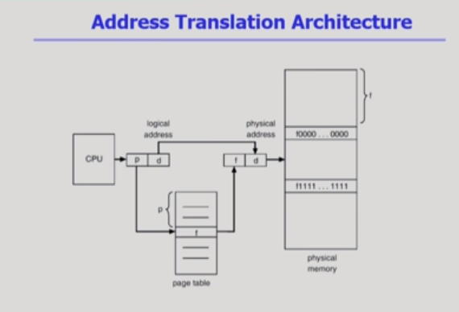

- CPU가 논리적인 주소를 주면 물리적인 메모리 상에 주소를 바꿔서 저장
- p : 페이지 주소
- f : 프레임 위치
- d : 오프셋(변하지 않음)

#### Page table

- 페이지 테이블의 용량이 굉장히 큼
  - 프로그램마다 페이지 테이블 별도로 존재
- 메모리에 상주 => 2번의 메모리 테이블 접근 필요
  - 주소 변환을 위한 접근
  - 실제 데이터를 위한 접근

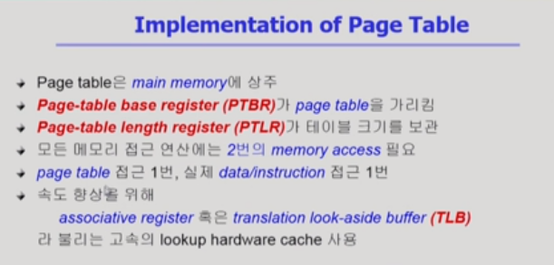

- 속도 향상을 위해 TLB (일종의 캐시) 사용
  - CPU와 메인메모리 사이에 사용
  - 빈번히 참조되는 페이지 엔트리를 저장
  - 페이지 테이블의 전체 정보가 아닌 일부를 담고 있는 것
  - p / f를 쌍으로 가지고 있어야 한다.
  - 전체 searching 필요 <=> 테이블에서는 인덱스로 접근 가능
  - 프로세스마다 달라짐

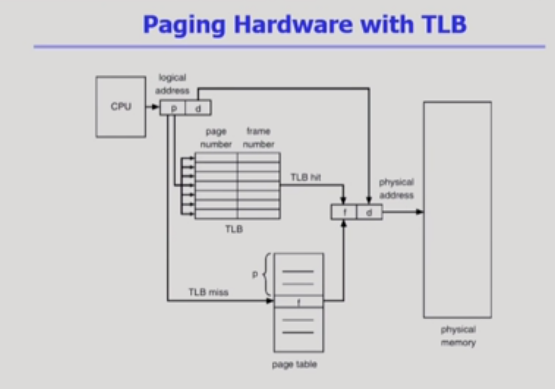

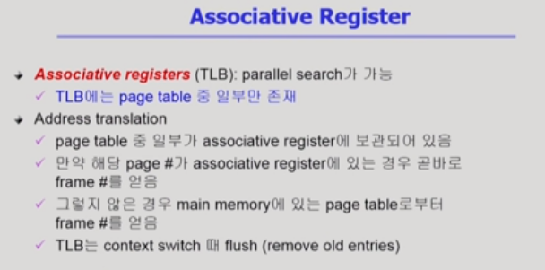

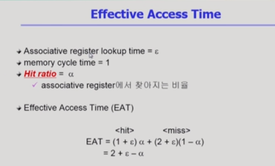

- Hit ratio : TLB로부터 주소 변환되는 비율(1에 가까움, 입실론은 1보다 훨씬 작은 값)
- 페이지 테이블로만 접근하는 2보다 훨씬 적은 시간

#### Two-Level Page Table

- page table이 두 단계로 구성
- 페이지 테이블을 위한 공간을 줄이기 위한 것(시간은 조금 더 걸림)
- 사실 공간도 손해지(바깥쪽에 새로운 테이블이 생김)만, 사용되지 않는 공간, 즉 낭비를 줄이는 것
- 주소가 매우 크기에 일단계 페이징은 1M의 페이지 테이블 엔트리가 필요

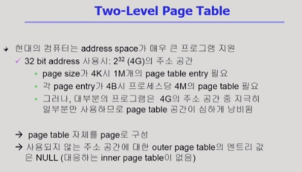

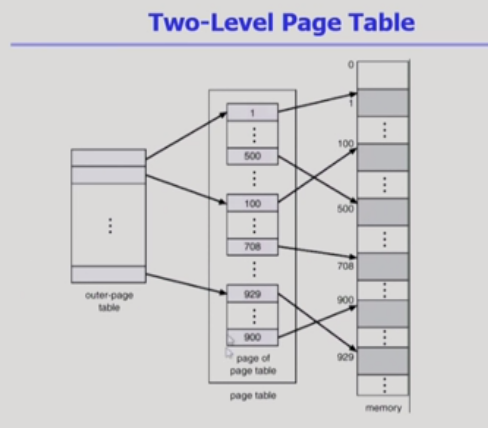

- 안쪽 페이지 테이블(가운데 네모 안의 테이블) 크기가 페이지 크기와 같음(4KB)
- 테이블 안의 엔트리 하나당 4 bit -> 1K를 집어넣을 수 있음

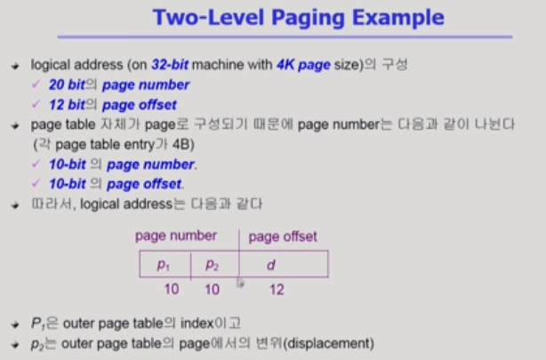

- 페이지 하나의 크기 = 4KB(2^12) => 12 bit 필요
- 안쪽 페이지 테이블 4KB / 테이블 안의 엔트리 하나당 4 bit -> 1K(2^10)개 존재 => 10 bit 필요

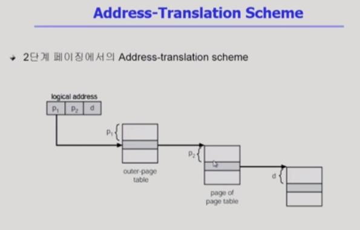

