# Memory Management 3

[toc]

## Paging

### Multilevel Paging and Performance

- Two-level 이상의 단계를 거치는 페이지 테이블을 사용 가능
- 더 많은 단계를 사용하며 페이지 테이블에 대한 메모리는 줄일 수 있음
- BUT, 주소 변환 시 많은 ==**페이지 테이블을 거쳐야 하고 메모리 접근 하는데 오래 걸림**==(ex. 4단계 : 4번의 주소변화 + 1번의 실제 주소 접근)
- TLB를 사용하면 위의 메모리 접근 시간을 줄일 수 있음(4단계: 500ns -> 128ns)

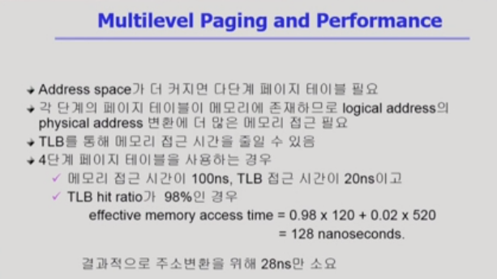

#### Page table  추가 정보

##### 1. valid/invalid

- page table에는 주소 변환 외에도, 여러 정보가 존재
- valid/invalid bit => 0으로 표시된 사용되지 않는 부분(사용되지 않는 엔트리)이 정말 의미가 없는 것인지 혹은 0을 가르키고 있는지를 판별하기 위한 것

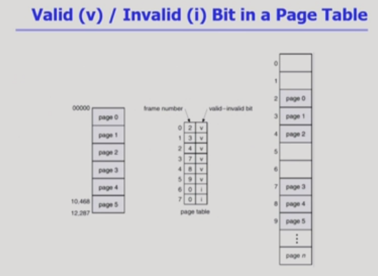

##### 2. Protection bit

- Protection bit 역시 추가적인 정보로 제공
  - 해당 페이지의 연산에 대한 접근을 나타냄
  - code와 같은 부분은 사용자로부터 수정을 막기 위해 read-only / data나 stack은 read&&write 권한 부여

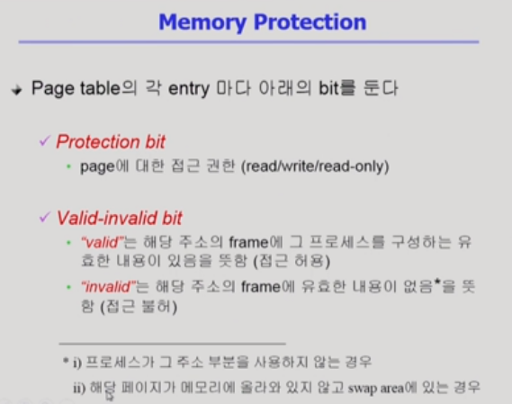

### Inverted Page Table

- 페이지 테이블 자체가 메모리를 많이 차지한다는 문제를 해결하기 위해 만듬
- 프로세스마다 존재하던 페이지 테이블이 **==단 하나==**로 존재
- 엔트리가 프로세스의 페이지 수만큼이 아니라, 물리적인 메모리 페이지 수만큼 존재
- 논리주소에 해당하는 물리적인 주소를 찾기 위해서는 엔트리를 다 찾아봐야 함 => 시간적인 overhead 발생(공간적 overhead는 감소)
- 주로 associative register을 사용하여 병렬적으로 탐색이 가능하게 하여 시간적인 overhead를 줄일 수 있음

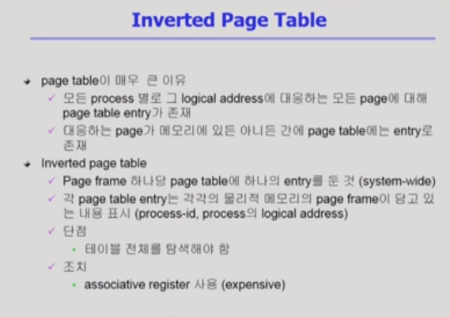

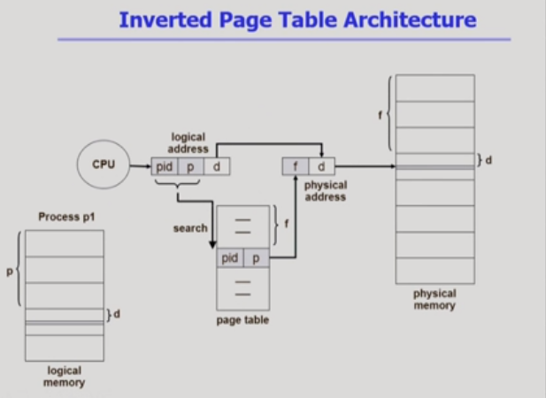

#### Shared Page

- 여러 개의 프로그램이 같은 코드를 쓸 때 중복을 제거하는 것

- 공유할 수 있는 코드(동일한 코드)는 한 번만 올림
- 제약 조건
  - read-only로 세팅
  - 동일한 논리적 address space에 위치해야 함

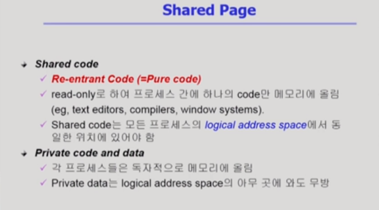

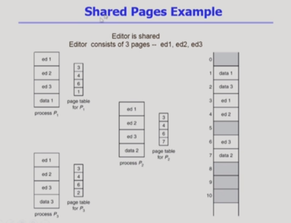

## Segment

- 의미 단위로 segment 구성
- 논리적 주소는 1. segment-number과 2. offset(세그먼트 안에서의 위치)으로 구성

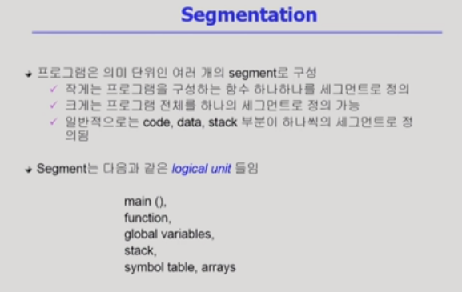

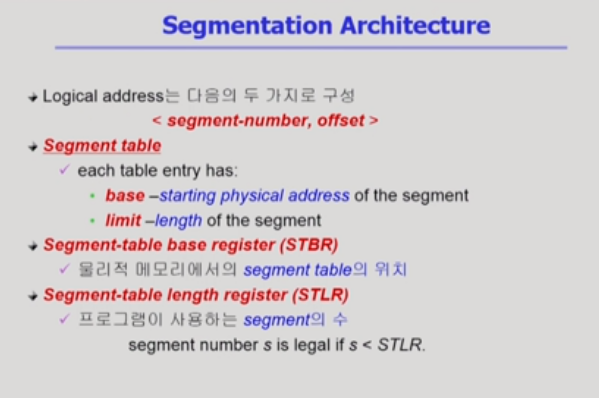

- STBR(시작 주소)에서 세그먼트 번호 떨어진 위치에 가면 물리적인 위치 찾을 수 있음
-  limit : paging과 달리 의미단위로 분리해 길이가 일정하지 않음으로 리밋을 제공
- 세그먼트 번호가 STLR보다 적어야함
- 세그먼트 길이보다 오프셋이 더 크지 않아야 함
- 오프셋이 세그먼트 최대 길이 제한 

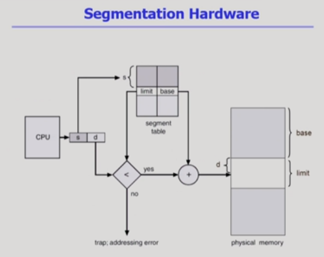

- 의미 단위로 쪼개기에 보완과 공유에 있어서 효과적

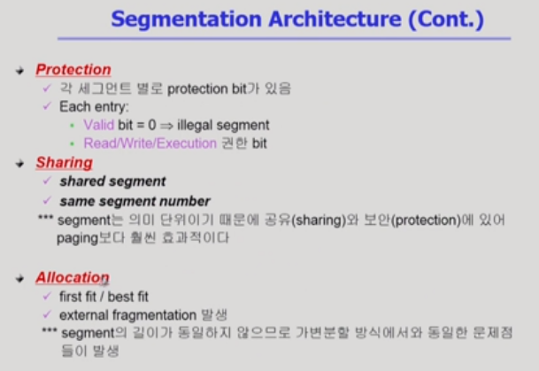