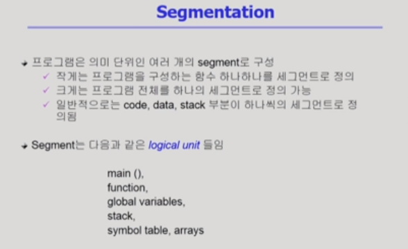
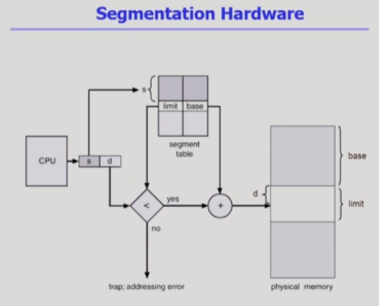
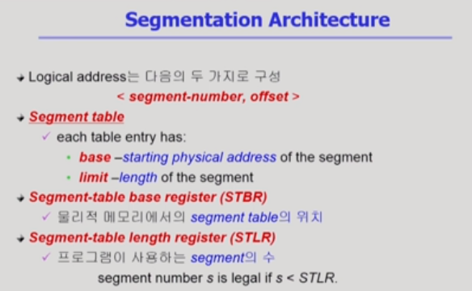
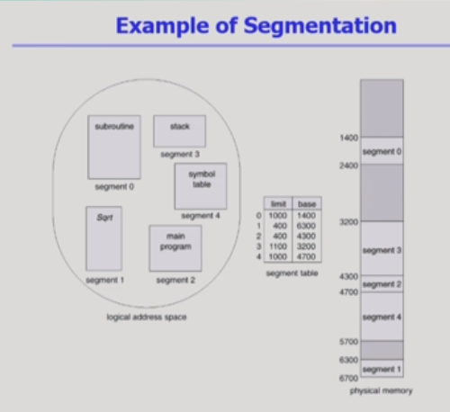
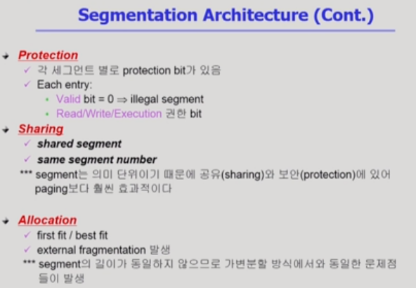
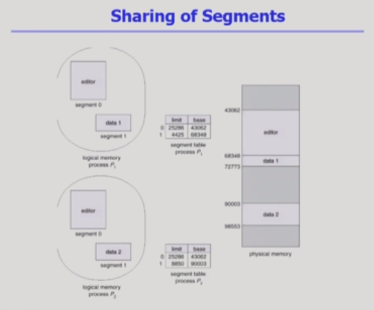
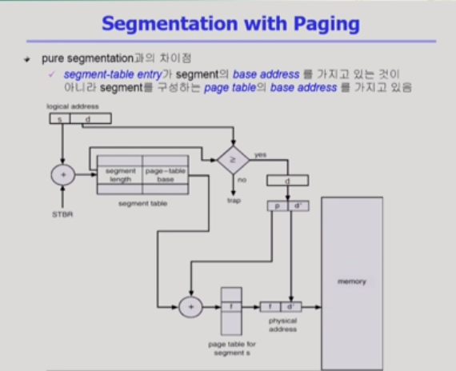

# Memory Management 4

[toc]

## Segmentation

- 프로세스의 주소 공간을 의미 단위인 세그먼트로 나눠서 올리는 방식
- 세그먼트 테이블을 이용해 주소 변환
- 논리주소 = 세그먼트 번호 + 세그먼트 안에서 얼마나 떨어졌는지를 의미하는 부분(offset)
- 세그먼트 안에는 엔트리가 몇 개 존재한는가? 세그먼트의 수만큼
- 의미 단위로 자르기 때문에 크기가 일정하지 않음 => 세그먼트의 길이가 얼마인지도 세스먼트 엔트리에 담고 있음

- STBR : 세그먼트의 시작 위치를 담고 있음
- STLR : 세그먼트의 길이(엔트리 개수)를 담고 있음
- 세그먼트 번호가 STLR보다 크거나 같으면 잘못된 요청(존재하지 않는 물리적 주소에 접근)

- paging 기법은 페이지 구성 개수가 많아서 테이블을 위한 메모리 낭비 발생
- 세그먼트는 의미단위로 나누기 때문에 테이블의 수가 적음(메모리 방비가 비교적 적음)

- 공유나 보안은 세그먼트가 유리
  - 크기가 아니라 의미 단위로 하는 일이기 때문
- 할당은 균일하게 공간을 나누는 페이징이 유리

- 세그먼트를 서로 다른 두 개의 프로세스가 공유하는 예제
  - 같은 논리적인 주소 상에 존재해야 함(같은 세그먼트에 존재)

## Paged Segmentation(Segmentation with Paging)❓

- 세크먼트 하나가 여러 개의 페이지로 구성(메모리에 올라갈 때 페이지로 나눠서 올림)
- 방법
  - 먼저 세그먼트에 대한 주소 변환 진행
  - 세그먼트 테이블 탐색 => 페이지 테이블의 시작 위치 
  - 해당 페이지 테이블을 탐색(페이지 엔트리는 세그먼트 테이블에 담아놓는다)
- allocation 문제 해결
- 공유나 보안은 세그먼트 레벨에서 진행

##### 위의 일련의 과정들은 운영체제가 아닌 하드웨어가 해야하는 것

- CPU를 가지고 메모리 접근할 때마다 운영체제가 개입하는 것이 아닌 하드웨어가 개입

- 운영체제는 I/O 접근할 때 개입

