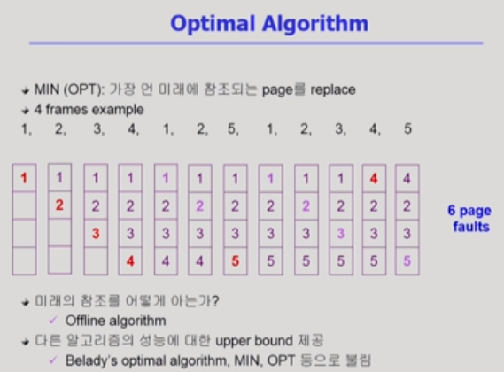
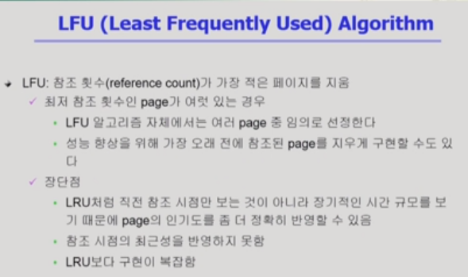

# Virtual Memory 1

[toc]

물리적인 메모리의 주소 변환은 운영체제가 관여하지 않는다.

가상 메모리 기법은 전적으로 운영체제가 관여한다.

## Demand Paging

- 요청이 있으면 주소를 메모리에 올린다.
  - I/O 양의 감소
  - 물리적 메모리 사용량 감소
  - 더 많은 사용자 수용
  - 빠른 응답 시간 기대 가능
- Invalild bit
  - 물리적인 메모리에 올라와 있지 않고 backing store에 있음(오른쪽)
  - 사용되지 않는 주소 영역인 경우(왼쪽)
  - demand page -> 최초에는 Invaild였다가 페이지가 올라가면 vaild로 바뀜
  - 요청한 페이지가 Invaild인 경우 => page fault => CPU는 운영체제에게 넘어감

- Invaild Page 접근 => trap(page fault trap) => CPU가 운영체제에게 넘어감 => page fault handler  실행
  - 잘못된 요청이 아닌지 확인
  - 정상적인 요청이라면, 빈 페이지 획득(없으면 뺏어옴)
  - 디스크에서 그 페이지를 메모리에 올림(느린 작업 => CPU를 뺏어서 block 상태로 만들어주고 ready 상태 프로세스에게 넘겨줌)
  - 이 프로세스가 CPU를 잡고 다시 running
  - 아까 중단되었던 insrtuction 재개

### Page fault

- page fault가 얼마나 발생하는가에 따라 메모리 접근 시간이 크게 차이남(디스크 접근)
- 대부분의 경우는 page fault가 발생하지 않지만, 발생한다면 시간이 많이 걸림

#### Page replacement

- 빈 페이지가 없는 경우(쫓아내야 하는 경우)
- page fault를 최소화(0에 가깝게)하는 것이 목표

- 쫓겨난 것은 invaild로, 추가된 것은 vaild로 바꿔주는 일련의 과정을 운영체제가 하는 것

#### Optimal Algo(미래를 안다고 가정)

- page fault를 가장 적게 발생시키는 알고리즘
- 미래를 reference string을 알고있다는 가정 하에 쓰는 알고리즘
- 가장 먼 미래에 참조되는 page를 replace
- 빨강색은 page fault, 연보라색은 참조에 대해 메모리에서 직접 참조된 경우
- 미래를 안다고 가정하는 것이기에 실제 시스템에서는 사용 불가

- 다른 알고리즘 성능에 대한 upper bound 제공(아무리 좋은 알고리즘을 만들어도 이것보다 좋을 수는 없다)

#### 미래를 모르는 상태에서 사용 가능한 알고리즘

미래를 모를 때는 과거를 참조하여 예상

##### FIFO Algo

- 먼저 들어온 것을 먼저 내쫓음(들어온 것을 기준으로)
- 메모리 크기를 늘려줘도 page fault 수가 증가하는 기묘한 현상 발생 => FIFO Anomaly

##### LRU Algo

- 가장 오래 전에 사용된 것을 삭제(사용된 것을 기준으로)

##### LFU Algo

- 가장 덜 사용한 것을 쫓아내자(과거 사용 빈도를 기준으로)

##### LRU와 LFU의 장단점

- LRU의 단점: 마지막 참조 시점만 보기 때문에 이전에 어떤 기록을 가지고 있는지는 확인하지 않는다.
- LFU의 단점: 비록 가장 적게 참조하긴 했지만, 이제 막 참조가 시작된 페이지를 쫓아낼 수가 있음

##### LRU와 LFU 알고리즘 구현

- LRU
  - 메모리 안의 페이지를 참조 시간에 따라서 줄을 세움
  - 아래로 갈수록 최근
  - linked_list 형태로 관리됨
  - 최근 참조된 것을 맨 아래 추가 / 쫓아낼 때는 맨 위에 것을 제거
  - O(1) complexity
  - 만일, 페이지마다 참조시간을 기록한다면 O(n) complexity이 걸려 비효율적

  

- LFU

  - 메모리 안에 참조 횟수를 기준으로 위처럼 바로바로 줄을 세울 수 없음(비교 필요)
  - 비교를 통해 자리를 바꿈

  
  - heap을 통해 문제 해결

