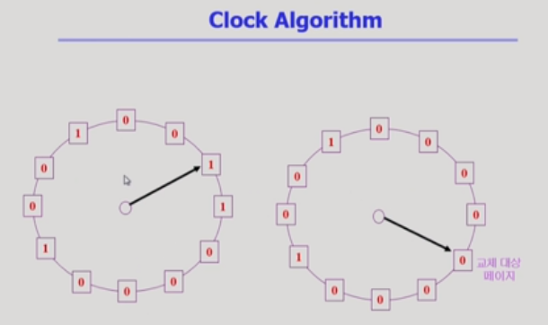

# Virtual Memory 2

[toc]

이전 시간 가상 메모리에서 어떤 메모리가 쫓겨나야 할 때 어떤 것이 쫓겨날지 결정하는 replace algo에 대해 공부했는데, 사실 이런 시스템은 가상 메모리에서 뿐만 아니라 컴퓨터 시스템 내에서 캐싱이라고 하여 다양한 곳에서 사용되고 있음

## 캐싱

- 한정된 빠른 공간에 데이터를 저장했다가 사용하는 것(속도 up)
- example
  - 캐시 메모리 : CPU에서 메모리에 접근할 때, 메인 메모리와 CPU 사이에 존재하여 속도를 높이는 것
  - buffer caching : file 시스템에 대한 read/write 요청을 메모리에서 빠르게 서비스하는 것
  - Web caching : 내 컴퓨터에 이미 읽어온 웹 페이지를 저장하는 것
  - 앞의 두개는 단일 컴퓨터 내에서 수행하는 것, 웹 캐싱은 지리적으로 떨어져 있는 것
- 어떤 것을 삭제할 지 고민하기 위해 시간을 너무 많이 사용하면 안된다. (LRU => O(1) / LFU => O(log n) 만족)

- 사실 페이징 시스템에서 더 엄청난 제약 조건 존재
  - 주소 변환은 하드웨어적으로 수행하는 일(vaild의 경우)
  - page fault가 발생하는 경우(I/O에 접근 / trap에 걸림 / 그 과정에서 필요하면 replacement 수행)
  - 메모리에 그 페이지가 있으면 메모리(언제 올라왔는지, 몇 번 쓰였는지 등)와 관련된 대한 정보가 없고, page fault가 나면 그 페이지가 언제 메모리에 올라왔는지 등의 정보를 알 수 있음 => 가상 메모리에서는  LRU/LFU와 같은 알고리즘 사용 불가(버퍼나 웹 캐싱 등에서 사용 가능)
  - Clock Algorithm 사용

### Clock Algorithm

- LRU 근사 알고리즘(NUR / NRU(가장 오래전에 사용한 것을 모르기에 최근 사용하지 않은 것으로 접근))

- 동작 원리

  - 네모 : 페이지 프레임

  - reference bit
    - 최근 참조가 되었으면 1로 표시되어 사용되었다고 표시(하드웨어가 하는 일)
    - 쫓아내야 할 것을 찾으며 보다가 1을 만나면 0으로 바꿔주고 다음 것 확인, 0을 만나면 그것을 쫓아냄(LRU와 정확히 동일하게 움직이진 못하지만,어느 정도 비슷하게 작동)
  - modified bit(dirty bit)
    - 어떤 페이지가 참조된건 read일 수도 있지만, write일 수도 있음
    - 어떤 페이지가 쫓겨날 때 modified bit이 0이면 수정이 발생하지 않았다 => 쫓아내기만 하면 됨
    - 어떤 페이지가 쫓겨날 때 modified bit이 1이면 수정이 발생했다(write) => 수정된 내용을 저장하고 쫓아냄
    - modified bit이 0인걸 우선적으로 쫓아낸다면 조금 더 빠를 수 있음

  

## Page Frame의 Allocation

- page fault를 줄이기 위한 것
- 각각의 프로그램에게 어느 정도의 메모리 페이지를 나눠주자

- Eqaul allocation
  - 모든 프로그램에 동일하게 할당
- Proportional allocation
  - 프로그램 크기에 비례 할당

- Priorty allocation
  - 프로그램 priorty(cpu 우선 순위가 높은 것)에 따라 할당

## Global vs. Local Replacement

- Global replacement
  - LFU/LRU와 같은 알고리즘을 사용하면 알아서 메모리 할당량이 조절된다
  - 다른 프로그램의 페이지도 쫓아낼 수 있는 방법
- Local replcaement
  - 자신에게 할당된 페이지를 쫓아내는 방법

- page fault가 빈번히 발생하는 상황

- x축 : 메모리에 올라와있는 프로그램 수(프로세스 수)
- 너무 적으면 CPU가 노는 시간 발생
- 많아질 수록 CPU 유지 시간이 길어짐
- 일정 수준을 넘어가면 page fault 발생
- I/O 접근 필요
- CPU 유지 시간이 작아짐 => CPU 유지 시간이 적은 것으로 판단해 프로세스 추가(잘못된 판단, 앞선 상황으로 생각) => 문제 심화 
- ==동시에 올라갈 수 있는 할당량을 조절해 줘야 함== => working set &&PFF

### Global Replacement

#### Working-Set Model

- working set : 어떤 프로그램이 실행되며 그 순간에 메모리에 꼭 올라와 있어야하는 페이지들의 집합(한 번에 올라와있어야 함)

![assets/02/image-20210906205058105.png)

- working set을 미리 알 수 없음 => 과거를 통해 추정
- 과거 델타 시간 동안 참조된 페이지들을 쫓아내지 않는 것
- working set의 크기는 변화한다(아래 예시 참조)
- 참조된 시간을 제외하고는 버림

#### PFF(Page-Fault-Frequency) Scheme

- page-fault rate을 확인하여 page fault를 많이 일으키는 프로그램에게 메모리를 더 주는 것
- 반대로, page-fault가 너무 발생 안하는 프로세스는 메모리를 좀 빼앗음
- 일정 수준의 page-fault 유지
- 더 줄 메모리가 없는 경우 통째로 swap out 시킴

## Page Size 결정

- 메모리 사이즈가 커지면, 페이지 사이즈도 커져야 함

