# File System Implementation

[toc]

## 디스크에 파일을 저장하는 방법

- 파일은 크기가 균열하지 않지만, 디스크를 동일한 크기로 나눠 섹터 단위로 이용
- 각각의 블록 = 논리적인 블록
- 메모리 관리의 페이징 기법과 유사

### Contiguous Allocation

- 연속된 방법
- 단점
  - 외부조각 발생 가능(비어있는 공간보다 파일들의 길이가 길다면, 빈공간 발생)
  - file grow가 어려움(제약이 존재함, 뒤의 빈 블록을 고려해야 함)
  - 파일 크기가 커질 때를 고려해 빈 공간을 준다면 내부 조각 발생(할당 되었는데 사용되지 않는 공간 발생)
- 장점
  - 빠른 I/O 가능(접근 시간을 줄일 수 있음)
  - swapping 용도로 좋음(공간 효율성보다 시간 효율성이 중요하기 때문, 금방 지워질 것)
  - real time 용
  - 직접 접근 가능(앞을 걸치지 않고 앞에서부터 5번째 위치한 블록으로 바로 접근 가능)

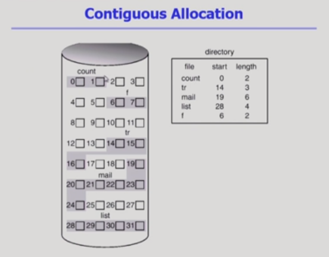

### Linked Allocation

- 연속적으로 할당하는 것이 아닌 빈공간에 할당하는 것
- 시작위치만 디렉토리에 저장하고, 디스크에 다음 위치 저장
- 장점
  - 외부 조각 발생 X
- 단점
  - 직접 접근 불가능(앞의 위치를 다 탐색해야 함)
  - reliability 문제 : 한 sector가 유실되면 그 뒤에도 유실
  - 다음 위치를 저장해야 하기 때문에 공간 효율성이 떨어짐

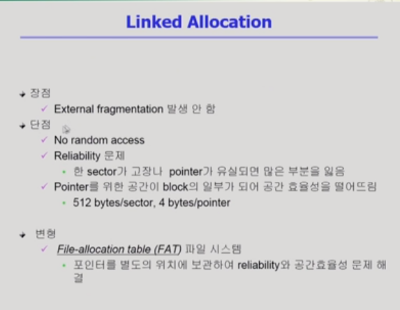

#### FAT(File allocation table)

- Linked Allocation을 활용하되, 공간 효율성을 높인 방법(뒤에 참조)

### Indexed Allocation

- 디렉토리에 인덱스 정보를 저장

- 장점

  - 직접 접근 가능
  - 외부 조각 발생 X

- 단점

  - 아무리 작은 파일이더라도 두 개의 블록 필요(인덱스 저장 블록/실제 데이터 저장 블록)

  - 굉장히 큰 파일일 경우 하나의 인덱스 파일로 표시 불가 

    cf. linked schema(인덱스 마지막에 다음 인덱스 위치 저장) / multi-level index(인덱스 안의 데이터가 또 다른 인덱스 위치를 가르키게 만드는 것) 사용

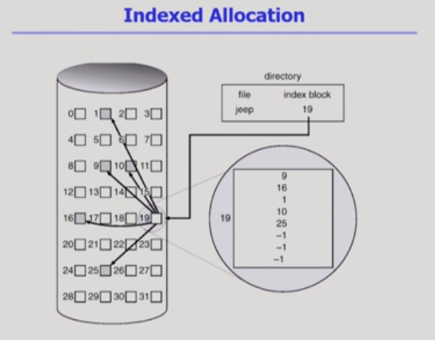

## 실제 시스템에서 어떤 파일 시스템을 어떻게 쓰는가?

### UNIX 파일시스템의 구조

- Partition(=Logical Disk)
  - Boot block(어떤 파일 시스템이건 가장 먼저 나옴)
  - Super block : 파일 시스템에 대한 총체적인 정보(어디가 빈 블록이고 어디가 사용중인 블록인지 그리고  inode list 데이터 정보)
  -  Inode list : 실제 파일의 메타데이터가 있는 위치(파일의 위치 정보는 index allocation 사용)
    - 크기에 따라 위치 정보 구성(direct(파일 위치) / single indirect (인덱스-파일 위치)/ double indirect(인덱스-인덱스-파일위치))
  - Data block : 파일의 이름은 디렉토리가 가지고 있음

### FAT File System

- 직접 접근이 가능하다!(FAT이라는 작은 테이블 내에서 확인하는 것이기 때문에)
- Linked allocation의 한계를 모두 극복한 것

- Partition(=Logical Disk)
  - Boot block
  - FAT : 파일의 메타 데이터 중 일부(위치 정보만, 나머지는 디렉토리에)
    - data block 개수만큼 존재(다음 블럭을 가르킴)
  - Root directory
  - Data block

## Free-Space Management

비어있는 공간을 관리하는 방법

- bit map or bit vector
  - 각각의 블록별로 번호 존재
  - 그 번호에 대해 사용 중인지 혹은 아닌지를 판단하는 것
  - 연속적인 빈 공간을 찾는데 효율적

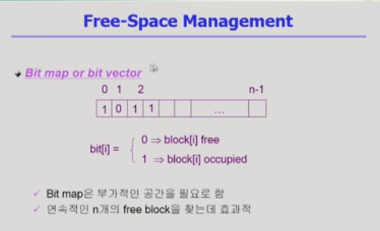

- Linked list
  - 비어있는 블록들을 연결해 놓는 것(어차피 비어있기 때문에 다음 빈 블록 위치 저장 가능)
  - 연속적인 위치를 찾기 어려움
- Grouping
  - 인덱스 형식으로 그룹핑
  - index allocation과 비슷
  - 연속적인 빈 블록을 찾기에는 어려움
- Counting
  - 빈블록의 첫번째 위치와, 거기서부터 몇 개가 빈 블록인지 쌍으로 관리
  - 연속적인 빈 블록을 찾기에 용이

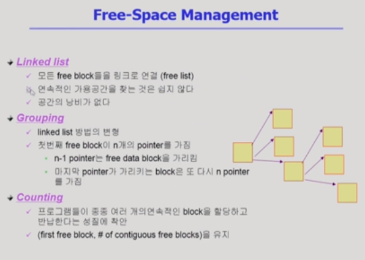

## Directory Implementation

디렉토리(그 디텍토리 안의 메타데이터 관리)를 어떻게 구현하는가

- Linear list
  - 크기를 고정
  - 연산에 대해 시간이 많이 필요
- Hash Table
  - 파일의 이름을 hash 함수를 사용해 저장(ex. ccc라는 파일 저장)
  - 위의 값이 3이라면 3번 엔트리에 ccc 파일의 이름과 메타데이터 저장

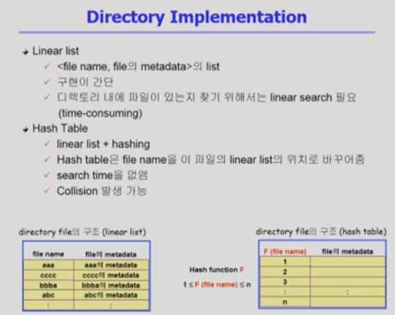

- 메타데이터를 FAT/inode와 같은 곳에 메타데이터를 나눠서 저장 가능
- 긴 파일 이름에 대한 지원
  - 어느 정도 길이로 먼저 한정
  - 그 한정을 넘어가는 경우는 파일 이름 마지막에 다음 엔트리 위치 지정
  - 다음 엔트리에 나머지 이름 저장

## VFS and NFS

- VFS
  - 사용자가 파일 시스템에 접근할 때는 시스템콜을 해야함
  - 만일, 파일시스템 종류마다 다른 시스템콜을 해야 한다면?
  - 그래서 개별 파일 시스템 밑에 VFS를 두고 있음
  - 사용자가 어떤 파일 시스템에 접근하든 동일한 시스템 콜을 통해 접근 가능
- NFS
  - 파일 시스템이 로컬에 저장될 수도 있지만 원격에 저장될 수도 있음(NFS같은 인터페이스를 통해 접근해야 함)
  - 내가 찾는 파일이 내 로컬에 없다면 NFS를 통해 다른 컴퓨터 파일에 접근 가능
  - 양쪽 모두에게 NFS 모듈 필요

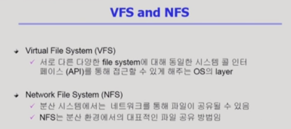

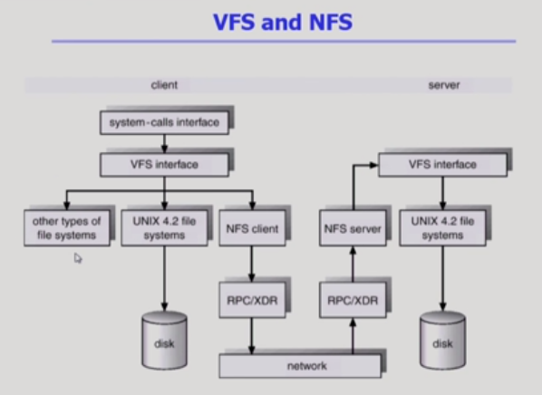

## Page Cache and Buffer Cache

- Page Cache
  - 페이징 시스템에서 사용하는 페이지 프레임
  - 운영체제에게 주어지는 정보가 제한적(=> 클락 알고리즘 사용)
- Memory-Mapped I/O
  - 파일의 일정 부분을 메모리에 맵핑 시켜서 사용
  - read/write 시스템 콜이 아니라 메모리에 읽고 쓰게 되는데 그게 파일까지 영향을 미치는 형태
- Buffer Cache
  - 파일 시스템 관점
  - 파일의 데이터를 사용자가 요청했을 때, 사용자 주고 끝나는게 아니라 읽어온 내용을 자신의 영역 중 일부에 저장하는 것
  - 파일 접근이기에 시스템 콜 발생으로 CPU 제어권이 운영체제에게 넘어옴(=> LRU 알고리즘 등 사용 가능)
- Unified Buffer Cache
  - 페이지 캐시와 버퍼 캐시를 합친 것
  - 버퍼 캐시도 페이지 단위로 관리한다.

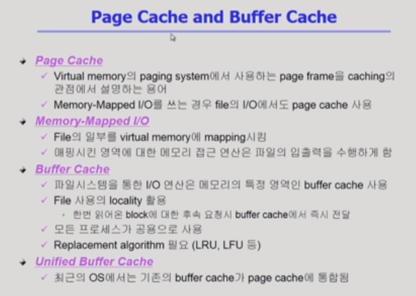

- 커널 메모리 영역
  - 원래는 여기에 버퍼 캐시 존재
- 사용자 메모리 영역
  - 페이지 단위로 필요한 데이터 관리

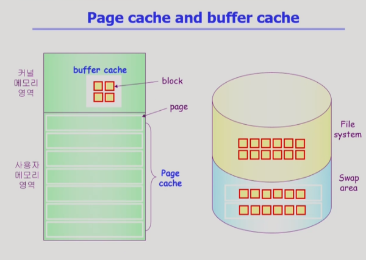

##### next time

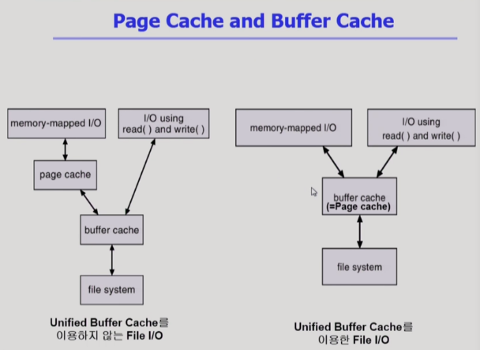
