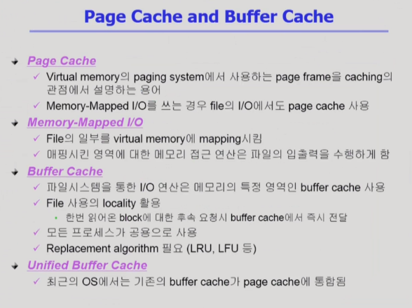
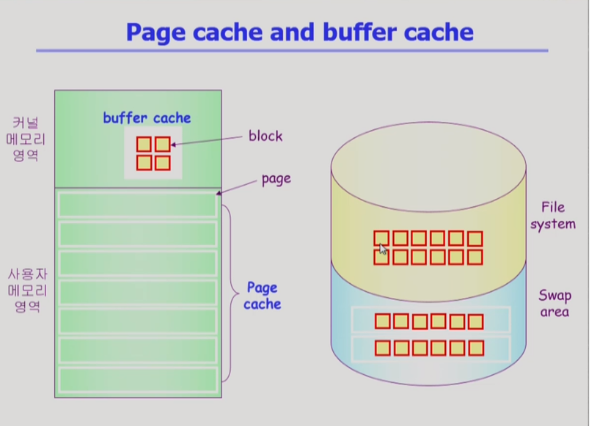
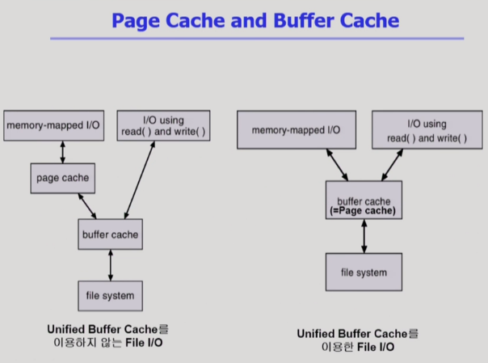
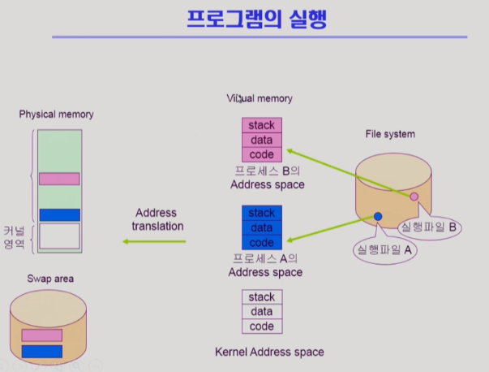
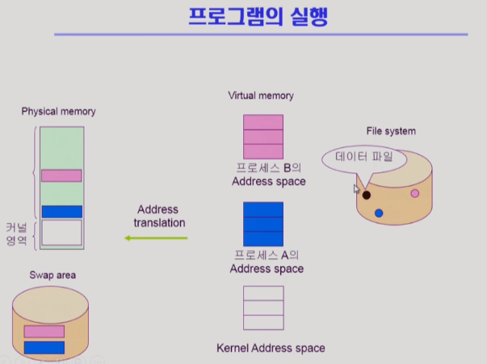
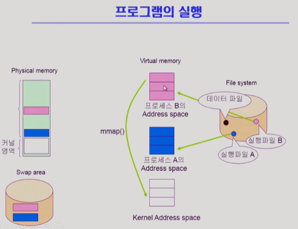
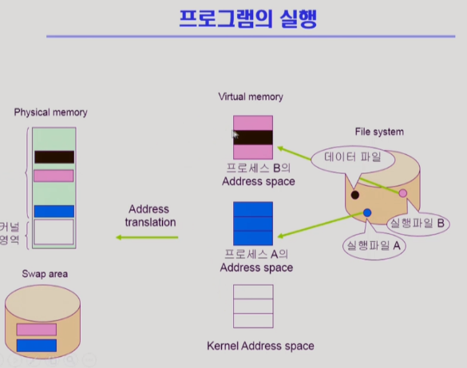
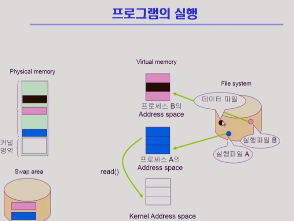
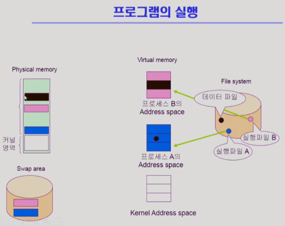

# File System Implementations 2

[toc]

- Page Cache
  - 메모리 관리 시, 페이지 프레임을 두고 당장 필요한 내용만 메모리에 올리고 나머지는 내쫓는 것(캐싱의 관점)
  - 프로세스의 주소 공간을 구성하는 페이지가 swap area에 올라가있는가 내려가 있는가
  - 페이지 캐시의 단위 : 주로 페이지
- Memory-Mapped I/O
  - 프로세스의 주소 공간 중 일부를 파일에 맵핑
  - 메모리 접근 입출력을 이용해 접근 가능
- Buffer Cache
  - 운영체제가 파일 입출력 시, 사용자 프로그램의 요청을 받아서 디스크에서 읽어온 내용을 읽고 끝내는 것이 아닌버퍼 캐시에 읽어놓고 사용자 프로그램에게 카피를 해서 넘겨줌
  - 차후 동일한 파일 시스템에 대한 요청이 있을 시 위를 사용
  - 파일 데이터가 스토리지에 저장되어 있는가 아님 버퍼 캐시에 저장되어 있는가 
  - 버퍼 캐시의 단위 : 섹터(block)
- Unified Buffer Cache

### Page Cache and Buffer Cache

#### Unified Buffer Cache 이용 X File I/O

- 파일 입출력

  - 파일을 오픈한다음 read/write 시스템 콜(buffer캐시에 있든 없은 운영체제한테 요청 필요)

  - 메모리 맵드 I/O 사용 => 자신의 주소 공간 중 일부를 파일에 맵핑
    - 읽어온 내용을 페이지 캐시에 저장(페이지 캐시에 올라온 내용은 운영체제의 접근 없이 사용 가능)

- buffer 캐시에 내용이 있는지 확인 => 어떤 경우든 버퍼 캐시 내용을 자신의 페이지 캐시에 저장해야 하는 오버헤드 존재
- 있으면 바로 전달 / 없으면 읽어와서 전달

#### Unified Buffer Cache 이용 File I/O

> buffer cache와 page cache가 shared

- 파일 입출력
  - 파일을 오픈한다음 read/write 시스템 콜(buffer캐시에 있든 없은 운영체제한테 요청 필요)
  - 메모리 맵드 I/O 사용 => 자신의 주소 공간 중 일부를 파일에 맵핑 => 페이지 캐시가 맵핑(buffer cache 복제 필요 X, 페이지 캐시 자체가 맵핑)

#### Unified Buffer Cache 이용 File I/O 흐름

- 실행파일이 실행되면 프로세스가 됨(주소 공간 형성)
- 주소 변환 중 바로 필요한 것은 메모리에 아닌 것은 swap area로 이동
- code는 read only기에 메모리에서 쫓겨날 경우에 swap area에 갈 필요가 없다
- code는 주소 영역에 맵핑해서 사용

- 실행 파일 말고 데이터 파일 역시 존재
  - read/write 시스템콜이나 메모리 맵드 I/O로 접근 가능

- 메모리 맵드 I/O로 접근하기
  - 데이터 파일의 주소를 주소 공간에 맵핑
  - 만일 그 페이지가 메모리에 없다면 page fault 발생
  - CPU가 OS에게 넘어가 그 페이지를 물리적 메모리에 올라감
  - 가상 메모리가 물리적 메모리와 맵핑됨
  - 쫓아낼 때 swap area가 아닌 파일에 그 내용을 저장

- 동일한 데이터에 대해서 메모리 맵드 I/O 수행 가능

- 동일한 파일에 대해 read/write 시스템 콜을 이용해 사용하는 것도 가능

- read 시스템콜을 했을 시 그 내용이 버퍼 캐시에 있다면 그 내용을 복사해서 사용자에게 전달

#### Memory Mapped I/O 특징 정리

- Memory Mapped I/O 장점
  - 메모리에 올라온 파일의 내용은 시스템 콜 없이 직접 접근 가능하기에 빠르다
  - 캐시에 올라온 내용을 자신의 공간에 복사하는 오버헤드가 없다
- Memory Mapped I/O 단점
  - 일관성 문제(버퍼 캐시를 맵핑하는 것이기에 다른 프로세스가 사용한다면 일관성 문제를 주의해야한다)
    - read/write는 복제본을 가지는 것이기에 문제 X