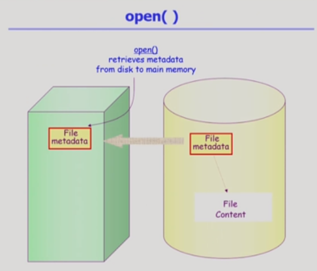

# File Systems

[toc]

## File

- 일반적으로 하드디스크와 같이 비휘발성 보조기억장치에 정보를 저장하는 단위
- 이름을 통해 접근
- 다양한 정자 장치를 file로 관리(일반적인 파일과는 다른 것)
- 연산
  - 파일 생성 연산
  - 파일 삭제 연산
  - read/write 연산
  - reposition(seek): 지정 위치 포인트 수정 연산
  - open/close: read/write를 위해서는 open을 해야 함, 끝나면 close
    - open: 파일의 메터데이터를 올려놓는 작업
- file attribute: 파일 관리를 위한 각종 정보(=metadata)

### Directory and Logical Disk

- Directiry
  - 파일의 메타데이터 중 일부를 보관하는 파일
- operation
  - search for a file : 파일 목록 보기
  - create a file
  - delete a file

#### open()

file의 메타데이터를 메모리에 올려놓는 것(파일의 위치도 포함되어있음)

- root디렉토리는 알려져있음

- 사용자 프로그램이 시스템 콜을 함 = open()
- 시스템 콜(CPU제어권이 운영체제로 넘어감)
- root 디렉토리 metadata는 알고있음 -> root metadata -> a의 metadata -> b의 metadata
- open() 종료 => 시스템콜이기에 결과값 return
- metadata 포인터 배열을 return
- 이제 read/write시 바로 접근(요청) 가능
- b라는 파일에서 무언가를 읽음(시스템콜)(CPU제어권이 운영체제로 넘어감)
- b의 위치는 인덱스에서 확인 가능
- 일정 부분을 읽고, 그 부분을 먼저 메모리에 올리고, 사용자 프로그램에게 전달

- 위의 작업에서 반복되는 것은 바로 읽을 수 있음(ex. b / 메모리에 있기 때문)
- cf. buffer caching
- LRU / LFU 사용 가능(시스템콜로 인해 운영체제에게 CPU 제어권이 넘어가기 때문)

- table이 여러개 있는 경우도 있음
  - 프로세스가 어떤 파일을 가르키고 있는지에 대한 offset

## File Protection

파일 접근 권한

- 1. 접근 권한이 누구에게 있는가와 2. 어떤 연산이 가능한가에 대한 정보 필요
- 접근 권한 제어
  - Access control Matrix : 행렬을 통해 누가 어떤 파일에 권한이 있는지 확인(희소 행렬 형태가 될 수 있음, 특정 사용자만 사용할 수 있는 파일) => 아래 두개는 행렬 공간 낭비를 막기 위한 것
    - Access control list : 파일을 주체로 특정 파일에 권한을 가진 사용자를 리스트 형태로 표시
    - Capability: 사용자를 주체로 자신에게 접근 권한이 있는 파일을 리스트 형태로 표시
  - Grouping
    - 일반적으로 사용
    - 각각의 파일에 대해서 소유자 / 동일 그룹 사용자 / 나머지 전체 사용자로 나눠 구분
    - 9개 비트면 모두 표시 가능
  - Password
    - 모든 파일을 password를 통해 관리(혹은 디렉토리에)

## File System의 Mounting

- 하나의 물리적인 디스크를 파티셔닝을 통해 여러 개의 논리 디스크로 나눌 수 있음

- 각각의 논리적인 디스크에는 파일 시스템을 설치해 사용 가능

- 만일 다른 파티션에 있는 파일 시스템에 접근해야할 경우에는?
  - 마운팅 연산
    - 루트 파일 시스템의 특정 디렉토리 이름에 다른 파티션을 마운트해주면 접근 가능

## Access Methods

파일 접근 방법

- 순차 접근(A->B->C가 있을 때 A와 C를 보고 싶다면 중간의 B를 거쳐야 함)
- 집적 접근(A->B->C가 있을 때 A와 C를 보고 싶다면 B를 건너뛰고 접근할 수 있음)

