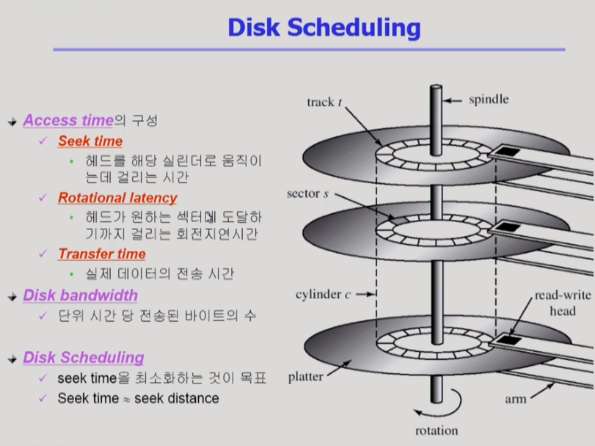

# Disk Management & Scheduling 1

[toc]

## Disk 기본 개념

- Disk의 최소 단위는 sector(디스크 내부에서 관리하는 단위)

- 디스크 외부에서 보는 디스크의 단위는 logical block
- 디스크 외부(컴퓨터 호스트 내부)에서는 logical block을 통해 디스크 접근
- logical block이 sector에 맵핑이 되어 들어가있음(서로 맵핑되어 있음)
- 0번 섹터는 부팅과 관련된 정보

- 디스크 컨트롤러가 읽고 쓸 수 있도록 섹터들로 나누는 과정
- 각각의 섹터는 logical block말고 다른걸 저장할 수 있는 공간이 약간 있음
  - header & trailer에는 정보가 잘 되어있는지 확인하는 체크 코드나 주소 맵핑을 위한 섹터 번호가 저장되어있음
  - 실제 data : logical block
  - cf. ECC : 데이터를 작게 요약한(축약된) 일종의 finger print => 데이터 에러 확인 및 수정(작은 에러의 경우)
- partitioning : 섹터를 묶어주고 독립적인 디스크로 취급
  - 각각의 파티션을 파일 시스템 용도나 swap area 용도로 사용 가능
- Logical formatting : 위의 파일 시스템을 만드는 것
- Booting
  - 처음에 메모리가 비어있음
  - ROM에 부팅을 위한 로더가 저장하고 있음
  - CPU에서 instruction 형태로 small bootstrap loader가 실행됨
  - 하드디스크에서 0섹터 내용을 메모리에 올리고 실행하라고 지시
  - 파일 시스템에서 운영체제 커널 위치를 찾아 메모리에 올리고 실행하라고 지시

### Disk 접근 시간

- Access time : 디스크 접근 시간
  - Seek time : Access time을 가장 많이 차지하는 부분으로 해당 실린더로 움직이는데 걸리는 시간(안쪽~바깥쪽)
  - Rotational latency : 디스크는 지속적으로 회전하기 때문에 원하는 섹터에 도달하기까지 걸리는 시간
  - Transfer time : 실제 데이터 전송 시간(굉장히 짧은 시간 설치)
- 디스크 성능 
  - Disk bandwidth : 단위 시간 당 전송된 바이트 수
  - 디스크가 효율적이 되려면 Seek time을 줄여야 함
- Disk Scheduling
  - Seek time을 최소화해 bandwidth를 높이는 것이 목표

## Disk Scheduling Algorithm

사실은 스케줄링 알고리즘이 구현되는 곳이 디스크 내부가 아니기에, I/O 스케줄러가 디스크보다 위쪽(운영체제) 쪽에 존재하기에 정확한 디스크 상의 위치는 모르고, logical block 번호를 보고 스케줄링 진행

### FCFS

- 들어온 순서대로 처리
- 비효율적

### SSTF

- 현재 헤드 위치에서 가장 가까운 위치의 요청을 우선적으로 처리
- 디스크 헤드 이동 시간이 줄어듬
- but, statvation 문제 발생 가능

### SCAN

- 가장 간단하면서 획기적인 방법
- 엘리베이터 스케줄링
- 가장 안쪽에서 가장 바깥쪽으로 이동하며 그 길목에 있는 요청들을 처리하고 방향을 바꿈
- 디스크 헤드 이동 거리가 짧아짐
- 비교적 공정하면서 효율적
- but, 위치에 따라 대기 시간이 다르다는 문제가 있음
  - 가운데 부분은 예상 대기 시간가 짧음(최악의 경우 반 바퀴를 기다려야 함)
  - 가장 자리의 경우 예상 대기 시간이 김(최악의 경우 한 바퀴를 기다려야 함)

### C-SCAN

- circular-scan

- 가장 안쪽에서 가장 바깥쪽으로 이동하며 그 길목에 있는 요청들을 처리하고 다시 처음으로 돌아감(처리없이 이동만)
- 한방향으로 순환
- 이동 거리는 다소 길어질 수 있지만(scan에 비해), 균일한 대기 시간 제공

### N-SCAN && LOOK && C-LOOK

- N-SCAN
  - 디스크 헤드가 이동하면서, 처리하되 이동 중에 들어온 요청은 무시(다음턴에 처리)
  - 큐에 들어온 요청들의 대기 시간이 조금 더 균일해짐
- LOOK && C-LOOK
  - SCAN과 C-SCAN의 약간의 비효율적인 부분을 개선한 것
  - 요청이 있든 없든 끝에서 끝으로 헤드가 이동하는 SCAN과 C-SCAN
  - LOOK : 가고 있는 방향에 대해 더 이상의 요청이 없다면 반대로 이동하는 것
  - C-LOOK : C-SCAN을 쓰는데 더 이상 그 방향으로 요청이 없다면 반대로 이동

## Disk-Scheduling Algorithm의 결정

- 현대에서는 SCAN에 기반한 알고리즘을 다수 사용
  - 디스크 헤드 이동 거리를 줄일 수 있음
- File 할당 방법도 디스크 요청에 영향을 미침
  - 산발적으로 할당하면 이동 거리가 길어질 수 있음
- 개별적인 요청을 처리하기보다는 묶어서 처리

