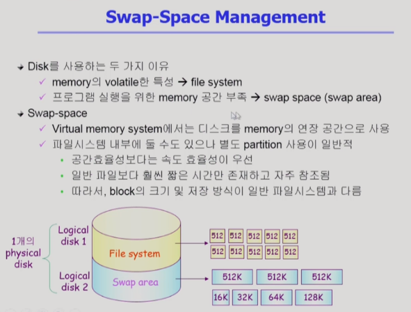

# Disk Management & Scheduling 2

[toc]

## Swap-Space Management

- 보조기억장치(하드디스크) 사용 이유
  - 메모리의 휘발성(파일 시스템처럼 데이터를 연속적으로 유지하기 위해)
  - 디램메모리가 공간이 한정되어있기 때문(메모리의 연장 공간으로 디스크 사용) => swap area(swap space) 용도
- Swap-space(하드디스크에서 스왑스페이스는 어떻게 관리되어야 하는가)
  - 물리적인 디스크를 파티셔닝
  - 로지컬 디스크 생성(독립적인 존재로 인식)
  - 로지컬 디스크를 파일 시스템/swap area로 사용할 수 있음
  - 파일 시스템은 기본적으로 512바이트 섹터 단위로 정보 저장 / 정보 저장 방식은 이전 수업 참조
  - swap area는 프로그램이 실행되는 중에만 연장 공간으로 사용하는 것
    - 공간 효율성보다 속도 효율성이 우선적(어차피 프로세스가 끝나면 사라질 내용)

## RAID

- RAID
  - 여러 개의 디스크를 묶어서 사용하는 것
- RAID 사용 목적
  - 디스크 처리 속도 향상(분산 저장 / interleaving, striping)
  - 신회성 향상(Mirroring, shadowing)
- RAID 여러 방식
  - 통째로 디스크를 복제하는 방법
  - parity : 중복정도를 낮추는 방법

