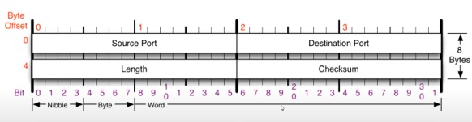

# 🤔 UDP 프로토콜

> 비연결 지향형 프로토콜

## 🧐 UDP 프로토콜

#### 특징

사용자 데이터 프로토콜은 유니버셜 데이터그램 프로토콜이라고 일컫기도 한다.

UDP의 전송 방식은 너무 단순해서 서비스의 신뢰성이 낮고, 데이터그램 도착 순서가 바귀거나 중복되거나 심지어는 통보 없이 누락시키기도 한다.

UDP는 일반적으로 오류의 검사와 수정이 필요없는 프로그램에서 수행할 것으로 가정한다.

#### 구조

✨**Source Port** : 출발지 포트번호 (2바이트)

✨ **Destination Port** : 도착지 포트번호 (2바이트)

✨ **Length**: UDP 프로토콜 헤더 길이 + payload

✨ **Checksum**: 프로토콜 손상 여부 체크 값

#### 대표적 프로그램

1. DNS서버

도메인 주소(ex. `www.naver.com`) 입력하면 도메인 주서의 IP주소를 알려주는 것이 DNS서버

2. tftp 서버

파일 전송 프로그램

3. RIP 프로토콜

라우팅 정보를 공유하는 프로토콜(라우터들끼리 서로 라우터를 공유해서 최신 테이블 갱신)