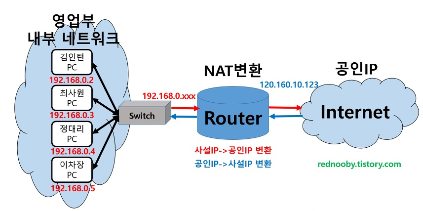

# 🤔 NAT와 포트포워딩

## 🧐 NAT

> 네트워크 주소 변환

#### ◾ 특징

- public outside address와 private inside address의 사이에서 border router로서의 역할을 수행한다.
  즉, **내부 망에서는 사설 IP주소를 사용하여 통신을 하고, 외부망과의 통신시에는 NAT를 거쳐 공인 IP 주소로 자동 변환된다.**

- NAT(Network Address Translation)는 IP 패킷의 TCP/UDP 포트 숫자와 소스 및 목적지의 IP 주소 등을 **`재기록`**하면서 라우터를 통해 네트워크 트래픽을 주고 받는 기술

- 패킷에 변화가 생기기 때문에 IP나 TCP/UDP의 체크섬(checksum)도 다시 계산되어 재기록해야한다.
- NAT를 이용하는 이유는 대개 사설 네트워크에 속한 여러 개의 호스트가 하나의 공인 IP주소를 사용하여 인터넷에 접속하기 위함이다.
- 하지만, 꼭 사설IP를 공인IP로 변환 하는 데에만 사용하는 기술은 아니다.

#### ◾ 왜 NAT?

대개 사설 네트워크에 속한 여러개의 호스트가 하나의 공인 IP주소를 사용하여 인터넷에 접속하기 위함이다.

NAT는 IPv4의 주소 부족 문제를 해결하기 위한 방법으로 고려되었으며, 주로 비공인 네트워크 주소를 사용하는 망에서 외부의 공인망과의 통신을 위해서 네트워크 주소를 변환한다.

#### ◾  장.단점

- 장점

  - 인터넷의 공인 IP주소를 절약할 수 있다. (공인 IP 자원 부족 문제 해결!)
  - 인터넷이란 공공망과 연결되는 사용자들의 고유한 사설망을 침입자로부터 보호할 수 있다.
  - 하나의 공인 IP로 여러개의 사설 IP를 사용가능하다.
  - 직접적으로 공격을 할 방법이 없다.(보안성 향상)

- 단점

  - end-to-end간의 추적(IP trace)이 어려워진다.

    > 여러개의 NAT 라우터에 의해 multiple NAT가 적용 되었을 경우 경로 추적이 매우 어려워지는데 이러한 단점은 반면 해커가 대상 경로를 추적하기 어렵게 만듦으로써 좀 더 보안성 있는 연결을 하게 된다고도 볼 수 있다. 

#### ◾ 통신

##### 1. 사설 IP 대역에서 pc나 노트북이 통신할 때 공인IP로 변경되어 통신한다. 이때, NAT테이블이라는 곳에 통신을 기록한다.

##### 2. 실제 바깥에서는 공유기 끼리만의 통신으로밖에 보이지 않는 것이다.

## 🧐 포트포워딩(Port-Forwarding)

> 포트 전달!
>
> *Port: 어떤 프로세스에서 데이터를 받을 것인지를 알아야 할 때 사용하는 것!
> (2계층은 MAC주소, 3계층은 IP주소와 같듯이..)
>
> 컴퓨터의 LAN선은 하나인데 통신을 필요로 하는 프로그램이 다수일 때 이 다수의 프로그램을 구별할 수 있는 번호가 바로 포트번호이다.

#### ◾ 특징

- 포트 포워딩 도는 포트 매핑은 패킷이 라우터나 방화벽과 같은 네트워크 장비를 가로지르는 동안 특정 IP주소와 포트 번호의 통신 요청을 특정 다른 IP와 포트 번호로 넘겨주는 네트워크 주소 변환(NAT)의 응용이다.
- 게이트웨이(외부망)의 반대쪽에 위치한 사설네트워크에 상주하는 호스트에 대한 서비스를 생성하기 위해 흔히 사용횐다.
- 공유기에게 이정표를 달아주는 것을 포트포워딩이라고 한다. 

> 21번 포트로 요청이 오면 공유기는 이정표를 참조해서 192.168.0.20번 PC로 정확하게 전달해 줄 수 있다.

#### ◾ 통신

##### 1. 위 그림에서 사설 IP 대역의 PC가(클라이언트) 신호를 보낼때 보이지 않는 모르는 곳으로 보내는데, 사실 직접 그 컴퓨터의 IP를 치는게 아니라

#####  공인IP로 보낸다. 그리고 신호를 받는 공유기에는 포트포워딩이 설정되어 있어야 한다.

##### (이때, IPv4를 세팅할 때 목적지 IP주소가 `공인 IP 2`의 공유기에 할당된 주소이다.)

##### 2. 이제 패킷을 보내게 되면 공유기에서 특정 포트로 들어온 요청을 다른 특정 IP의 특정 포트로 전송하는 역할을 해준다. (포트포워딩)

##### 3. 그리고 최종적으로 포트포워딩을 통해 특정 포트로 패킷을 넘겨준다.

