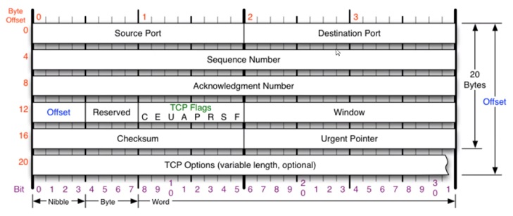
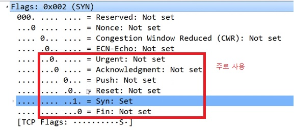

# 🤔 TCP 프로토콜

> 연결지향형 TCP프로토콜

## 🧐 TCP 프로토콜

#### 특징

- 전송 제어 프로토콜(Transmission Control Protocol, TCP)은 인터넷에 연결된 컴퓨터에서 실행되는 프로그램 간에 통신을 안정적으로, 순서대로, 에러없이 교환할 수 있게 한다.
- TCP의 안정성을 필요로 하지 않는 애플리케이션의 경우 일반적으로 TCP 대신 UDP를 사용한다.
- TCP는 UDP보다 안전하지만 느리다.

#### 구조

최대 20바이트인데 TCP Options 때문에 최대 60바이트까지 가능하다.

**✨ Source Port**: 출발지 포트

**✨ Destination Port**: 도착지 포트

**✨ Sequence Number**: (4바이트)

**✨ Acknowledgment Number**: (4바이트)

**✨ Offset**: 헤더의 길이

**✨ Reserved**: 예약된 필드로 사용하지 않는 필드

✨ **Window**: 데이터 통신 시 서로의 신호를 저장(데이터를 얼마만큼 보낼지)

**✨ Urgent Pointer**

## TCP 플래그

CEUAPRSF 중에 UAPRSF만 알면 되는데,

플래그는 일단 TCP가 통신할 때 상대방과 연결 상태를 확인할 때 사용된다. 연결을 시작하려는 건지, 데이터를 보내려는건지, 받으려는건지, 연결을 끊으려는지 등을 나타내는 값

TCP의 주된 기능이 플래그에 의해 나누어 진다.

**✨ U**: Urgent Flag, 긴급 비트(우선순위가 높은 데이터 지정) (1이면 급함을 뜻함)
(Urgent Pointer가 어디부터가 급한 데이터인지 나타내는 위치 값)

**✨ A**: Ack Flag, 승인 비트(TCP에서 중요한 플래그)(계속해서 물어본 것에 대한 응답을 보내줄 때, 예를 들면 응 데이터 보내면 돼 이런 것들)

**✨ P**: Push Flag, 밀어넣기 비트(TCP버퍼(내가 받을 수 있는 공간)가 일정한 크기만큼 앃여야 하는데, 그 공간을 무시하고 데이터를 계속해서 밀어넣겠다는 뜻, 잘 사용 안함)

**✨ R**: Reset Flag, 연결 관계를 초기화하는 비트

**✨ S**: Sync Flag, 동기화 비트(상대방과 연결을 시작할 때 무조건 사용하는 플래그로써 S가 처음 보내지고 난 다음부터 둘 사이에 연결이 서로 동기화되기 시작(상태를 계속 주고받으면서 상태를 동기화))

**✨ F**: Fin Flag: 종료 비트(데이터를 다 주고 받은 다음에 연결을 끊을 때 사용하는 플래그)

