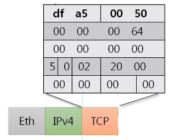

# 🤔 TCP 프로토콜

> 연결지향형 TCP프로토콜

## 🧐 TCP 프로토콜

#### 특징

- 전송 제어 프로토콜(Transmission Control Protocol, TCP)은 인터넷에 연결된 컴퓨터에서 실행되는 프로그램 간에 통신을 안정적으로, 순서대로, 에러없이 교환할 수 있게 한다.
- TCP의 안정성을 필요로 하지 않는 애플리케이션의 경우 일반적으로 TCP 대신 UDP를 사용한다.
- TCP는 UDP보다 안전하지만 느리다.

#### 구조

최대 20바이트인데 TCP Options 때문에 최대 60바이트까지 가능하다.

**✨ Source Port**: 출발지 포트

**✨ Destination Port**: 도착지 포트

**✨ Sequence Number**: (4바이트)

**✨ Acknowledgment Number**: (4바이트)

**✨ Offset**: 헤더의 길이

**✨ Reserved**: 예약된 필드로 사용하지 않는 필드

✨ **Window**: 데이터 통신 시 서로의 신호를 저장(데이터를 얼마만큼 보낼지)

**✨ Urgent Pointer**

## TCP 플래그

`CEUAPRSF` 중에 `UAPRSF`만 알면 되는데,

플래그는 일단 TCP가 통신할 때 상대방과 연결 상태를 확인할 때 사용된다. 연결을 시작하려는 건지, 데이터를 보내려는건지, 받으려는건지, 연결을 끊으려는지 등을 나타내는 값

TCP의 주된 기능이 플래그에 의해 나누어 진다.

**✨ U**: Urgent Flag, 긴급 비트(우선순위가 높은 데이터 지정) (1이면 급함을 뜻함)
(Urgent Pointer가 어디부터가 급한 데이터인지 나타내는 위치 값)

**✨ A**: Ack Flag, 승인 비트(TCP에서 중요한 플래그)(계속해서 물어본 것에 대한 응답을 보내줄 때, 예를 들면 응 데이터 보내면 돼 이런 것들)

**✨ P**: Push Flag, 밀어넣기 비트(TCP버퍼(내가 받을 수 있는 공간)가 일정한 크기만큼 앃여야 하는데, 그 공간을 무시하고 데이터를 계속해서 밀어넣겠다는 뜻, 잘 사용 안함)

**✨ R**: Reset Flag, 연결 관계를 초기화하는 비트

**✨ S**: Sync Flag, 동기화 비트(상대방과 연결을 시작할 때 무조건 사용하는 플래그로써 S가 처음 보내지고 난 다음부터 둘 사이에 연결이 서로 동기화되기 시작(상태를 계속 주고받으면서 상태를 동기화))

**✨ F**: Fin Flag: 종료 비트(데이터를 다 주고 받은 다음에 연결을 끊을 때 사용하는 플래그)

## 🧐 TCP를 이용한 통신과정

#### ◾ 연결 수립 과정

TCP를 이용한 데이터 통신을 할 때 프로세스와 프로세스를 연결하기 위해 가장 먼저 수행되는 과정

- 클라이언트가 서버에게 요청 패킷을 보내고
- 서버가 클라이언트의 요청을 받아들이는 패킷을 보내고
- 클아이언트는 이를 최종적으로 수락하는 패킷을 보낸다.

위 3개의 과정을 **`3 Way handshake`** 라고 부른다

**✨ TCP 3Way Handshake**: 연결 수립을 하기 위한 통신

(왔다, 갔다, 왔다 총 3번 해서 3Way Handshake라고 한다.)

(각각의 flag가 어떻게 설정되는지 보면 충분)

##### 1. 연결을 수립하기 위해서 뒤에 따로 payload는 없이 각각의 TCP, IPv4, Eth를 인캡슐레이션한다.

**✨ df a5**: 출발지 포트번호

**✨ 00 50**: 도착지 포트번호

**✨00 00 00 64**: 시퀀스 번호 (중요)

**✨00 00 00 00**: ack 번호 (중요)

**✨5**: header 길이(원래 tcp 20바이트인데 4로 나눈 값)

**✨0**: Reserved (사용 x)

**✨02**: flag (중요)

**✨20 00**: window

**✨00 00**: checksum

**✨ 00 00**: 몰라도 됨 

TCP 말고도 Eth, IPv4도 붙어서 데이터를 보낸다.

##### 2. Flag는 SYN(싱크)로, S(시퀀스)는 100, A(ack)는 0으로 세팅되며 서버로 요청 전송한다.

##### 3. 들어온 요청을 디캡슐레이션하고 보낼 응답을 인캡슐레이션 작업을 한다.

**✨00 50**: 출발지 포트

**✨ df a5**: 도착지 포트

**✨ 12**: flag

##### 4. 인캡슐레이션해서 Flag는 SYN+ACK로, S(시퀀스)는 2000으로 A(ack)는 101로 세팅하여 전송한다.

##### 5. 받은 클라이언트는 똑같이 디캡슐레이션을 하고 다시 인캡슐레이션 하여 전송 준비를 한다.

이때 flag값은 10이다.

##### 6. 최종적으로 서버 측에서는 응답을 또 받고 끝난다

##### ※ S(시퀀스번호), A(ack번호)

이 번호를 가지고 시스템을 서로 동기화하는데

맨 처음 S: 100, A: 0는 임의로 보낸다

다음 S: 2000, A: 101은 A에 처음 받은 100에 +1인 값, S는 처음 보내는 것이기 때문에 자기만의 랜덤한 값

다음 S: 101, A: 2001은 A에 이전에 받은 S(2000)에 +1인 값, S에는 이전에 받은 A(101)

(+)이 경우,

Session Hijacking 공격을 받아서 오히려 서버측과 해커가 연결되어 통신을 진행 할 수도 있게 된다.

따라서, 보안에서 신경 써야 하는 부분이 된다.

#### ◾ 데이터 송수신 과정

> 연결 수립 다음에 하는 통신(S,A 동기화를 그대로 이어간다.)

TCP를 이용한 데이터 통신을 할 때 단순히 TCP 패킷만을 캡슐화해서 통신하는 것이 아니라 payload를 포함한 패킷을 주고 받을 대의 일정한 규칙

연결 수립때 서버쪽에서 통신을 받고 연결이 수립이 성공하고 끝났고,
이제 클라이언트가 서버에게 요청을 보낼 차례가 된다.

- 보낸 쪽에서 또 보낼 대는 SEQ번호와 ACK번호가 그대로다.
- 받는 쪽에서 SEQ번호는 받은 ACK번호가 된다.
- 받는 쪽에서 ACK번호는 받은 SEQ번호 + 데이터의 크기(payload가 있어서 위 연결 수립 과정에서의 +1과 다름)

##### 1. 클라이어트 측에서 요청 데이터를 세팅하여 전송한다.

이때, 데이터를 밀어 넣는 거니까 Flag는 PSH(푸쉬)와 ACK로 세팅된다.
(데이터 밀어 넣고(PSH) 너 잘 받았으면 응답해줘 라는 요청(ACK))

S: 101, A: 2001 >> 아까 것 그대로 이어서 사용

##### 2. 디캡슐레이션하여 데이터 내용 확인 후, 응답 데이터를 세팅하여 전송한다.

마찬가지로 데이터를 보내면서(PSH) 잘 받았는지를 묻는다(ACK).

A번호는 받은 S번호(101) + 100(아까 받은 데이터의 크기)

S번호는 받은 A번호(2001) 그대로

##### 3. 클라이언트는 또 디캡슐레이션하여 데이터를 확인 한 뒤, 데이터를 잘 받았음을 확인하는 답장을 준다.

S는 받은 A번호(201) 그대로

A는 받은 S번호(2001) + 500(데이터의 크기)

## 🧐 TCP 상태전이도

#### ◾ TCP의 여러가지 상태 변화

실선은 클라이언트의 상태 변화

점선은 서버의 상태 변화

##### 여기서 LISTEN과 ESTABLISHED가 가장 중요한 상태이다.

**✨LISTEN**: 포트번호를 열어놓고 있는 상태(포트번호를 프로그램이 사용하고 있는 상태, 서버측에서)(클라이언트의 요청을 항상 듣고 있는 상태)

**✨ESTABLISHED**: 연결이 서로 수립이 된 상태 (3Way Handshake 한 상태)

나머지,

**✨active open**: 클라이언트 입장에서 능동적으로 포트를 여는 것

**✨SYN_SENT**: 클라이언트가 능동적으로 포트를 열면서 싱크 보낸 상태 

등등등...

#### ◾ 3Way Handshake 과정에서의 상태 변화

##### 1. 클라이언트가 요청을 만들어서 보내면 동시에 STN_SENT 상태가 되고 서버는 LISTENING 상태일때 요청을 받을 수 있기 때문에 항상 LISTENING 상태여야 하며, 받으면 SYN_RECEIVED 상태가 된다.

##### 2. 이번엔 서버가 패킷을 만들어서 보낸다.

##### 3. 마지막으로 클라이언트 측에서 ack 패킷을 보낸다. 그러면 서버, 클라이언트 양측 모두 ESTABLISED 상태가 된다.

이렇게 SENT, RECEIVED에서 ESTABLISHED상태가 되어야지 서로 데이터를 주고 받을 수 있는 상태가 되는 것이다.

*3Way Handshake 예시

