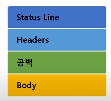
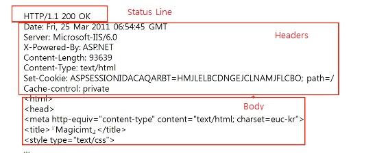
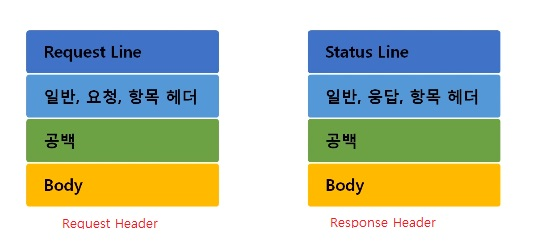

# 🤔 HTTP 프로토콜

 

## 🧐 HTTP 응답 프로토콜

### 1. 구조

### 2. Status Line

#### 📕 상태 코드 종류

**✨100 ~ 199**: 단순한 정보

**✨200~299**: Client의 요청이 성공(`정상적인 통신 완료`)
	- 200 OK

**✨300~399**: Client의 요청이 수행되지 않아 다른 URL로 재지정

**✨400~499**: Client의 요청이 불완전하여 다른 정보가 필요(`Client 잘못`)

	- 403 Forbidden (Client가 권한 없는 페이지를 요청했을 때)
	- 404 Not Fount (Client가 서버에 없는 페이지를 요청했을 때)

**✨500~599**: Server의 오류를 만나거나 Client의 요청 수행 불가(`Server 잘못`)

### 3. HTTP 헤더 포맷

> 수많은 정보를 담고 있는 HTTP 헤더

#### 📕 일반 헤더

> 일반적인 정보를 담고 있는 헤더

**✨Content-Length**: 메시지 바디 길이를 나타낼 때 쓰인다.

**✨Content-Type**: 메시지 바디에 들어있는 컨텐츠 종류(Ex. HTML 문서는 text/html)

#### 📕 요청 헤더

> 클라이언트 정보를 담고 있는 헤더

**✨Cookie**: 서버로부터 받은 쿠키클 다시 서버에게 보내주는 역할을 한다.

**✨Host**: 요청된 URL에 나타난 호스트명을 상세하게 표시

**✨User-Agent**: Client Program에 대한 식별 가능 정보를 제공

#### 📕 응답 헤더

> 서버 정보를 담고 있는 응답 헤더

**✨Server**: 사용하고 있는 웹 서버의 소프트웨어에 대한 정보를 포함(알려줄 수도 있고 안알려 줄 수도 있고)

**✨Set-Cookie**: 쿠키를 생성하고 브라우저에 보낼 때 사용한다.