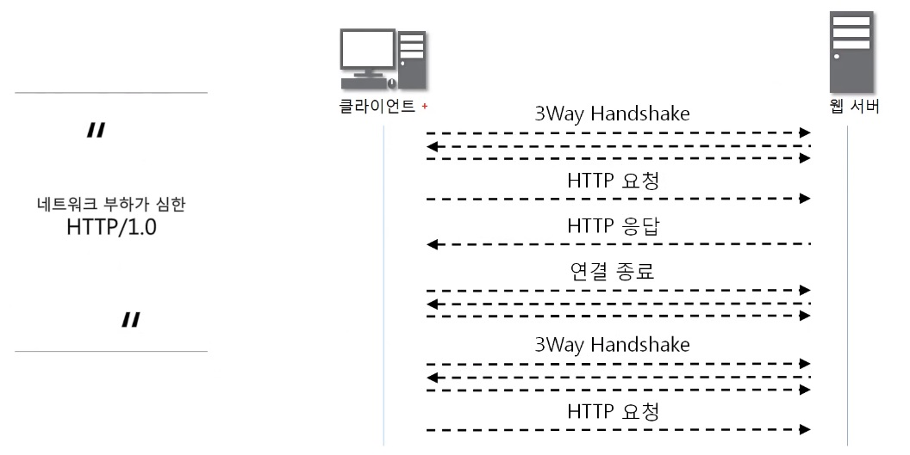
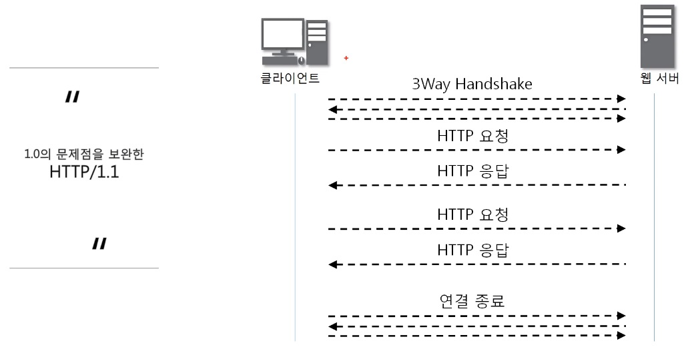
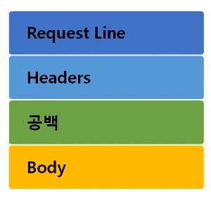
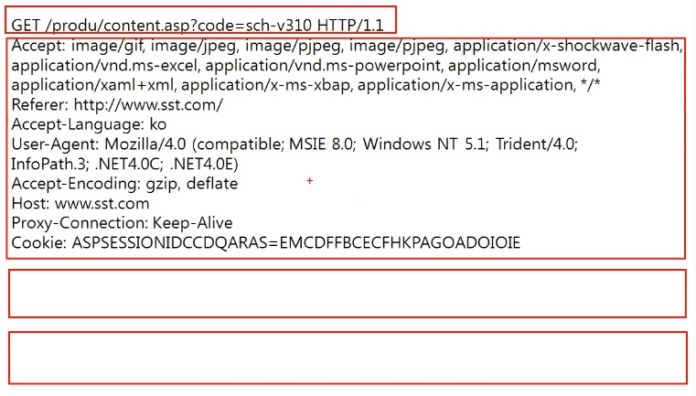
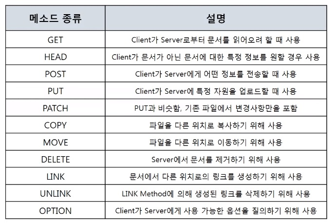

# 🤔 7계층 프로토콜

> 7계층 프로토콜에는 굉장히 종류가 많고 잘 알려진 것들이 있다.
>
> 웹에서는 가장 유명한 것이 HTTP 프로토콜

## 🧐 HTTP 프로토콜

### 1. 웹을 만들기 위해 사용되는 다양한 기술들

**`HTTP`**, **`HTML`**, **`JavaScript`**, **`CSS`**, **`DB`**, Python, Spring, Ajax 등...

✨ **HTTP**: 웹 페이지를 채울 내용

✨ **JavaScript**: 웹 페이지에 들어갈 기능

✨ **CSS**: 웹 페이지를 예쁘게 꾸밀 디자인

✨ **HTTP** (HTTPS -> SSL/TLS): 서버에서 HTML, JS, CSS(웹 표준 데이터)를 받아오는 프로토콜

 

### 2. HTTP 프로토콜

#### 📕 특징

- HyperText Transfer Protocol 
- www에서 쓰이는 핵심 프로토콜로 문서의 전송을 위해 쓰이며, 오늘날 거의 모든 웹 애플리케이션에서 사용되고 있다.
  (음성, 화상 등 여러 종류의 데이터를 MIME로 정의하여 전송 가능)
- Request / Response 동작에 기반하여 서비스 제공
- HTTP1.0
  - 연결 수립, 동작, 연결 해제의 단순함이 특징(하나의 URL은 하나의 TCP연결)
  - HTML 문서를 전송 받은 뒤 연결을 끊고 다시 연결하여 데이터를 전송
  - 단순 동작(연결 수립, 동작, 해제)이 반복되어 통신 부하 문제 발생
  - 

- HTTP 1.1
  - HTTP 1.0과 호환 가능
  - Multiple Request 처리가 가능하여 Client의 Request가 많을 경우 연속적인 응답 제공
  - HTTP1.0과 달리 Server가 갖는 하나의 IP Address와 다수의 Web Site 연결 가능
  - 빠른 속도와 Internet Protocol 설계에 최적화될 수 있도록 Cache 사용
  - Data를 압축해서 전달이 가능하도록 하여 전달하는 Data 양이 감소
  - 

### 3. HTTP 요청 프로토콜

#### 📕 구조

- 요청하는 방식을 정의하고 클라이언트의 정보를 담고 있는 구조
- 여러 구조로 이루어진 Headers
- Body에는 데이터가 담김
- 

#### 📕 요청 타입

✨ **GET**: 자원을 보내달라고 요청하는 것

✨ **POST**: Client가 Server에게 데이터를 보낼때 사용

##### *GET, POST 차이점

사실 GET, POST 모두 서버에 데이터를 보내고 요청을 할 수 있는데,

GET방식은 서버에 데이터를 보낼 때 URI부분에 포함시켜서 보내고
(https://~~~/~?titleId=5763&weekday=thu...)

POST방식은 주소창이 아닌 Body에 포함시켜서 보낸다.

`GET은 URI에 다 데이터가 나오기 때문에 민감한 데이터는 POST방식으로 처리한다.`

