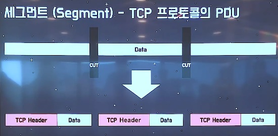

# 🤔 TCP/IP

> 데이터가 의도된 목적지에 닿을 수 있도록 보장해주는 통신 규약
>
> (TCP와 IP 두가지의 프로토콜로 이루어져 있다.)
>
> 요약 : IP => 데이터가 찾아갈 주소
>
> ​			TCP => 찾아온 데이터가 형식에 맞게 왔는지 확인하는 필터

## 🧐 TCP

### 1. 정의

서버와 클라이언트간의 데이터를 신뢰성 있게 전달하기 위해 만들어진 규약

데이터를 전달하는 과정에서 그 순서가 의도하지 않게 뒤바뀌거나 손실이 있을 수 있는데,
TCP는 데이터 패킷에 일련의 번호를 부여함으로써, 데이터 손실을 찾아내서 교정하고, 순서를 재조합하여 클라이언트에게 전달할 수 있게 해준다.

TCP는 많은 양의 데이터를 가져와서 컴파일 한 다음 동료 TCP계층에서 수신하도록 전송하여 패킷을 유용한 정보/데이터로 바꾸는 역할을 한다.
TCP는 전달 받은 패킷을 재조립하고, 패킷에 손상이 있거나 손실된 패킷이 있다면 재전송을 요청하는 패킷을 전송하여 재전송을 받는다.

### 2. 특징

- 복잡성
- 신뢰성
- 흐름 제어
- 혼잡 제어

#### ✨ **흐름 제어**

> 데이터의 처리 속도를 조절하여 수신자의 버퍼 오버플로우를 방지, 수신자가 윈도우 값을 통해 수신량을 정할 수 있다.

송신측과 수신측의 데이터처리 속도 차이를 해결하기 위한 기법 2가지

##### ▫ Stop and Wait 방식

매번 전송한 패킷에 대해 확인 응답을 받아야만 그 다음 패킷을 전송하는 방법

##### ▫ 슬라이딩 윈도우 기법

수신측에서 설정한 뒨오두 크기만큼 송신 측에서 확인 응답 없이 세그먼트를 전송할 수 있게 하여 데이터 흐름을 동적으로 조절하여 제어하는 기법

#### ✨ **혼잡 제어**

> 네트워크 내의 패킷 수가 넘치게 증가하지 않게 방지, 정보의 소통량이 과다하면 패킷을 조금만 절달하여 혼잡을 방지

송신측의 데이터 전달과 네트워크의 처리속도 차이를 해결하기 위한 기법
(사실 이 부분은 중요치 않고.. 잘 모르겠다..)

##### ▫ Fast Recovery(빠른 회복)

빠른 회복 정책은 혼잡한 상태가 되면 창 크기를 1로 줄이지 않고 반으로 줄여 선형 증가시키는 방법이다.

##### ▫ slow start

윈도우 크기를 2배로 늘린다. 그러다 혼잡현상이 발생하면 창 크기를1 로 떨어뜨린다.
그 후 혼잡현상이 발생했던 창 크기의 절반까지는 이전처럼 지수 함수 꼴로 창 크기를 증가시키고 그 이후부터는 완만하게 1씩 증가시킨다.

### 3. TCP 속도

TCP 속도 =  Window Size * (1/RTT)
(*RTT(Round trip delay) => Application이 ACK를 받은 시간 - Window Size만큼의 데이터를 보내기 시작한 시간(초))

## 🧐 IP

### 1. 정의

`인터넷에서 컴퓨터의 위치를 찾아서 데이터를 전송하기 위해 지켜야할 규칙`

컴퓨터와 컴퓨터간에 데이터를 전송하기 위해서, 각 컴퓨터의 주소가 필요하다.

IP(Internet Protocol)는 4바이트로 이루어진 컴퓨터의 주소이며, 192.168.9.255와 같이 3개의 마침표로 나뉘어진 숫자로 표시된다.

IP는 TCP와 달리 데이터의 재조합이나 손실여부 확인이 불가능하며, 단지 데이터를 전달하는 역할만을 담당한다.

## 🧐 TCP/IP

> IP 기반에 TCP가 사용되서 이렇게 불린다.
>
> TCP가 데이터의 추적을, IP가 배달을 처리한다고 보면 된다.

### 1. TCP/IP 4 Layer

TCP/IP 가 많이 사용되면서 흔히 사용되던 OSI 7계층을 더욱 추상화 한 TCP/IP 4계층이 등장했다. 

1. 네트워크엑세스 게층(물리계층, 데이터 링크 계층)
2. 인터넷계층(네트워크 게층)
3. 전송계층(전송계층)
4. 응용계층(세션계층, 표현계층, 응용계층)

#### ✨ **데이터 링크 계층**

- TCP/IP 패킷을 네트워크 매체로 전달하는 것과 네트워크 매체에서 TCP/IP 패킷을 받아들이는 과정을 담당
- 패킷을 전달하는 물리적 인터페이스와 관련된 하드웨어(실제 물리적 기계, PCB장치)를 제어하는 기능을 수행
- 에러 검출 기능, 패킷의 프레임화
- 네트워크 접근 방법, 프레임 포맷, 매체에 대해 독립적으로 동작하도록 설계
- TCP/IP 데이터 전송 프로토콜에 들어가는 MAC Address를 획득하는 프로토콜
- LAN, 패킷망 등에 사용됨

#### ✨ **네트워크 계층**

- 어드레싱(addressing), 패키징(packaging), 라우팅(routing) 기능을 제공
- 네트워크상 최종 목적지까지 정확하게 연결되도록 연결성을 제공
- 네트워크 상의 패킷 이동의 제어 기능을 수행하는 프로토콜(전송 요청 시 라우터에 보내면 알아서 해당 목적지에 요청)
- 프로토콜 종류 - IP, ARP, RARP

#### ✨ **전송계층**

- 애플리케이션 계층의 세션과 데이터그램 통신 서비스 제공
- 통신 노드 간의 연결을 제어하고, 신뢰성 있는 데이터 전송을 담당
- 즉, 두 Host PC 간에 종단 간 연결을 맺고 데이터를 전달할 수 있는 기능을 수행
- 프로토콜 종류 - TCP, UDP

#### ✨ **응용계층**

- 프로그램(브라우저)이 직접 인터랙트 하는 레이어. 데이터를 처음으로 받는 계층
- 다른 계츠으이 서비스에 접근할 수 있게 하는 애플리케이션 제공
- 애플리케이션들이 데이터를 교환하기 위해 사용하는 프로토콜을 정의
- HTTP, SMTP등의 프로토콜을 가짐
- TCP/UDP 기반의 응용 프로그램을 구현할 때 사용
- 프로토콜 종류 - FTP, HTTP, SSH

### 2. 3-Way Handshaking

> 두 컴퓨터 간에 통신할 때 연결되는 과정

- Host A 에서 B 컴퓨터에 연결을 시도하기 위해 SYN(Code1000)이라는 Check 메시지 전송
- Host B 에서는 SYN(Code 1000)메시지를 통해 A에게 자신에게 연결을 시도할 것이라는 상황을 인지
- Host B에서 A 컴퓨터에게 ACK(Code 1001)과 SYN(Code 4000)이라고 전송
  - ACK Code는 수신된 SYN Code + 1 해준 값
  - SYN Code 4000인 이유는 Host B도 A에 연결하는 것이기 때문에 새로운 Code전송
- Host A에서 SYN(4000)을 통해 연결 간으을 확인 한 후 ACK(4001)을 보내 연결을 하게 됨
  - ACK Code는 수신된 SYN Code + 1

이렇게 TCP/IP는 3단계를 거쳐 연결 되기 때문에 3-way-Handshaking이라고 한다.

## 🧐 왜 TCP/IP를 사용하는가?

> IP만 있어도 상호간에 통신이 가능한데 왜 굳이?

정리해보면,

**`IP`**는 가장 효율적인 방법으로 데이터의 작은 조각들을 되도록 빨리 보내는 일을 한다.

패킷 전달 여뷰를 보증하지 않고 패킷을 보낸 순서와 받는 순서는 다를 수 있다.

**`TCP`**는 IP위에서 동작하는 프로토콜로 데이터의 전달을 보증하고 보낸 순서대로 받게 해준다. 순서가 맞지 않거나 중간에 빠진 부분을 점검하여 다시 요청하는 일을 담당한다.

HTTP, FTP, SMTP등 TCP를 기반으로 한 많은 어플리케이션 프로토콜들이 IP위에서 동작하기 때문에 묶어서 TCP/IP라고 한다.

## 🧐 TCP / UDP

### 1. Transport Layer(전송계층)

End Point간 `신뢰성` 있는 데이터 `전송`을 담당하는 계층

`신뢰성`: 데이터를 순차적, 안정적으로 전달

`전송`: 포트 번호에 해당하는 프로세스에 데이터를 전달

#### 😨 만일 전송계층이 없다면??(전송 계층의 중요성)

##### ▫ 데이터의 순차 전송 원활히 X

송신자 [1, 2, 3] => 수신자 [2, 3, 1]

##### ▫ Flow(흐름 문제)

송수신자 간의 데이터 처리 속도 차이

수신자가 처리할 수 있는 데이터량을 초과

(ex. 송신자 측에선 데이터를 마음 껏 보낼 텐데, 
수신자 측에서는 웹서버라던지 프로그램 쪽에서 처리하는 속도가 더딜 수가 있음. 뭐 예를들 면 수신자 입장에서는 데이터를 받는 곳이 여러개일 수도 있으니까(크롬창 여러개 등) 
이때, 컴퓨터도 인간과 같이 데이터 저장량에 한계가 있는데 한계가 넘을 시에는 데이터에 손실이 발생한다.
그래서, 데이터 손실이 일어나지 않게 흐름을 제어하는 것!!)

##### ▫  Congestion(혼잡 문제)

네트워크의 데이터 처리 속도(ex. 라우터)

Network가 혼잡할 때

결국, 위와 같은 문제점에 의해서 **`데이터의 손실`**이 발생하게 된다.

ex) Hello Nice to meet you => Hell to you

이러한 문제점을 해결하기 위해 등장한 것이 TCP(Transmission Control Protocol)

### 2. TCP

- 신뢰성 있는 데이터 통신을 가능하게 해주는 프로토콜
- 3 way handshake(Connection 연결, 양방향 통신)
- 데이터의 순차 전송을 보장
- Flow Control(흐름 제어)
- Congestion Control(혼잡 제어)

- Error Detection(오류 감지)

#### 📕 세그먼트(Segment) - TCP 프로토콜의 PDU

> IP 프로토콜의 패킷처럼 프로토콜 안에서 데이터가 처리되고 움직일 때, 그 데이터의 단위를 **`세그먼트`**라고 한다.

**`세그먼트`**는 

어플리케이션 층(단)에서(TCP의 상위 계층)  **데이터**를 전송하면,

 TCP 프로토콜에서 내부적으로 Cut한뒤 각 데이터 조각마다 Header를 붙이는데
(Header를 통해 순차적송 신뢰성을 보장(따로 정리해둔 TCP header 참고!),)
(*Flag 비트 중 SYN, FIN, ACK 정도 알아두기)

이게 바로 세그먼트라고 하는 것이다.
(이 세그먼트를 가지고 프로토콜안에서 처리 및 이동이 일어난다.)

#### 📕 TCP의 3-way handshake(Connection 연결)

####  📕 TCP의 데이터 전송 방식

▫ Client가 패킷 송신

▫ Server에서 ACK 송신

▫ ACK를 수신하지 못하면 재전송

▫ 이러한 과정을 통해서 신뢰성 있는 통신을 보장!!

#### 📕 4-way handshake(Connection close)

▫ 데이터를 전부 송신한 Client가 FIN 송신

▫ Server가 ACK 송신

▫ Server에서 남은 패킷 송신(일정 시간 대기)

▫ Server가 FIN 송신

▫ Client가 ACK 송신

#### 📕 TCP의 문제점

▫ 전송의 신뢰성은 보장하지만...

▫ 매번 Connection을 연결해서 시간 손실 발생(3-way handshake)

▫ 패킷을 조금만 손실해도 재전송

그래서,,,, 나온 개념이 UDP

### 3. UDP

- TCP보다 신뢰성이 떨어지지만 전송 속도가 일반적으로 빠른 프로토콜
  (순차전송X, 흐름제어X, 혼잡제어X)
- Connectionless (3 way handshake X)
- Error Detection
- 비교적 데이터의 신뢰성이 중요하지 않을 때 사용(ex. 영상 스트리밍)

#### 📕 User Datagram - UDP 프로토콜의 PDU

TCP는 세그먼트

UDP는 User Datagram이 내부에서 동작 한다.

마찬가지로 어플리케이션 단에서 데이터를 내려받고 그 데이터에 UDP Header를 추가하여 만들어 진 것이 **`User Datagram`**

TCP는 데이터를 쪼개었지만 UDP는 쪼개지 않음!!

UDP Header는 TCP보다 훨씬 간결하다.

#### 📕 UDP 데이터 전송 방식

Connection이 없고

확인 없이 무조건 데이터를 보내는 것