# 🤔 OSI 7 Layer & TCP/IP 4 Layer

## 🧐 통신 MODEL

> 통신되는 절차(과정)를 표현하는 모형

### 1. OSI 7 Layer

> 표준 모델
>
> *장비들을 만들 때 참조하는 모델이다. 레퍼런스 모델!!

#### 📕 OSI 7 Layer란?

`네트워크의 연결`은 각기 다른 역할을 담당하는 기능/장비들이 어떠한 절차와 복잡한 규약을 바탕으로 한 논리 구조 위에서 이루어 진다.

이 때, 그 기능과 절차를 국제기구인 International Organization for Standardization (ISO)에서 OSI 7 계층으로 퓨준화하여 정리하였다.

그래서 OSI 7 계층이 뭐냐 하면,

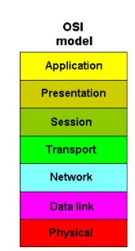

위 그림과 같이 계층들의 순서에 따라 각 계층에서 담당하는 기술과 방식으로 데이터를 endpoint에서 endpoint로 전달하는 것이다.

네트워크 장비들을 만들거나 할 때 이 OSI 7 계층 모델을 참조하여 만들게 된다.
IT기업 도한 고객에게 신제품을 설명할 대 OSI 모형을 통해 해당 제품이 어떤 계층에서 작동하는지 설명을 한다.

이 모형을 통해 우리는 특정 네트워킹 시스템에서 일어나는 일을 계층을 활용해 시작적으로 쉽게 볼 수 있으며,
네트워크 관리자는 어떤 문제의 원인이 어디에 있는지 범위를 좁힐 수 있다.
(보통 장애 판단을 할때 1계층부터 차례대로 선이 끊어졌는지 등을 확인하여 상위계층으로 간다.)

| Level          | Layer                                                        | Feature                                                      |
| -------------- | ------------------------------------------------------------ | ------------------------------------------------------------ |
| 7/Application  | 응용계층 `프로토콜 : DHCP, DNS, FTP, HTTP` 서비스 제공 | - 사용자가 네트워크에 접근할 수 있도록 해주는 계층 - 사용자 인터페이스, 전자우편, DB관리 등 서비스를 제공 |
| 6/Presentation | 표현계층 `프로토콜 : JPEG, MPEG, SMB, AFP` 이해할 수 있는 포멧 변환 | - 운영체계의 한 부분으로 입력 혹은 출력되는 데이터를 하나의 표현 형태로 변환 - 필요한 번역을 수행하여 두 장치가 일관되게 전송 데이터를 서로 이해할 수 있도록 한다. - 제어코드나 문자 및 그래픽등의 확장자(jpg,gif)를 생각하면 쉽다. |
| 5/Session      | 세션계층 `프로토콜: SSH, TLS` 응용간의 질서 제어   | - 통신 세션을 구성하는 계층으로, 포트(Port)연결이라고도 할 수 있다. - 통신 장치 간의 상호작용을 설정하고 유지하며 동기화한다. - 사용자간의 포트 연결이 유효한지 확인 및 설정을 한다. |
| 4/Transport    | 전송계층 `프로토콜 : TCP, UDP, ARP` 장비: 게이트웨이 | - 전체 메세지를 발신지 대 목적지간 제어와 에러를 관리한다. - 패킷들의 전송이 유요한지 확인하고 실패한 패킷은 다시 보내는 등 신뢰성 있는 통신을 보장하며, 머리맡에는 세그먼트가 포함된다. |
| 3/Network      | 네트워크계층 `프로토콜: IP, ICMP, IGMP` 장비: 라우터 | - 다중 네트워크 링크에서 패킷(packet)을 발신지로부터 목적지로 전달할 책임을 갖는다. - 2계층은 노드대 노드 전달을 감독하는 것이고 3계층은 각 패킷이 시작 시점에서 최종 목적지까지 성공적이고 효과적으로 전달되도록하며, 대표적으로 IP프로토콜이 있다. |
| 2/DataLink     | 데이터링크계층 `프로토콜: MAC, PPP` 장비: 브리지, 스위치 | - 오류없이 한 장치에서 다른 장치로 프레임(Frame, 비트의 모음)을 전달하는 역할을 한다. - 스위치 같은 장비의 경우 MAC주소를 이용하여 정확한 장치로 정보 전달한다. - 3계층에서 정보를 받아 주소와 제어정보를 헤더와 테일에 추가한다. |
| 1/Physical     | 물리계층 `프로토콜: Ethernet` 장비: 허브, 리피터   | - 물리적 매체를 통해 비트(Bit)흘므을 전송하기 위해 요구되는 기능들을 조정한다. - 케이플, 연걸 장치 등과 같은 기본적인 물리적 연결기의 전기적 명세를 정하고 네트워크의 두 노드를 물리적으로 연결시켜 주는 신호방식을 다룬다. |

##### ✨ 물리 계층(Physical Layer) - 1계층

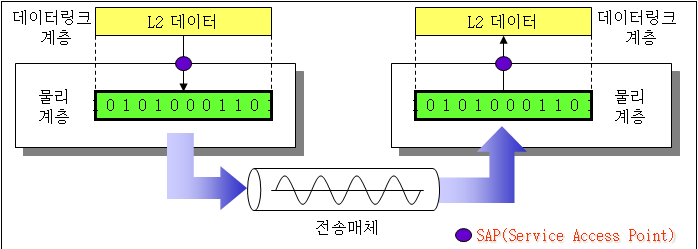

- 전기, 물리 신호에 대한 계층이다.
- 단순하게 장비를 가동시키기 위한 전기 공급 부터 장비 끼리의 물리적인 연결을 위한 랜 케이블, 무선 통신을 위한 주파수까지 다양한 전기적/물리적인 것들이 여기에 포함된다.
- 단위는 Bit이며 여기서 Bit는 전기적 신호(0 or 1)를 나타낼 때 사용한다.
- 이 계층에서는 오류 제어, 알고리즘 등이 없이 단순한 전기적인 신호를 전달하는 역할만을 담당한다.
- 대표적인 프로토콜/기술 : 전선, 광케이플, 랜 케이블, 허브, 리피터 등

##### ✨ 데이터링크 계층(DataLink Layer) - 2계층

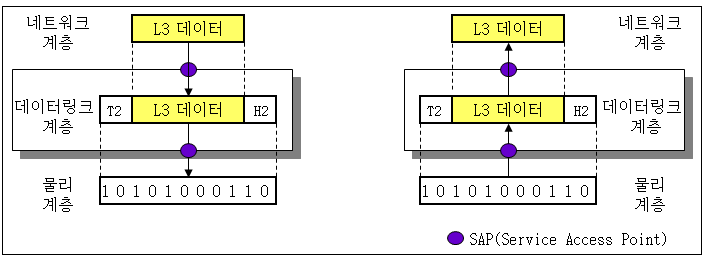

- 1 계층의 물리적인 링크를 이용하여 데이터를 신뢰성있게 전송하는 계층이다.
- ->물리 계층을 통해 송수신되는 정보의 오류와 흐름을 관리하여 안전한 정보의 수행을 도와주는 역할을 한다.
- 물리적인 주소를 지정하여 각 장비간 전송을 하게 한다.(MAC주소)
- 이 MAC 주소를 갖고 통신을 한다.
- 전송하는 데이터(비트의 모음)의 헤더에 다음 목적지 주소를 같이 붙이게 된다. 특히 데이터 링크 계층에서는 꼬리 부분에 오류 검출을 위한 부분이 따라 붙는다. 이러한 데이터 전체 구성을 **`프레임(Frame)`**이라고 한다.
- 물리 계층에서 발생할 수 있는 오류를 찾고 수정하는데 필요한 기능/절차들을 제공한다.
- LLC(Logical Link COntrol-논리적인 연결 제어): 데이터링크 계층의 기본 기능을 다룬다.
- MAC(Media Access Control-매체 접근 제어): 물리적 전송 선로의 특징과 매체 간의 연결 방식에 따른 제어 분리를 처리한다.
- 대표적인 프로토콜/기술 : L2 스위치 장비, 브릿지, 이더넷, ARP, 무선 랜 등

##### ✨ 네트워크 계층(Network Layer) - 3계층

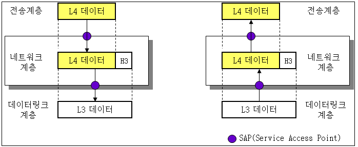

- 데이터 패킷이 어떻게 경로를 설정해서 나아갈지 결정하는 계층이다.
- 다른 여러 라우터를 통한 라우팅을 비롯한 패킷 전달을 담당한다.
- 전송 단위: Packet
- 데이터를 목적지까지 가장 안전하고 빠르게 전달 => 라우팅!
- 각 단말을 구분하도록 IP 주소를 할당하는 논리 주소 기능을 한다.
- 패킷 전달을 위해 할당된 IP 주소를 기반으로 네트워크를 구분하는 라우팅 기능을 한다.
- 복잡하고 다양한 경로들 중 가장 최적의 경로를 찾기 위한 경로를 설정한다.
- => 중계노드를 통하여 전송하는 경우, 어떻게 중계할 것인가를 규정한다.
- 대표적인 프로토콜/기술 : IP, ICMP 등

##### ✨ 전송 계층(Transport Layer) - 4계층

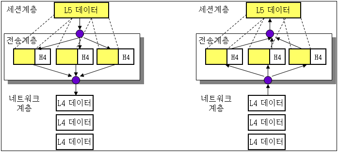

- 종단 간(End-to-Ent)에 신뢰성 있고 정확한 데이터 전송을 담당한다.
- 4계층에서 전송되는 단위는 **`세그먼트(Segment)`**이며, 종단 간의 에러복구와 흐름제어를 담당한다.
- 쪼개진 데이터 유닛인 세그먼트를 포트 번호 등으로 구분하여 각 응용 계층이 나눠 받도록 분할 작업을 한다.
- 서로 다른 장비 간 각기 다른 대역폭 속도를 서로 맞춰 주는 흐름제어(Flow Control) 작업을 한다.
  (ex. 서버는 100Mbps 속도를 제공하지만, 사용자 컴퓨터에서는 10Mbps 속도만 이용가능한 경우)
- 수신하지 못한 세그먼트가 있을 경우 해당 부분만 다시 송신을 요청하는 오류제어(Error Control)작업을 한다.
- 데이터 수신 유무를 확인하는 연결형(Connection-oriented)작업을 한다.(TCP)(3 way handshake)
- 데이터 수신 유/무를 확인하지 않는 비연결형(Connectionless)작업을 한다.(UDP)
- 대표적인 프로토콜/기술 : TCP, UDP 등
- (*TCP는 IP위에서 동작하는 프로토콜이다. 그래서 항상 TCP/IP라고 같이 부른다.)
- (*UDP는 TCP와 다르게 수신 확인을 하지 않는다. 오로지 '전송'을 위한 비연결형 프로토콜이다.)

##### ✨ 세션 계층(Session Layer) - 5계층

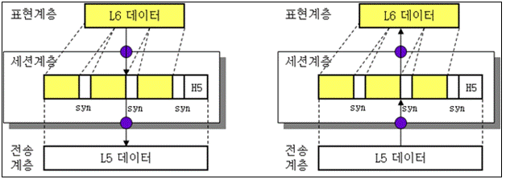

- 데이터가 서로 만나는 환경을 조성해주는 단계이다.
- 통신장치 간 상호작용 및 동기화를 제공한다.
- 양 끝단의 응용 프로세스가 통신을 관리하기 위한 방법을 제공한다.
- 쉽게 말해서, 컴퓨터 또는 서버 간에 대화가 필요하면 세션(session)을 만들어야 하는데 이 작업이 여기서 처리된다.
- 대표적인 프로토콜/기술 : TLS, SSH, NetBIOS 등

##### ✨ 표현 계층(Presentation Layer) - 6계층

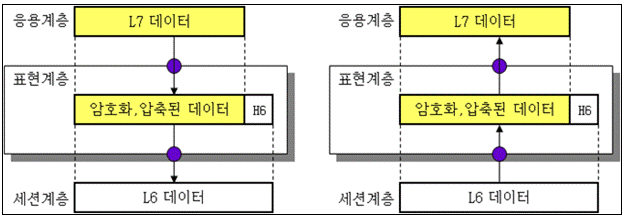

- 데이터 표현에 차이가 있는 응용처리에서의 제어 구조를 제공한다.
- 데이터를 더 빠르고 안전하게 전송하기 위한 압축, 그리고 더 안전하게 전송하기 위한 암호화/복호화 작업을 하는 단계이다.
- 데이터를 압축하기 전, 처음 상태가 5MB라고 가정해보면, 그 상태를 다른 형태로 번역 하여 크기를 줄일 수 있다면, 당연히 전송속도가 빨라지고 손실률이 감소하게 될 것이다.
- 또한, 그냥 데이터를 보내면 중간에 누군가가 가로채서 볼 수 있으므로 암호화를 해준다.
- 수신자는 당연히 역순으로 복호화하고 압축된 것을 원상복구해서 응용 계층으로 보낸다.
- 대표적인 프로토콜/기술: SSL, JPEG, MPEG
  (*JPEG: 정지 화상을 위해 만들어진 손실 압축 방법의 표준, 실사 사진, 컬러 이미지 등을 압축하기 위해 고안)

##### ✨ 응용 계층(Application Layer) - 7계층

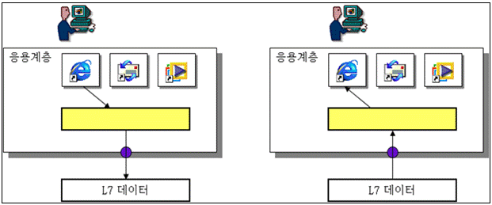

- 사용자와 가장 밀접한 계층이며, 인터페이스 역할을 한다.
- 도착한 데이터를 최종 사용자가 확인하는 마지막 단계이다.
- 브라우저, 메일 등 네트워크를 활용하는 다양한 으용 프로그램들이 이 계층에 포함될 수 있다.
- 웹 브라우저는 대표적으로 HTTP, HTTPS와 같은 프로토콜을 사용하고 있다.
  그 외에도 SNMP, DHCP, FTP 등과 같은 다양한 프로토콜들이 있으며 이들을 각각 활용하는 응용프로그램들은 굉장히 많다.
- 최종 목적지로서 HTTP, FTP, SMTP 등과 같은 프로토콜이 있다.
- 쉽게 User Interface를 제공하는 계층이다.

### 📕 캡슐화

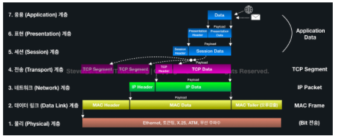

> 캡슐화 과정

OSI 7 계층에서는 데이터를 전송할 때 각각의 층마다 별도로 인식할 수 있는 헤더를 붙이게 되는데, 이 과정을 **`캡슐화`**라고 부른다. 반대로 데이터가 전송 매체를 통해 전송된 후 헤더가 벗져기는 과정을 **`디캡슐화`**라고 한다.

### 2. TCP/IP

> (TCP/IP는 하나의 모델이지만 OSI와 같이 Layer(계층)의 개념을 갖고 있음)
>
> 비표준 모델
>
> *실제로 통신 시 사용하는 모델(지금은 모든 인터넷이 TCP/IP를 사용하여 통신을 하고 있으며 실질적인 표준이다.)

#### 📕 TCP/IP란?

미 국방성 산하 방위고등연구계획국(DARPA)라는 곳에서 TCP/IP 통신 방식을 미 국방성의 통신 표준으로 채택하면서 인터넷 프로토콜 스위프트 혹은 DoD 모델이라고 부르는 TCP/IP 계층을 정의했다. (별 필요없는 말)

냉전 시절 중앙집중형 방식 네트워크의 한계를 극복하기 위해 중앙이 공격받아도 통신이 가능하도록 `패킷 교환 방식`을 사용하기로 한다. 이 때, 위의 DARPA에서는 'ARPANET'이라는 인터넷의 시초라고 할 수 있는 패킷 교환 방식의 네트워크를 구축하고 `TCP`라는 통신 규약의 초기 모델을 만든다.

인터넷 환경에서 대부분은 IP를 기반으로한 TCP 통신으로 이루어 진다. 이에 TCP/IP 통신을 기준으로 만든 것이 바로 TCP/IP 4계층이다.

이 모델은 OSI 7 계층 보다는 조금 더 간소화된 모델이라고 볼 수 있으며, 실질적인 표준 모델이다.

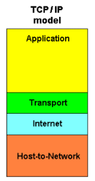

##### ✨ 네트워크 계층(Network Layer) - 1계층

- OSI 7 계층에서 **물리계층**과 **데이터링크계층**에 해당한다.
- 네트워크 드라이버와 같은 물리적인 TCP/IP 패킷의 전달 및 수신 과정에 대해 담당하고 있는 계층이다.
- 송신 측 컴퓨터의 경우 상위 계층으로부터 전달받은 패킷에 물리적인 주소 MAC 주소 정보를 가지고 있는 헤더를 추가하여 프레임을 만들고, 프레임을 하위계층인 물리 계층으로 전달한다.

##### ✨ 인터넷 계층(Internet Layer) - 2계층

- OSI 7 계층에서 **네트워크 계층**에 해당한다.
- 패킷을 목적지까지 효율적으로 전달하는 것만 고려하는 계층이다.
- 즉, 논리적인 주소인 IP주소를 판독하고 목적지의 네트워크를 찾아가서 해당 목적지(호스트)가 잘 받을 수 있도록 전송을 담당한다.
- 상위 전송 계층으로부터 받은 데이터에 IP패킷 헤더를 붙여 IP패킷을 만들고 이를 전송하는 것이다.
- 통신 노드 간의 IP 패킷을 전송하는 기능 및 라우팅 기능을 담당한다.

##### ✨ 전송 계층(Transport Layer) - 3계층

- OSI 7 계층의 **전송 계층**에 해당한다.
- 전달되는 패킷의 오류를 검사하고 재 전송을 요구하는 등의 전반적인 제어를 담당한다.
- 네트워크 양단의 송수신 호스트 사이에서 신뢰성 있는 전송 기능을 제공한다.
- 시스템의 논리주소와 포트를 가지고 있어서 각 상위 계층의 프로세스를 연결해서 통신한다.
- 정확한 패킷의 전송을 보장하는 TCP와 정확한 전송을 보장하지 않는 UDP 프로토콜을 이용한다.
- 통신 노드 간의 연결을 제어하고 자료 송수신을 담당한다.

##### ✨ 응용 계층(Application Layer) - 4계층

- OSI 7 계층에서 **세션 계층, 표현 계층, 응용 계층**에 해당한다.
- 사용자의 응용 프로그램 레벨에서 데이터를 처리하는 계층이다.

### 3. OSI 모델과 TCP/IP 모델 비교

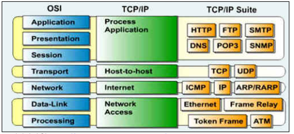

##### ✨ 두 모델은 정확하게 일치하지 않는다.

##### ✨ 두 모델 모두 계층형이라는 공통점이 있으며 TCP/IP는 인터넷 개발 이후 계속 표준화되어 신뢰성이 우수한 반면, OSI 7 Layer는 표준이 되기는 하지만 실제적으로 구현되는 예가 없다.

##### ✨ OSI는 장비 개발과 통신 자체를 어떻게 표준으로 잡을지 사용되는 반면, 실질적인 통신 자체는 TCP/IP를 사용한다.

##### ✨ 두 모델 모드 데이터 통신을 계층형으로 구조화한 것이라는 것에서는 같지만, 그 계층의 범위에서 차이가 있다.

