# 🤔 HTTP & HTTPS

## 🧐 HTTP(Hypertext Transfer Protocol)

> 인터넷상에서 노드간에 데이터 통신을 위한 기초적인 프로토콜
> (Application 계층의 프로토콜)
>
> 쉽게, 웹 서핑할 때 서버에서 브라우저로 데이터를 전송해 주는 용도로 가장 많이 사용한다.

### 1. HTTP란?

✨ **인터넷 상에서 `HyperText`를 교환하기 위해 사용되기 시작했다.**

- HyperText는 다른 파일에 대한 참조 링크인 **하이퍼링크**를 갖고 있다.
  이 하이퍼링크를 통해 다른 문서로 이동하거나 그 페이지를 운영하는 서버에 데이터를 보낸다.
  (대표적인 HyperText에는 HTML이 있다.)

**✨ 서버/클라이언트 모델을 따라 데이터를 주고 받기 위한 프로토콜**

✨ **HTTP는 인터넷에서 하이퍼텍스트를 교환하기 위한 통신 규약으로, 80번 포트를 사용한다.**

✨ **따라서, Http 서버가 80번 포트에서 요청을 기다리고 있으며, 클라이언트는 80번 포트로 요청을 보낸다.**

### 2. HTTP 구조

✨ **HTTP는 Application 레벨의 프로토몰로 TCP/IP 위에서 작동한다. HTTP는 상태를 가지고 있지 않는 Stateless 프로토콜이며 Method, Path, Version, Headers, Body 등으로 구성된다.**

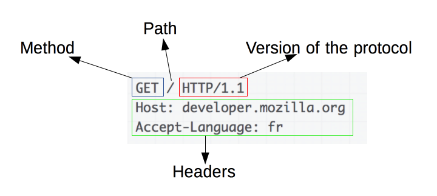

✨ **하지만, HTTP는 암호화가 되지 않은 `평문 데이터`를 전송하는 프로토콜이기 때문에, HTTP로 비밀번호나 주민등록번호 등 민감 정보를 주고 받으면 제 3자가 정보를 조회할 수 있어 보안에 취약하다.**

### 3. HTTP 통신

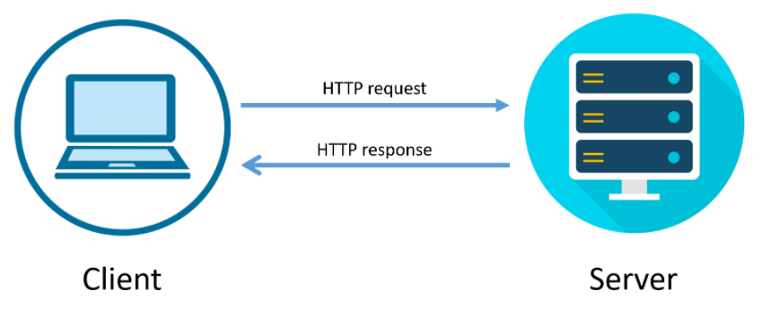

✨ **Client & Server 구조에서 이용되며 클라이언트에서 요청을 보내고 서버는 응답을 해주는 방식이다.**

✨ **웹 서버는 모드 HTTP Daemon을 갖고 있는데, HTTP Dameon은 HTTP 요청을 기다리고 있다가 요청이 들어오면 이를 처리하도록 설계되어 있다.**

✨ **사용자가 URL을 입력하거나, 하이퍼텍스트 링크를 클릭하여 데이터를 요구하면, 브라우저는 HTTP 요구를 URL에 적혀있는 IP 주소에 전달한다. 지정된 서버상의 HTTP Daemon은 그 요구를 받아서 필요한 작업이 있다면 처리한 뒤 요구된 데이터를 찾아서 응답한다.**

### 4. HTTP 메시지

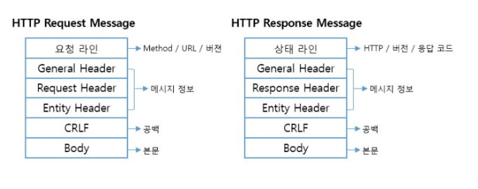

#### 📕 Request Message

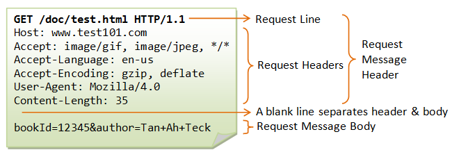

✨ **Host**: 서버의 도메인 주소(DNS)

✨ **Accept**: 브라우저가 처리할 수 있는 데이터의 형태

✨ **Accept-Language**: 서버가 돌려주기로 예상된 언어

✨ **Accept-Encoding**: 브라우저가 처리할 수 있는 컨텐츠 인코딩 압축 방식

✨ **Content-Length**: 메세지의 본문 크기를 byte단위로 표시

✨ **User-Agent**: 사용자의 웹 브라우저 종류&버전 정보

#### 📕 Request Message Header

> RequestLine + RequestHeader
>
> (헤더까지 deep하게 팔 필요는 없을 것 같다.)

✨ **RequestLine**: 해당 요청 또는 응답에 대한 성공 또는 실패를 기록하며 항상 한줄로 끝난다.

✨ **RequestHeader**: 다양한 요청 메타데이터 정보가 들어있으며 크게 Request, General, Entity Header로 나눌 수 있다.

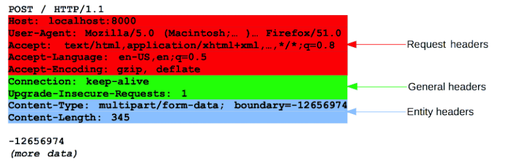

- General headers: 요청 및 응답 메시지 모두에서 사용 가능한 일반 목적의 헤더 항목
- Request headers: Request Message에서만 나타나며, 요청을 구체화 시키거나 context를 제공한다.
- Entity headers: Request, Response에서 모두 사용 가능한 Entitiy에 대한 설명 부분이다.

#### 📕 Request Message Body

✨ **요청과 관련된 내용이 옵션으로 들어가거나, 응답과 관련된 문서가 들어간다.**

✨ **POST 요청인 경우 업데이트를 하기 위해 서버에 데이터를 전송한다.**

✨ **GET, HEAD, DELETE, OPTIONS처럼 리소스를 가져오는 요청은 보통 본문이 필요없다.**

✨ **즉, 데이터를 전송하려면 body를 이용하면 되고, 가져오려면 header에 존재하는 url에 쿼리를 이용하면 된다.**

#### 📕 Response Message

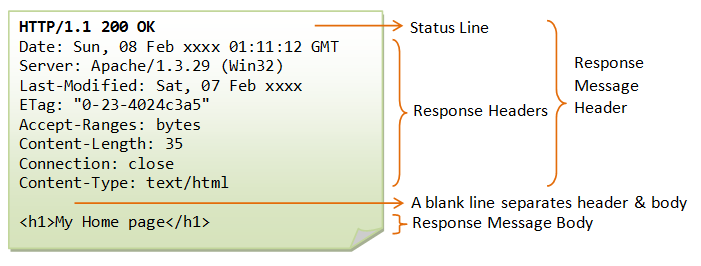

#### 📕 Response Message Header

✨ **ResponseLine**: HTTP Version + Status Code + Status Text로 구성된다. 상태코드는 성공 및 실패의 여부를 나타내며, 상태 텍스트는 상태 코드에 대한 간결한 설명을 나타낸다.

✨ **ResponseHeader**: 다양한 응답 메타데이터 정보가 들어있으며, 크게 Response, General, Entity Header가 있다.

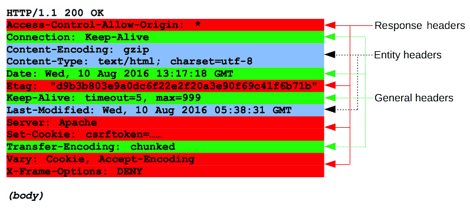

> General, Entity Header는 요청 메세지와 동일하며, Response Header에는 상태 텍스트와 코드에서 미처 나타내지 못한 서버의 메타데이터 정보를 담고있다.

#### 📕 Response Message Body

✨ **모든 응답에 본문이 들어가지 않는다.**

✨ **길이를 아는 단일 리소스 본문, 길이를 모르는 단일 리소스 본문, 그리고 다중 리소스 본문으로 나눌 수 있다.**

✨ **길이를 모르는 단일 리소스 본문에는 Transfer-Encoding이 chunked로 설정되어 있으며, 파일은 청크로 나뉘어 인코딩 되어있다.**

## 🧐 HTTP 1.0 & HTTP 1.1 & HTTP 2.0

### 1. HTTP 1.0

✨ **HTTP 1.0은 단순하게 open/operation/close의 방식을 취하고 있어 단순하다.**

✨ **TCP connection당 하나의 URL만 fetch하며 매번 request/response가 끝나면 연결이 끊긴다.**

✨ **그러므로 매번 필요할 때마다 다시 연결을 해야하므로 속도가 떨어진다.**

✨ **또한, 한번에 얻어서 가져올 수 있는 데이터의 양이 제한되어있고, URL의 크기도 작다**

✨ **즉, 매번 Connection/Close 작업을 해야하며 전송할 데이터량이 작다.**

✨ **이를 해결하기 위해 `HTTP1.1` 등장**

### 2. HTTP 1.1

✨ **HTTP의 인터넷에 impact를 줄이고 cache를 두어 인터넷 프로토콜 수행이 빠르게 될 수 있도록 성능을 향상하고 있다.**

✨ **multiple request에 대한 처리가 가능하다.**

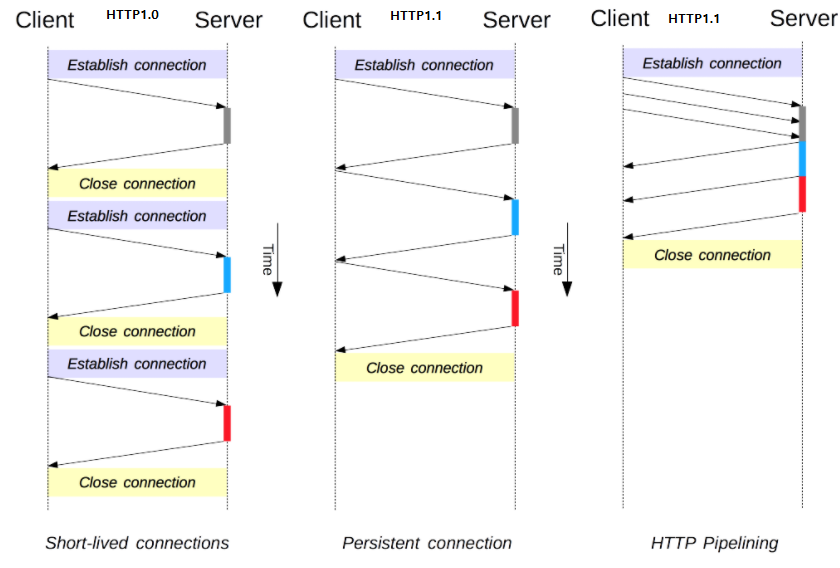

> HTTP1.0에서는 매 요청 응답마다 close를 하는데 HTTP1.1에서는 여러 요청응답을 하고 close를 한다.
> 마지막 3번째의 방식을 파이프라인 방식이라고 하는데, 여러 request를 한번에 보내고 한번에 응답을 받는 것을 말한다.
>
> 이를 keep-alive라 부르며, 한 번 맺어졌던 연결을 끊지 않고 지속적으로 유지하여 불필요한 hand-shake를 줄여 성능을 개선할 수 있다.

✨ **하지만, HTTP1.1에도 문제점이 존재한다.**

✨ **만일 파이프라인 방식에서 처음에 요청한 Request에 문제가 생겨 응답이 늦어지면 2번째, 3번째에 요청한 Request의 응답도 같이 늦어진다는 것이다.(Head of Line  Blocking)**

### 3. HTTP2

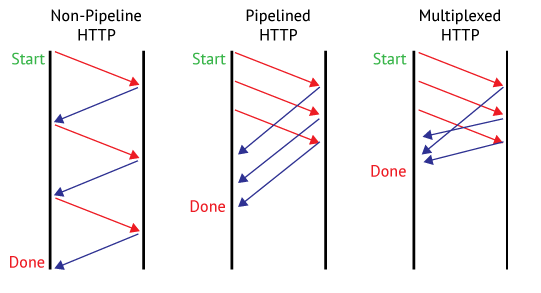

✨ **HTTP2에서는 Head Of Line Blocking 문제를 해결하기 위해 MultiPlexing이라는 개념을 도입한다.**

✨ **위 그림의 형태처럼 요청과 응답의 순서와 상관없이 먼저 끝나는 순으로 Client에서는 응답을 받는다.**

## 🧐 HTTPS

### 1. HTTPS(Hyper Text Transfer Protocol Secure)란?

✨ **HTTP에 데이터 암호화가 추가된 프로토콜이다.**

✨ **SSL 프로토콜을 이용하여 Client와 Server가 데이터를 주고 받는 통신 규약이다.**

✨ **HTTPS는 HTTP와 다르게 443번 포트를 사용하며, 네트워크 상에서 중간에 제 3자가 정보를 볼 수 없도록 공개키 암호화를 지원한다.**

- [공개키/개인키]
  - HTTPS는 공개키/개인키 암호화 방식을 이용해 데이터를 암호화한다.
    (공개키: 모두에게 공개 가능한 키 / 개인키 : 나만이 가지고 있어야 하는 키)
  - 공개키로 암호화를 하면 개인키로 복호화 할 수 있다.
    (개인키는 나만 갖고 있으므로, 나만 볼 수 있다.)
  - 개인키로 암호화하면 공개키로만 복호화 할 수 있다.
    (공개키는 모두에게 공개되어 있으므로, 내가 인증한 정보임을 알려 신뢰성을 보장할 수 있다.)
  - 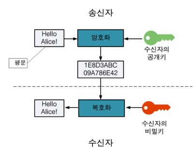

### 2. HTTPS 동작 과정

✨ **HTTPS는 SSL과 같은 프로토콜을 사용하여 공개키/개인키 기반으로 데이터를 암호화하고 있다.**
(SSL 인증서는 사용자가 사이트에 제공하는 정보를 암호화한다.)

✨ **데이터는 암호화되어 전송되기 대문에 임의의 사용자가 데이터를 조회하여도 원본 데이터를 보는 것은 불가능 하다.**

✨ **자세한 동작 과정**

> 서버는 클라이언트가 요청을 보낼 때 암호화를 하기 위한 공개키를 생성해야 하는데, 일반적으로 인증된 기관(CA)에 공개키를 전송하여 인증서를 발급받고 있다.

- A기업은 HTTP 기반의 애플리케이션에 HTTPS를 적용하기 위해 공개키/개인키를 발급함
- CA 기업에게 돈을 지불하고, 공개키를 저장하는 인증서의 발급을 요청
- CA 기업은 CA기업의 이름, 서버의 공개키, 서버의 정보 등을 기반으로 인증서를 생성하고, CA 기업의 개인키로 암호화하여 A기업에게 제공함
- A기업은 클라이언트에게 암호화된 인증서를 제공함
- 브라우저는 CA기업의 공개키를 미리 다운받아 갖고있어, 암호화된 인증서를 복호화함
- 암호화된 인증서를 복호화하여 얻은 A기업의 공개키로데이터를 암호화하여 요청을 전송함
- 즉, 호환된 인증서는 CA의 개인키로 암호화되었기 때문에, 신뢰성을 확보할 수 있고,
  클라이언트는 A 기업의 공개키로 데이터를 암호화하였기 대문에 A 기업만 복호화하여 원본의 데이터를 얻을 수 있음
- HTTPS는 이런 공개키/개인키 기반의 대칭키 암호화 방식을 활용하여 안전성을 확보하고 있다.

####  📕 SSL(보안 소켓 계층) 인증서?

브라우저 또는 사용자의 컴퓨터와 서버 또는 웹사이트 간에 암호화된 연결을 수립하는데 사용된다.

쉽게 이해하자면 들어오고 나가는 데이터들을 암호화하는 보안 기능을 갖고 있는 '**보안 인증서**' 이다.

SSL은 암호화된 링크를 수립하기 위한 표준 보안 기술로 작동 원리는 아래와 같다.

최종 사용자가 볼 수 없는 'SSL Handshake'라는 프로세스를 통해 웹 서버와 브라우저 간에 안전한 연결이 수립된다.

3가지 키를 사용하여 대칭 세션 키를 만들며 이렇게 만들어진 세션 키는 전송 중 데이터를 암호화하는데 사용된다.

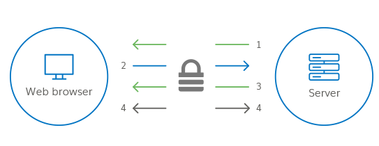

1. 서버에서는 `비대칭 공개 키`의 복사본을 브라우저로 전송한다.
2. 브라우저에서는 `대칭 세션 키`를 만들어 서버의 `비대칭 공개 키`로 암호화한 다음 이를 서버로 전송한다.
3. 서버는 `대칭 세션 키`를 얻기 위해 `비대칭 비공개 키`를 사용하여 암호화된 세션 키를 **해독**한다.
4. 이제 서버와 브라우저에서 대칭 세션 키를 사용하여 전송된 모든 데이터를 암호화 및 해독한다. 브라우저와 서버에만 대칭 세션 키에 대한 정보가 있으며 세션 키는 해당하는 특정 세션에만 사용되기 때문에 채널 보안이 보장된다.
   (다음날 브라우저가 동일한 서버에 다시 연결되면 새로운 세션 키가 생성된다.)

## 🧐 HTTP HTTPS 차이점

### 1. SSL

HTTPS는 HTTP와 달리 SSL을 통하여 클라이언트와 서버가 데이터를 주고 받을 때 암호화를 하여 주고받아서

훨씬 보안에 뛰어나다.

### 2. SEO

검색 엔진 최적화를 위해서도 HTTP 대신 HTTPS 보안 접속을 적용해야 한다.

동일한 키워드의 페이지가 있다고 할 때 사용자가 키워드 검색 시 상위 노출되는 기준 중 하나가 보안요소이며, HTTP 사이트보다 HTTPS 사이트가 우선 검색될 수 있다.