# 🤔 DNS와 DHCP

## 🧐 도메인

> 인터넷에 연결된 컴퓨터를 사람이 쉽게 기억하고 입력할 수 있도록 문자로 만든 인터넷 주소

### 1. IP와 도메인?

인터넷에 연결되어 있는 장치들은 각각의 장치를 식별할 수 있는 주소를 가지고 있는데 이를 ip라고 한다.

ip는 숫자로 구성되어 있다. ex) naver => 220.95.233.172, daum => 114.108.157.19

이렇게 불규칙적인 숫자로 이루어져있기 때문에 일일히 이해하고 기억하기가 매우 어렵다.

이를 해결하기 위해 각 ip에 이름을 부여할 수 있게 했는데, 이것을 **`도메인`**이라고 한다.

### 2. 도메인의 구성요소

✨ **opentutorials.org**

- opentutorials: 컴퓨터의 이름
- org: 최상위 도메인 - 비영리단체

✨ **daum.co.kr**

- daum: 컴퓨터의 이름
- co: 국가 형태의 최상위 도메인을 의미
- kr: 대한민국의 NIC에서 관리하는 도메인을 의미

## 🧐 DNS

### 1. Domain Name System

사람이 IP주소를 이해하고 활용하고자 하지만 불규칙적인 숫자를 모두 외운다는건 굉장히 힘든 일이다.

결국에는 특정 서버에서 도메인값을 IP주소로 반호나해주는 역할을 해야하며 이러한 작업을 하는 것이 바로 **`DNS서버`**이다. 이 DNS는 브라우저가 인터넷 자원을 로드할 수 있도록 도메인 이름을 IP주소로 변환한다.

즉, DNS란 특정 노드의 주소를 찾기 위해 사람이 이해하기 쉬운 도메인 이름을 IP주소로 변환해주는 역할을 한다. 

그리고 이 안에서 부분적으로 자기 자신의 역할을 하는 서버를 DNS 서버라고 한다.

(2017년 말 기준 도메인 이름의 수는 3억 3,200만개 이상)

### 2. DNS 구조와 작동 방식

#### 📗 구조

인터넷에서 사용되는 도메인은 전 세계적으로 고유하게 존재하는 이름이다.

정해진 규칙 및 체계에 따라야 하며, 임의로 변경되거나 생성될 수는 없다.

인터넷상의 모든 도메인은 ".(dot)" 또는 루트(root)라 불리는 도메인 아래에 그림과 같이 나무를 거꾸로 위치시킨 역트리구조로 계층적으로 구성되어있다.

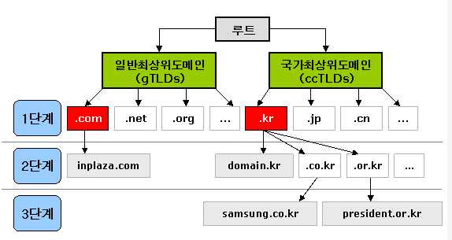

DNS 구조는 다음과 같이 Root, Top-Level, Second-Level, Sub의 위계구조를 갖는다.

루트 도메인 바로 아래의 단계를 1단계 도메인 또는 최상위 도메인(TLD, Top Level Domain)이라고 부르며, 그 다음 단계를 2단계 도메인(SLD, Second Level Doamin)이라고 한다.

해당 부분을 담당하는 컴퓨터(DNS서버)가 각각 존재하며, DNS 서버는 Root에서 시작해서 Sub로 거슬러 올라가며 IP를 탐색한다.

도메인은 일반최상위도메인(gTLD)과 국가최상위도메인(ccTLD)로 구분할 수 있다.

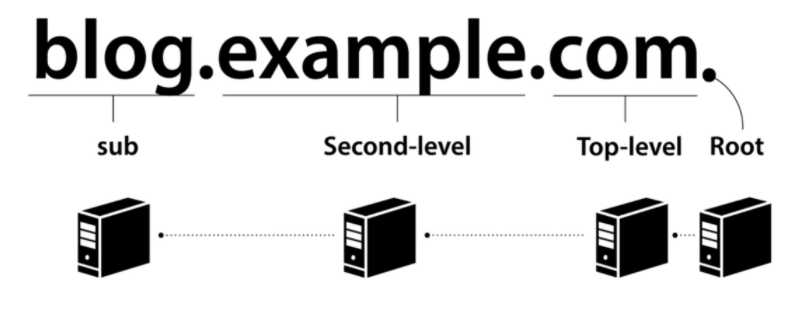

초창기 인터넷에서는 1대의 DNS 서버만으로도 충분히 IP주소와 이름의 관리가 가능했지만, 인터넷이 폭발적으로 확장되면서, 몇 대의 DNS 서버로는 실시간으로 인터넷 상의 수많은 컴퓨터들을 관리할 수가 없게 되었다.

그래서 위와 같은 트리 구조의 '도메인 이름 체계'가 나온 것이다.

#### 📗 DNS 서비스 유형

✨ **신뢰할 수 있는 DNS**

- 퍼블릭 DNS 이름을 관리하는 데 사용하는 업데이트 메커니즘을 제공하며, 이를 통해 DNS 쿼리에 응답하여 도메인 이름을 IP주소로 변환한다.
- 신뢰할 수 있는 DNS는 도메인에 대해 최종 권한이 있으며 재귀적 DNS서버에 IP주소 정보가 담긴 답을 제공할 책임이 있다.

✨ **재귀적 DNS**

- 보통 클라이언트는 신뢰할 수 있는 DNS 서비스에 직접 쿼리를 수행하지 않고, 해석기 또는 재귀적 DNS 서비스라고 알려진 다른 유형의 DNS 서비스에 연결하는 경우가 일반적이다.
- 일정 기간 동안 캐시된 또는 저장된 DNS 레퍼런스를 가지고 있는 경우, 소스 또는 IP 정보를 제공하여 DNS쿼리에 답을 하거나, 해당 정보를 찾기 위해 쿼리를 하나 이상의 신뢰할 수 있는 DNS 서버에 전달한다.

#### 📗 DNS 서버 종류 구분

도메인의 수가 너무 많기 때문에, DNS 서버 종류를 계층화해서 단계적으로 처리한다.

특히 도메인의 총 관리는 ICANN에서 하기 때문에, DNS 서버도 최상위 도메인에서 개인 도메인의 서브 도메인까지 도메인 이름의 분류와 마찬가지로 디렉토리/계층 형태로 구분된다.

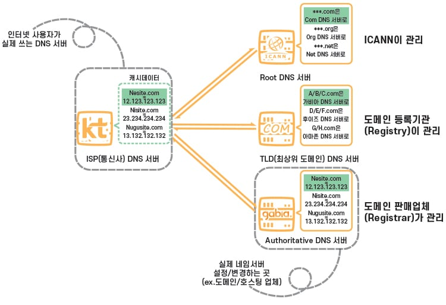

- Root DNS Server: ICANN이 직접 관리하는 절대 서버로, TLD DNS 서버 IP들을 저장해두고 안내하는 역할
- TLD(최상위 도메인) DNS Server: 도메인 등록기관(Registry)이 관리하는 서버로, Authoritative DNS서버 주소를 저장해두고 안내하는 역할을 한다. 어떤 도메인 묶음이 어떤 Authoritative DNS Server에 속하는지 아는 이유는 도메인 판매 업체(Registrar)의 DNS설정이 변경되면 도메인 등록 기관(Registry)으로 전달되기 때문이다.
- Authoritative DNS Server: 실제 개인 도메인과 IP 주소의 관계가 기록/저장/변경되는 서버이다. 그래서 권한의 의미인 Authoritative가 붙은 것이다. 일반적으로 도메인/호스팅 업체의 '네임서버'를 말하지만, 개인 DNS 서버 구축을 한 경우에도 여기에 해당한다.
- Recursive DNS Server: 인터넷 사용자가 가장 먼저 접근하는 DNS 서버이다. 위 3개의 DNS 서버를 매번 거친다면 효율이 낮을 수 밖에 없으니, 한 번 거친 후 얻은 데이터를 일정기간 동안 **캐시**라는 형태로 저장해 두는 서버이다. 직접 도메인과 IP 주소의 관계를 기록/저장/변경하지는 않고 캐시만을 보관하기 때문에, Authoritative와 비교되는 의미로 반복의 Recursive가 붙는다. 대표적으로 KT/LG/SK와 같은 ISP(통신사) DNS 서버가 있고, 브라우저 우회 용도로 많이 쓰는 구글 DNS 등이 있다.

#### 📗 작동 원리

DNS서버는 **IP 주소를 특정 도메인 주소와 같다는 기록을 저장**해두고, 인터넷 사용자들이 도메인 주소를 검색했을 때 IP 주소로 연결되도록 해준다.

브라우저가 URL에 적힌 값을 파싱해서 HTTP Request Message를 만들고 전송 요청을 하게 되는데, 이 때 IP주소가 아닌 Domain만으로는 요청을 보낼 수가 없기 때문에 **`DNS Lookup`**을 수행한다.

- Recursive Query: Local DNS 서버가 여러 DNS 서버를 차례대로 (Root DNS 서버 => com DNS 서버 => naver.com DNS 서버)질의해서 답을 찾아가는 과정
- 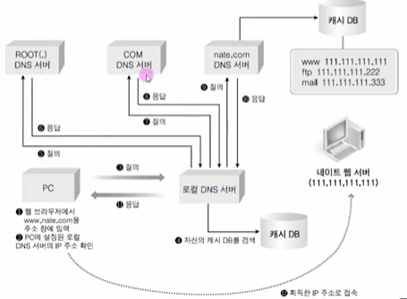

- **DNS 동작 과정**

  ​	

  - **1단계: Local Hosts 파일 참조**
    (hosts 파일을 이용한 네트워크 접속은 윈도우 같은 경우 `C:\Windows\System32\drivers\etc\hosts`파일에 URL과 IP주소를 기록해 놓는 방식 사용)

    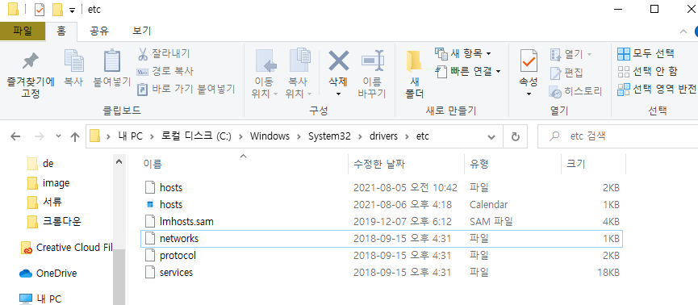

    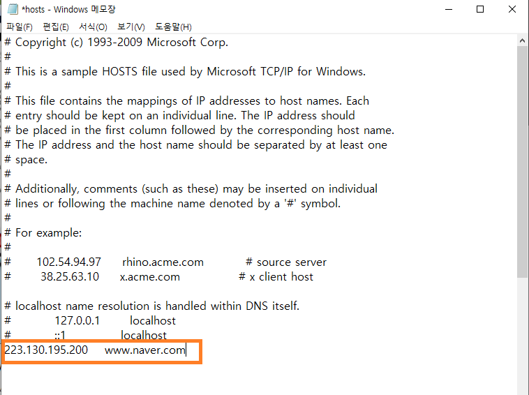

    > (여기에 IP와 도메인을 추가해서 사용할 수 있다. 만약 3단계에서 DNS서버를 엉뚱하게 해놓고 여기에 옳바른 IP주소와 도메인을 메모해놓으면 제대로 잘 찾아간다. 만약 잘못 적어놓으면 해당 사이트를 못찾아 가는데, 결국 컴퓨터는 알고 찾아가는 것이 아니라 적혀있는데로 찾아가는 것이다.)

  - **2단계: 자체의 DNS cache table**

  - **3단계: DNS Server 참조**
    (최상위인 Root Domain으로 보낸 후 Top-Level Domain, Second-Level Domain 서버 검색, Sub 서버 검색 순으로 이름에 해당하는 IP를 찾게된다.)
    (방대한 양의 도메인 주소를 정리해 놓은 전화번호부 같은 것이다. DNS 서버는 인터넷에서 변화하는 모든 컴퓨터의 URL과 IP정보를 거의 실시간으로 제공하므로, 사용자는 더 이상 URL에 해당하는 IP 주소를 신경 쓸 필요가 없다.)

    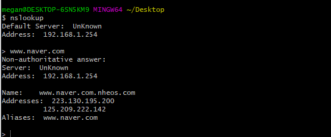

    > (이렇게 DNS 서버를 통해 네이버의 IP주소를 얻어낼 수 있다.)

    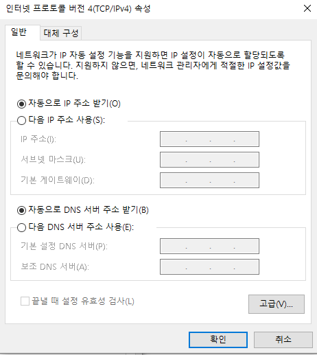

    > (제어판 > 네트워크 및 인터넷 > 네트워크 및 공유 센터 > 연결: (나의 경우)Wi-Fi(NEXT_8004N) > 속성 > 인터넷 프로토콜 버전 4(TCP/IPv4) > 속성)
    > (여기서 보면 자동으로 DNS 서버 주소 받기를 통해 DNS서버를 이용하고 있다는 것을 알 수 있다. 만일 여기서 DNS 서버를 다른 것으로 해놓고 브라우저에 도메인을 적어보면 해당 사이트를 찾아가질 못한다.)

- 예시
  - 웹 브라우저에 www.naver.com을 입력하면 먼저 Local DNS에게 IP주소를 질의하여 Local DNS에 없으면 다른 DNS name 서버 정보를 받음(Root DNS 정보 전달 받음)
  - Root DNS 서버에 www.naver.com 질의
  - Root DNS 서버로부터 com도메인을 관리하는 TLD(Top-Level Domain)이름 서버 정보 전달 받음
  - TLD에 www.naver.com 질의
  - TLD에서 name.com 관리하는 DNS 정보 전달
  - naver.com 도메인을 관리하는 DNS서버에 www.naver.com 호스트네임에 대한 IP 주소 질의
  - Local DNS 서버에게 www.naver.com에 대한 IP주소 222.122.195.6 응답
  - Local DNS는 www.naver.com에 대한 IP주소를 캐싱을 하고 IP 주소 정보 전달

## 🧐 DHCP

> Dynamic Host Configuration Protocol은 네트워크 조직의 호스트에게 동적으로 IP를 할당하는 프로토콜이다.
>
> 즉, 동적으로 IP를 할당 받도록 도와주는 DHCP!

### 1. DHCP?

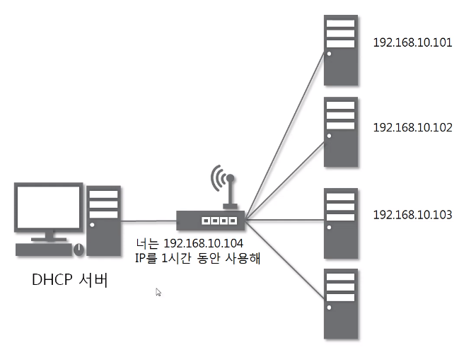

간단하게 말해서 IP주소를 관리해주는 서버이다.

우리가 인터넷을 사용할 때 각각의 기기마다 고유한 IP주소가 필요한데, 이걸 직접 하려면 중복검사도 어렵고 충돌이 나는 그런 단점들이 있다.
(*충돌이 나면 인터넷에 연결되지 않는다고 한다.)

이때, DHCP를 통해서 동적으로 IP주소를 할당받게 되는데, 같은 네트워크 대역에서 사용할 수 있는 IP주소를 DHCP서버가 관리를 하게 되면 사용자가 필요할 때마다 편하게 가져다 쓰면 된다.

결국,

**DHCP란 호스트의 IP주소와 각종 TCP/IP 프로토콜의 기본 설정을 클라이언트에게 자동적으로 제공해주는 프로토콜을 말한다.** 

DHCP는 네트워크에 사용되는 IP주소를 DHCP서버가 중앙집중식으로 관리하는 클라이언트/서버 모델을 사용하게 되며, DHCP 지원 클라이언트는 네트워크 부팅과정에서 DHCP서버에 IP주소를 요청하고 이를 얻을 수 있다.

그래서, 보통 이 DHCP의 기능이 우리의 공유기에 들어가 있고, 설정을 보면

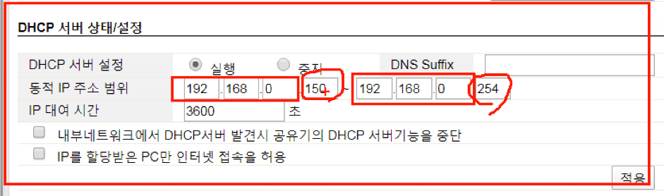

이렇게 각각의 IP 주소 범위 및 대여시간을 설정할 수 있다.

여기서 보면 `대여 시간`이라고 나와있는데, 말 그대로 IP 주소 할당은 **`임대`**라는 개념이며,
단말에 영구적으로 할당하는 것이 아니다. 임대 기간을 명시하여 그 기간 동안만 단말이 IP 주소를 사용하도록 하는 것이다.

단말은 임대기간 이후에도 계속 해당 IP주소를 사용하고자 한다면,
IP주소 임대기간 연장을 DHCP서버에 요청해야하고
또한 단말은 임대 받은 IP 주소가 더 이상 필요치 않게 되면 IP 주소 반납 절차를 수행하면 된다.

#### 📕 장점

- PC의 수가 많거나 PC 자체 변동사항이 많은 경우 IP 설정이 자동으로 되기 때문에 효율적으로 사용 가능하고, IP를 자동으로 할당해주기 때문에 IP 충돌을 막을 수 있다.

#### 📕 단점

- DHCP 서버에 의존되기 때문에 서버가 다운되면 IP할당이 제대로 이루어지지 않는다.
- 포트포워딩같은 서비스를 이용하는 경우 이를 다시 셋팅해줘야한다.
  (A가 연결을 해제하면 A가 갖고 있던 IP주소를 다른 컴퓨터가 받을 수 있다.)

### 2. DHCP 구성

✨ **DHCP 클라이언트**

- DHCP 서버에 자신의 IP를 요청하고 IP를 부여받고 나면 TCP/IP통신을 할 수 있다.
- 클라이언트들은 시스템이 시작하면 DHCP 서버에 자신의 시스템을 위한 IP주소를 요청하고, 부여받으면 TCP/IP 설정은 초기화되고 다른 호스트와 TCP/IP를 사용해서 통신할 수 있게 된다.

✨ **DHCP 서버**

- 클라이언트로부터 IP할당 요청이 들어오면 설정된 범위안에서 사용하고 있지 않은 IP를 클라이언트에 부여하여 할당 가능한 IP들의 영역을 관리한다.
- 네트워크 인터페이스를 위해서 IP주소를 가지고 있는 서버에서 실행되는 프로그램으로 일정한 범위의 IP주소를 다른 클라이언트에게 할당하여 자동으로 설정하게 해주는 역할을 한다.
- DHCP 서버는 클라이언트에게 할당된 IP주소를 변경없이 유지해 줄 수 있다.

### 3. DHCP 원리

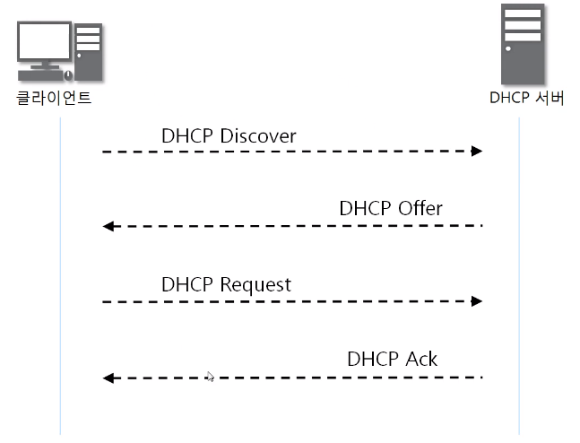

✨ **DHCP Discover** 

- 맨 처음 IP주소가 없는 클라이언트가 DHCP 서버에 DHCP Discover 패킷을보낼 때, 이더넷 프로토콜에 MAC주소를 **브로드캐스트** 주소로 하여 보내게 된다.
  (같은 네트워크 대역에 DHCP서버가 있어야지 IP를 할당 받을 수 있다.)
- 클라이언트가 DHCP 서버를 찾기 위한 패킷이며 브로드캐스트로 전송하여 LAN상에 DHCP가 있는지 찾는다.
- 즉, DHCP Discover는 같은 네트워크 대역에 DHCP 서버가 있는지 없는지를 알아낸다.
- 메시지 방향: 단말 => DHCP 서버

✨ **DHCP Offer**

- "저 여기 있어요!! 내가 DHCP 서버에요!!"
- 메시지 방향: DHCP 서버 => 단말
- 단순히 DHCP 서버의 존재만을 알리지 않고, 단말에 할당할 IP 주소 정보를 포함한 다양한 네트워크 정보를 함께 실어서 단말에 전달한다.
- 서버가 Discover 패킷을 받았으면 자신이 임대해줄 수 있는 네트워크 정보와 함께 자신의 IP를 전달한다.

✨ **DHCP Request**

- "아, 당신이 DHCP서버군요!! 저 여기 네트워크 대역에서 사용할 IP를 할당받으려고 합니다!! 하나만 할당해주세요!!"
- 메시지 방향: 단말 => DHCP 서버
- 단말은 DHCP 서버의 존재를 알았고, DHCP 서버가 단말에 제공할 네트워크 정보(IP주소, subnet mask, 등)를 알았다.
  이제 단말은 DHCP Request 메시지를 통해 하나의 DHCP 서버에게 단말이 사용할 네트워크 정보를 요청한다.
- 클라이언트가 전달받은 네트워크 정보를 사용하겠다고 DHCP에 전달하는 패킷이다. Offer에서 DHCP 서버의 IP를 전달받았으니 이번에는 브로드캐스트가 아닌 DHCP 서버에게만 패킷을 전달한다.

✨ **DHCP Ack**

- "xxx.xxx.xxx.xxx의 IP주소를 xx시간 동안 사용하세요!!"
- 메시지 방향: DHCP 서버 => 단말
- Reqeust를 전달받은 DHCP가 최종적으로 승인을 내리고 네트워크 정보를 임대해준다.
- DHCP 절차의 마지막 메시지로, DHCP 서버가 단말에게 네트워크 정보를 전달해 주는 메시지이다.

이런 과정을 통해 클라이언트는 IP주소를 할당받게 되고, 이후 인터넷 사용이 가능해진다.

### 4. 임대, 갱신, 반환

✨**임대(Lease)**

- 임대 과정은 위에서 말한 DORA를 통해 IP를 받는 과정이다. iptime의 경우 기본적으로 7200초(2시간)이 설정되어 있다.

- 만약 유동 인구가 많은 카페같은곳에 임대 시간을 10시간, 20시간으로 설정해버리면 더이상 제공할 주소가 없어져버릴 수 있기 때문에 임대 시간을 적절히 설정해야 한다.

- 흔히 보는 윈도우의 ipconfig /renew 가 임대 과정을 거친다.

 

✨**갱신(Renewal)**

- 갱신은 말 그대로 IP 임대 시간을 갱신한다는 의미이다. 만약 2시간으로 설정 되어 있는데, IP를 임대받은 클라이언트가 계속 사용중이여서 2시간마다 계속 DORA 과정을 거치게 되면 불필요한 트래픽이 발생할 것이다.

- 이런 이유로 임대 시간이 모두 차기 전, 약 두번의 시도를 통해 갱신을 시도 한다.
  - 임대 시간의 50%가 지낫을 때 갱신을 시도 한다. 갱신에 성공하면 설정 되어있던 임대 시간(2시간)만큼 추가적으로 할당되며, 실패 시 갱신을 보류한다.
  - 임대시간의 87.5%가 지낫을 때 두번째 갱신을 시도 한다. 갱신에 성공하면 설정 되어있던 임대 시간(2시간)만큼 추가적으로 할당되며, 실패 시 갱신이 종료된다.

- 갱신 과정은 이미 DORA 과정에서 DHCP의 IP를 알아왔기 때문에 유니캐스트 통신을 시도하며 위에서처럼 갱신이 2번 모두 실패할 경우 아래의 반환 과정을 거친다.

 

✨**반환(Release)**

- 갱신 과정에 모두 실패하여 임대 시간이 모두 지났거나, IP 주소를 더이상 사용할 필요가 없을 때 DHCP에게 할당받았던 IP를 반환한다.

- 만약, 임대 시간이 모두 지났는데 클라이언트와 DHCP 서버끼리 통신이 되지 않을 경우 DHCP는 그냥 반환 받은것으로 처리해버린다.

- 흔히 하는 윈도우의 ipconfig /release 명령어가 반환 과정을 거친다.