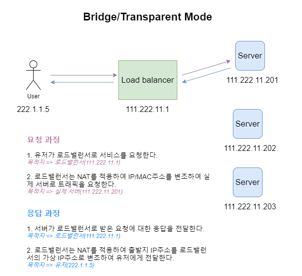
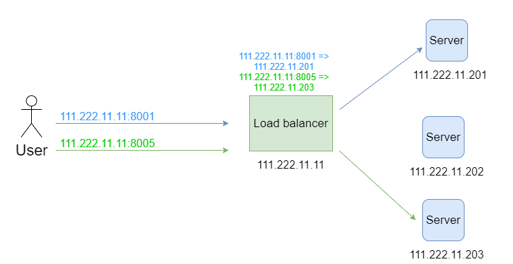
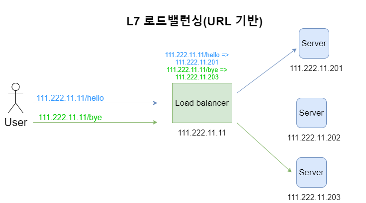

# 🤔 로드 밸런서

## 🧐 로드 밸런서

> 서버 앞단에서 클라이언트 측의 요청을 분산해주는 프로그램

### 1. 정의

하나의 인터넷 서비스가 발생하는 트래픽이 많을 때 여러 대의 서버가 분산처리하여 서버의 로드율 증가, 부하량, 속도 저하 등을 고려하여 적절히 분산처리하여 해결해주는 서비스이다.

서버에 가해지는 **부하를 분산**해주거나 장애에 대응하기 위한 장치 또는 기술을 통친한다.

#### 📕 왜 필요한가?

Client가 한 두명일 경우에는 Server를 여유롭게 이용할 수가 있다.

하지만 클라이언트가 한 두명이 아닌, 수천~수만명이라면 Server는 모든 사람들의 응답을 해주려고 노력하지만 결국엔 터지게 될 것이다.

이러한 문제를 해결하기 위해서 아래와 같은 방법을 사용한다.

✨ **Scale-up**: Server가 더 빠르게 동작하기 위해 하드웨어 성능을 올리는 법
(ex. CPU i3인 컴퓨터를 i7로 업그레이드)

✨ **Scale-out**: 여러 대의 Server가 나눠서 일을 하는 방법
(ex. CPU i3인 컴퓨터를 여러대 추가)

여기서 **`Scale-out`**을 사용함으로써,

- 하드웨어 향상 비용보다 서버 한대 추가 비용이 더 적다.
- 여러 대의 Server 덕분에 무중단 서비스를 제공할 수 있다.

위 2가지 장점을 가질 수 있고 이렇게 여러대의 Server에게 균등하게 Traffic을 분산시켜주는 역할을 하는 것이
**`Load Balancer`**인 것이다.

### 2. 주요 기능

✨ **NAT(Network Address Translation)**

- 사설 IP주소를 공인 IP주소로 바꾸는 데 사용하는 통신망의 주소 변조기이다.
  - 왜 Private IP주소를 Public IP주소로 바꿔서 사용하는가?
  - Private IP주소는 Router가 주소를 할당하기 때문에 **여러 Router 내에서 같은 Private IP 주소를 가질 수 있으며, 외부 접근이 불가능**하기 때문에 Public IP 주소로 바꿔서 사용해야한다.
- 내부 네트워크에서 사용하던 사설 IP주소를 로드밸런서 외부의 공인 IP주소로 변경해준다.
- 이렇게 하게 되면 부족한 공인 IP주소를 효율적으로 사용할 수 있지만, 로드밸런싱 관점에서 여러개의 호스트가 하나의 공인 IP주소를 통해 접속하는 것이 주 목적이다.

✨ **Tunneling**

- 인터넷상에서 보이지 않는 통로를 만들어 통신할 수 있게 하는 개념이다.
- 가상의 Tunnel을 구축한 상호 간에 Data를 Encapsulation하여 전달하고 Decapsulation하여 수신하는 통신 기술
- 데이터를 캡슐화해서 연결된 상호 간에만 캡슐화된 패킷을 구별해 캡슐화를 해제할 수 있다.
- 즉, 로드밸런서는 클라이언트와 서버 간 중간에 터널링을 제공해고,
- 연결된 상호 간에만 캡슐화된 패킷을 구별해 캡슐화를 해제하게 한다.

✨ **DSR(Dynamic Source Routing protocol)**

- 로드 밸런서 사용 시 서버에서 클라이언트로 되돌아가는 경우 목적지 주소를 스위치의 IP주소가 아닌 클라이언트의 IP주소로 전달해서 네트워크 스위치를 거치지 않고 바로 클라이언트를 찾아가는 개념이다.
- 이 경우 로드밸런서의 부하를 줄여줄 수 있다는 장점이 있다.

### 3. 로드 밸런싱 알고리즘

#### 📕 Round Robin(라운드 로빈)

> 서버에 들어온 요청을 순서대로 돌아가며 배정하는 방식

- Client의 요청을 모든 Server에 순서대로 Load Balancing
- 대상 Server의 성능이 동일하고 처리 시간이 짧은 Application의 경우 적합하다.
- 단순하지만 Server의 부하 등을 고려하지 않기 때문에 효율적이진 않다.

#### 📕 Weighted Round Robin(가중 라운드 로빈)

> 각각의 서버마다 가중치를 매기고 가중치가 높은 서버에 클라이언트 요청을 우선 배분

- Server마다 가중치를 두어 Client의 요청을 Roud Robin 방식으로 처리하는 Load Balancing
- 주로 서버의 트래픽 처리 능력이 상이한 경우 사용되는 부하 분산 방식이다.
- 부하가 많아질 경우 특정 Server에 요청이 편향되는 문제가 발생한다.
- 예를 들어, A서버가 5, B서버가 2라는 가중치라면 A 서버에 5개 B 서버에 2개의 클라이언트 요청을 보낸다.

#### 📕 IP Hash(IP 해시)

> 클라이언트의 IP주소를 특정 서버로 매핑하여 요청을 처리하는 방식

- Client의 IP주소를 특정 Server에 Mapping하여 Load Balancing
- 사용자의 IP를 해싱(Hasing, 임의의 길이를 지닌 데이터를 고정된 길이의 데이터로 매핑하는 것)해 로드를 분배하기 때문에 사용자가 항상 동일한 서버로 연결된다.
- 사용자가 항상 동일한 Server로 연결되는 것이 보장된다.
- Server의 성능 및 상황에 따라 사용자마다 응답 시간이 달라질 수 있다.

#### 📕 Least Connection(최소 연결)

> 요청이 들어온 시점에 가장 적은 연결상태를 보이는 서버에 우선적으로 트래픽 배분

- 가장 접속이 적은 Server로 Load Balancing
- 자주 세션이 길어지거나, 서버에 분배된 트래픽들이 일정하지 않은 경우에 적합한 방식이다.
- 비슷한 성능의 Server로 구성될 경우 요청이 많은 경우에도 효과적으로 분산하여 빠른 Server에서 처리할 수 있다.

#### 📕 Least Response Time(최소 리스폰 타임)

> 서버의 현재 연결 상태와 응답시간을 모두 고려하여 트래픽을 배분한다.

- Server가 요청에 응답하는 시간이 가장 짧은 Server로 Load Balancing
- 가장 적은 연결상태와 가장 짧은 응답시간을 보이는 서버에 우선적으로 로드를 배분한다.

### 4. 로드 밸런싱 과정

##### 	1. 클라이언트가 브라우저에 도메인 입력(ex. naver.com)

##### 	2. PC에 설정된 Local DNS 서버로 DNS Query 날림

##### 	3. Local DNS 서버는 naver.com을 관리하는 DNS 서버에 DNS Query 날림

##### 	4. L4의 VIP주소 획득

##### 	5. Local DNS는 획득한 VIP주소를 Client에게 전송

##### 	6. 획득한 DNS를 기반으로 L4 VIP로 http 요청

##### 	7. L/B 장비는 내부 알고리즘 (RR 등)을 통해 최적의 서비스 서버를 선별하여 요청을 전송하며 서버는 작		업 결과를 L/B 장비로 전송한다.

##### 	8. 전달받은 서버 작업 결과 L/B장비 통해 Client로 전송하여 요청 처리 완료

### 5. 로드 밸런싱 종류

로드밸런서는 OSI 7 Layer를 기준으로 어떻게 부하를 분산하는지에 따라 종류가 나뉜다. 2계층을 기준으로 부하를 분산한다면 L2, 3 계층을 기분으로 부하를 분산한다면 L3가 되는 것이다.

상위 계층으로 갈 수록 섬세한 부하 분산이 가능하지만 가격이 비싸진다. 하위 계층으로 갈 수록 간단한 부하 분산이 가능하고 가격이 저렴해진다.

| **L2** | Data link 계층을 사용, Mac주소 기반 부하 분산     |                |
| ------ | ------------------------------------------------- | -------------- |
| L3     | Network 계층을 사용, IP주소 기반 부하 분산        |                |
| L4     | Transport 계층을 사용, Port 기반 부하 분산        | TCP, UDP       |
| L7     | Application 계층을 사용, 요청(URL) 기반 부하 분산 | HTTP, HTTPS 등 |

#### **📘 L2(Data Link Layer)**

L2 로드밸런싱 : Layer 2(Data Link 계층)에서 정의된 정보를 바탕으로 로드 밸런싱을 한다.

- **MAC 주소**를 이용하여 전달할 서버를 결정한다.

  (ex.Mac > 80–00–20–30–1C-47)

- 브릿지, 허브 등

- 장점 : 구조가 간단, 신뢰성이 높다, 가격저렴, 성능이 좋다.

- 단점 : **Broadcast 패킷에 의해 성능저하 발생**, 라우팅 등 상위Layer 프로토콜 기반 스위칭 불가

L2 로드밸런싱 전략을 사용하기 위해서는

L2 로드밸런싱의 **기준이 되는 데이터가 MAC 주소**이기 때문에

**로드밸런서와 서버가 반드시 같은 네트워크에 속해야 한다.**

#### **📘 L3(Data Link Layer)**

L3 로드 밸런싱 : Layer 3(Network 계층)의 정보를 바탕으로 부하를 분산한다.

- **IP 주소**를 이용하여 전달할 서버를 결정한다.

  (ex. IP > 213.12.32.123)

- L2 + Routing

- Router, ICMP 프로토콜, IP

- 장점: Broadcast 트래픽으로 전체 성능 저하 방지, 트레픽체크

- 단점: 특정 프로토콜을 이용해야 스위칭 가능

#### **📘 L4(Data Link Layer)**

L4 로드 밸런싱 : Layer 4(Transport 계층)의 정보를 바탕으로 부하를 분산한다.

- **IP 주소와 port 번호**를 이용하여 전달할 서버를 결정한다.

  (ex. IP + Port > 213.12.32.123:80, 213.12.32.123:1024)

- TCP, UDP Protocol

- 장점 : Port기반 스위칭 지원, VIP를 이용하여 여러대를 한대로 묶어 부하분산

- 주로 **Round Robin 방식 사용**

- 하위 레이어의 정보(L3)도 활용하지만, 통상 L4 로드 밸런싱이라고 부른다.

L4 로드 밸런서는 패킷 헤더의 `source IP`와 `destination IP`를
**NAT(Network Address Translation)을 통해 바꿔서 서버에게 전달한다.**
반대로 클라이언트로 패킷이 갈 때도 `source IP`와 `destination IP`를 바꿔서 즉, **DSR 기술을 이용하여** 클라이언트에게 잘 전달되도록 한다.

L2보다는 비용이 더 비싸다는 단점이 있지만,
**IP와 포트번호를 활용하여 상대적으로 더 섬세한 라우팅이 가능하다.**
내용물을 보지 않기 때문에 **TLS termination이 없다.**

#### **📘 L7(Data Link Layer)**

L7 로드 밸런싱 : Layer 7(Application 계층)의 정보를 바탕으로 부하를 분산한다.

- Layer 7(Application 계층)의 정보를 바탕으로 부하를 분산한다.

  (ex. IP + Port + 패킷내용(HttpMessage?) >213.12.32.123:80, 213.12.32.123:1024 + `GET/ img/aaa.jpg`)

- HTTP, FTP, SMTP Protocol

L2, L4 로드 밸런싱은 물리적 단계에서 충분하지만,
L7은 소프트웨어까지 사용해야 하기 때문에 비용이 더 비싸다.
대신, 가장 섬세한 라우팅이 가능하다.
endpoint 별로 각기 다른 서버로 라우팅하거나,
라우팅한 서버에서 특정 `http status code`를 받았을 때 핸들링하는 등의 작업을 할 수 있다.
패킷의 내용을 복호화 해야하기 때문에 더 많은 비용이 든다.

MSA를 생각하면 쉽다.
`/category` 이거나, `/message` 같은 엔드포인트가 주어지면
이에 해당하는 기능만 수행하는 서버에 분산처리를 할 수 있다.