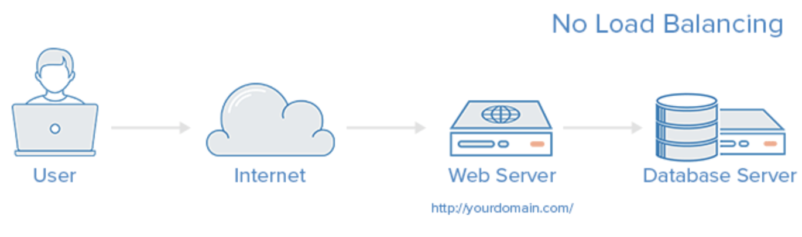
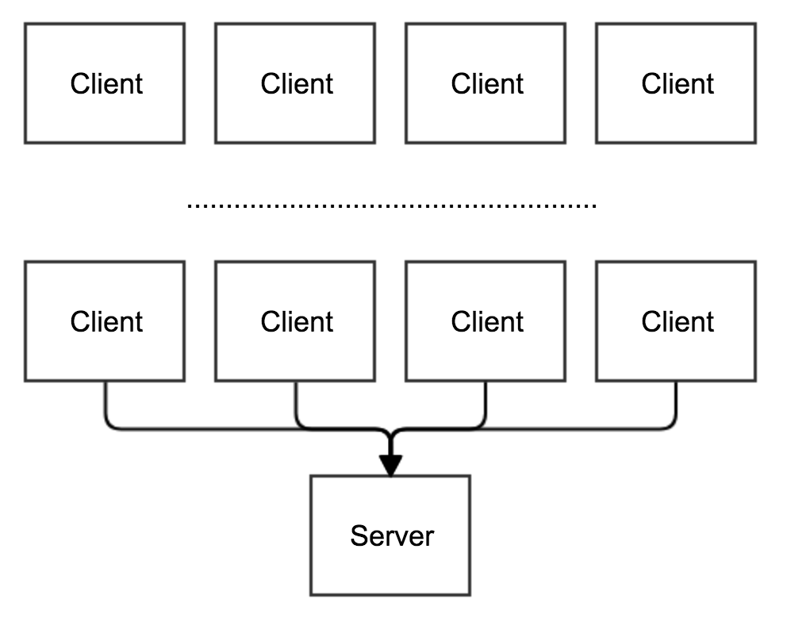

# 🤔 로드 밸런서

## 🧐 로드 밸런서

> 서버 앞단에서 클라이언트 측의 요청을 분산해주는 프로그램

### 1. 정의

하나의 인터넷 서비스가 발생하는 트래픽이 많을 때 여러 대의 서버가 분산처리하여 서버의 로드율 증가, 부하량, 속도 저하 등을 고려하여 적절히 분산처리하여 해결해주는 서비스이다.

서버에 가해지는 **부하를 분산**해주거나 장애에 대응하기 위한 장치 또는 기술을 통친한다.

#### 📕 왜 필요한가?

Client가 한 두명일 경우에는 Server를 여유롭게 이용할 수가 있다.

하지만 클라이언트가 한 두명이 아닌, 수천~수만명이라면 Server는 모든 사람들의 응답을 해주려고 노력하지만 결국엔 터지게 될 것이다.

이러한 문제를 해결하기 위해서 아래와 같은 방법을 사용한다.

✨ **Scale-up**: Server가 더 빠르게 동작하기 위해 하드웨어 성능을 올리는 법
(ex. CPU i3인 컴퓨터를 i7로 업그레이드)

✨ **Scale-out**: 여러 대의 Server가 나눠서 일을 하는 방법
(ex. CPU i3인 컴퓨터를 여러대 추가)

여기서 **`Scale-out`**을 사용함으로써,

- 하드웨어 향상 비용보다 서버 한대 추가 비용이 더 적다.
- 여러 대의 Server 덕분에 무중단 서비스를 제공할 수 있다.

위 2가지 장점을 가질 수 있고 이렇게 여러대의 Server에게 균등하게 Traffic을 분산시켜주는 역할을 하는 것이
**`Load Balancer`**인 것이다.

### 2. 주요 기능

✨ **NAT(Network Address Translation)**

- 사설 IP주소를 공인 IP주소로 바꾸는 데 사용하는 통신망의 주소 변조기이다.
- 내부 네트워크에서 사용하던 사설 IP주소를 로드밸런서 외부의 공인 IP주소로 변경해준다.
- 이렇게 하게 되면 부족한 공인 IP주소를 효율적으로 사용할 수 있지만, 로드밸런싱 관점에서 여러개의 호스트가 하나의 공인 IP주소를 통해 접속하는 것이 주 목적이다.

✨ **Tunneling**

- 인터넷상에서 보이지 않는 통로를 만들어 통신할 수 있게 하는 개념이다.
- 데이터를 캡슐화해서 연결된 상호 간에만 캡슐화된 패킷을 구별해 캡슐화를 해제할 수 있다.
- 즉, 로드밸런서는 클라이언트와 서버 간 중간에 터널링을 제공해고,
- 연결된 상호 간에만 캡슐화된 패킷을 구별해 캡슐화를 해제하게 한다.

✨ **DSR(Dynamic Source Routing protocol)**

- 로드 밸런서 사용 시 서버에서 클라이언트로 되돌아가는 경우 목적지 주소를 스위치의 IP주소가 아닌 클라이언트의 IP주소로 전달해서 네트워크 스위치를 거치지 않고 바로 클라이언트를 찾아가는 개념이다.
- 이 경우 로드밸런서의 부하를 줄여줄 수 있다는 장점이 있다.