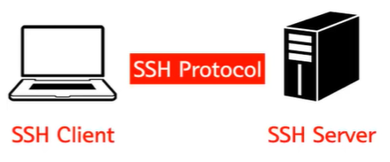
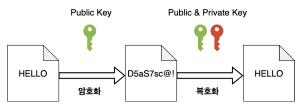

# 🤔 SSH

### 🎈 SSH란?

> Secure Shell Protocol

- 네트워크 프로토콜 중 하나로 컴퓨터와 컴퓨터가 인터넷과 같은 Public Network를 통해 서로 통신을 할 때 보안적으로 안전하게 통신을 하기 위해 사용하는 프로토콜
- 원격지에 있는 컴퓨터를 shell로 안전하게 제어하기 위한 프로토콜 또는 이 프로토콜을 사용하는 프로그램
- Client에서 shell을 통해 명령을 내리고 Server는 해당 명령을 받아와서 실행한다.
  - 제어의 주체가 되는 컴퓨터에는 SSH Client가 설치되어 있어야 한다.
  - 윈도우는 SSH Client를 제공하지 않기 때문에 Xshell, Putty와 같은 프로그램을 이용해서 다른 컴퓨터에 접속할 수 있다.
  - Linux, Mac 같은 Unix 계열의 OS는 기본적으로 SSH Client가 설치되어 있다.
  - 물론, 제어의 대상이 되는 원격지의 Server도 SSH Server가 설치되어 있어야한다. 마찬가지로 Unix 계열은 이미 설치되어 있고 윈도우는 없다.
    보통 윈도우는 SSH Client로 사용할 수 있을 뿐이다.
- shell은 명령어를 입력하여 컴퓨터를 제어하는 방식이며, SSH는 `명령어 방식으로 컴퓨터를 원격지에서 제어하는 방식`이다.

대표적인 사용 예시:

- 데이터 전송
  - 예로 원격 저장소인 깃헙이 있다. 소스 코드를 원격 저장소인 깃헙에 푸쉬할 때 우리는 SSH를 활용해 파일을 전송하게 된다.
- 원격 제어
  - 예로 AWS의  인스턴스 서버에 접속하여 해당 머신에 명령을 내기리 위해서도 SSH를 통한 접속을 해야한다.

FTP나 Telnet과 같은 통신을 위해 사용되는 프로토콜에 비해 "**보안**"에 뛰어나다.

### 🎈 Private Key & Public Key

SSH는 다른 컴퓨터와 통신을 하기 위해 접속을 할 때 우리가 일반적으로 사용하는 비밀번호의 입력을 통한 접속을 하지 안흔다.

기본적으로 SSH는 한 쌍의 Key를 통해 접속하려는 컴퓨터와 **인증 과정**을 거치게 된다.

- Private Key
  - 절대 외부에 노출이 되어서는 안되는 키로 본인의 컴퓨터 내부에 저장하게 되어있다. 이 키를 통해 암호화된 메시지를 복호화 할 수 있다.
- Public Key
  - 공개되어도 안전한 키
  - Public Key를 통해 메세지 전송 전 암호화를 한다. (복호화는 불가능!!)

Public Key와 Private Key는 매우 복잡한 수학적인 관계를 갖고 있다.

즉, Public Key를 통해 정보를 암호화하고 전송한 뒤 해당 데이터를 받을 때는 본인의 컴퓨터에 저장되어있는 Private Key를 사용하여 복호화를 한다.

이러한 과정을 통해 서로 관계를 맺고 있는 Key라는 것이 증명되면 비로소 두 컴퓨터 사이에 암호화된 채널이 형성이 되고 Key를 활용하여 정보를 암.복호화 하며 통신한다.