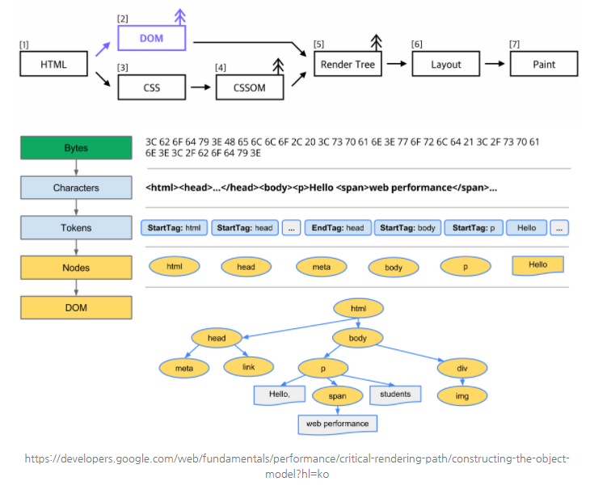
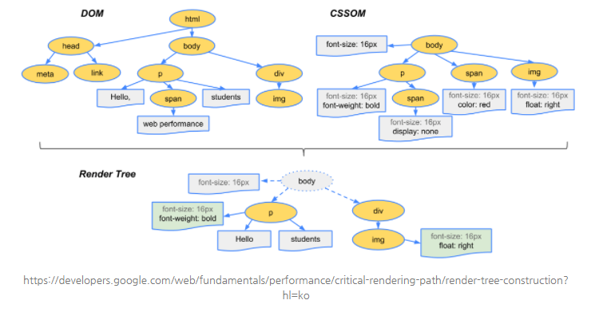
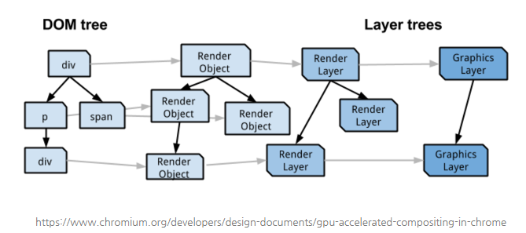

# 🤨 브라우저

## 	🧐 브라우저의 기능

##### ✨ 브라우저의 주 기능은 사용자가 선택한 자원을 서버에 요청하고 브라우저에 표시하는 것

##### ✨ 브라우저는 HTML과 CSS 명세에 따라 HTML파일을 해석해서 표시

## 	🧐 브라우저의 기본 구조

##### ✨ UI : 주소 표시줄, 이전/다음 버튼, 북마크 메뉴 등

##### ✨ 브라우저 엔진 : 사용자 UI와 렌더링 엔진 사이의 동작을 제어

##### ✨ 렌더링 엔진 : 요청한 콘텐츠 표시(HTML 요청 시 HTML과 CSS를 파싱하여 화면에 표시)

##### ✨ 통신 : HTTP 요청과 같은 네트워크 호출에 사용됨

##### ✨ UI백엔드

##### ✨ 자바스크립트 해석기 : 자바스크립트 코드를 해석 및 실행

##### ✨ 자료 저장소

### 📕 렌더링 엔진

> 요청 받은 내용을 브라우저 화면에 표시하는 역할

#### 1. 렌더링 엔진들

파이어폭스는 모질라에서 만든 게코(Gecko),
사파리와 크롬은 웹킷(Webkit)엔진을 사용

#### 	2. 동작과정

렌더링 엔진은 통신으로부터 요청한 문서의 내용을 얻는 것으로 시작하여
아래와 같은 동작 과정을 거침

##### ① DOM 트리 구축 위한 HTML 파싱

=> HTML 마크업을 처리하고 DOM 트리를 빌드('**무엇을**' 그릴지 결정)

=> CSS 마크업을 처리하고 CSSOM 트리를 빌드('**어떻게**' 그릴지 결정)

=> 렌더링 엔진은 HTML문서를 파싱하고 "콘텐츠 트리" 내부에서 태그를 DOM 노드로 변환한 뒤 외부 CSS 파일과 함께 포함된 스타일 요소도 파싱.

##### ② 렌더 트리 구축

=> DOM 및 CSSOM 을 결합하여 렌더링 트리를 형성('**화면에 그려질 것만**' 결정)

=> 스타일 정보와 HTML 표시 규칙은 "렌더 트리"라고 부르는 또 다른 트리를 생성

=> 이 `렌더 트리`는 색상 등 시각적 속성이 있는 것들을 포함하며 정해진 순서대로 화면에 표시

##### ③ 렌더 트리 배치

=> 렌더링 트리에서 레이아웃을 실행하여 각 노드의 기하학적 형태를 계산('**Box-Model**'을 생성)

=> 렌더 트리 생성을 한뒤 배치가 시작됨 (이는 각 노드가 화면의 정확한 위치에 표시되는 것을 의미)

##### ④ 렌더 트리 그리기

=> 개별 노드를 화면에 페인트

일련의 과정들은 점진적으로 진행됨
즉, 좀더 나은 UX를 위해 빠르게 내용을 표시하는데 모든 HTML을 파싱할 때까지 기다리지 않고 배치와 그리기 과정을 동시에 진행함. (내용의 일부 일부를 표시하는 것)

###### *추가 설명

브라우저가 하나의 화면을 그려내는 이 과정을 **중요 렌더링 경로(Critical Rendering Path)**라고 한다. 
우리가 일상적으로 주소창에 url을 입력하고, 엔터를 치면 브라우저는 해당 서버에 요청(request)를 보낸다.
서버에서는 응답(response)으로 HTML 데이터를 내려주고, 이 HTML 데이터를 실제 우리가 보는 화면으로 그리기까지 브라우저는 아래와 같은 단계를 거쳐 작업을 진행하게 된다.

이 과정의 각 단계가 최대한 효율적으로 이루어지도록 만드는 것을 **최적화**라고 한다.

a. 서버에서 응답으로 받은 HTML 데이터를 파싱한다.

b. HTML을 파싱한 결과로 DOM Tree를 만든다.

c. 파싱하는 중 CSS 파일 링크를 만나면 CSS 파일을 요청해서 받아온다.

d. CSS 파일을 읽어서 CSSOM(CSS Object Model)을 만든다.

e. DOM Tree와 CSSOM이 모두 만들어지면 이 둘을 사용해 Render Tree를 만든다.

f. Render Tree에 있는 각각의 노드들이 화면의 어디에 어떻게 위치할지를 계산하는 Layout 과정을 거쳐서

g. 화면에 실제 픽셀을 Paint한다.

각 과정을 자세히 살펴보자.

##### ✨ 서버에서 응답으로 받은 HTML 데이터를 파싱한다.

브라우저 주소창에 url을 입력하고 엔터키를 치면 브라우저는 해당 서버에 요청(request)을 하게 된다.

요청에 대한 응답으로는 HTML 문서를 받아오게 되고, 이걸 하나하나 파싱(parsing)하기 시작하면서 브라우저가 데이터를 화면에 그리는 과정이 시작된다.

- 미디어 파일을 만나면 추가로 요청을 보내서 받아온다.
- JavaScript 파일을 만나면 해당 파일을 받아와서 실행할 때 까지 파싱이 멈춘다.

##### ✨ HTML에서 DOM Tree로

컴퓨터의 모든 통신은 바이트 단위로 이루어진다. 즉 HTML문서를 받아올 때도 서버측에서 바이트 단위로 전환하여 보내게 된다.

브라우저는 읽어들인 HTML 바이트 데이터를 해당 파일에 지정된 인코딩(ex. UTF-8)에 따라 문자열로 바꾸게 된다.

바꾼 문자열을 다시 읽어서 HTML 표준에 따라 문자열을 토큰(token)으로 변환한다. 이미지에서와 같이 이 과정에서 `<html>`은 `StartTag: html`로, `</html>`은 `EndTag:html`로 변환된다.

이렇게 만들어진 토큰들을 다시 **노드**로 바꾸는 과정을 거친다. `StartTag:html`이 들어왔으면 html 노드를 만들고 `EndTag:html`을 만나기 전까지 들어오는 토큰들은 html 노드의 자식 노드로 넣는 식으로 변환이 이루어지기 때문에, 과정이 끝나면 Tree 모양의 DOM(Document Object Model)이 완성되게 된다.
(마찬가지로 StartTag:head를 만나면 EndTag:head까지 자식 노드로 넣어 위 이미지와 같은 큰 DOM트리를 만든다.)

##### ✨ CSS에서 CSSOM으로

HTML을 파싱하다가 CSS링크를 만나면, CSS파일을 요청해서 받아오게 된다.

받아온 CSS파일은 HTML을 파싱한 것과 유사한 과정을 거쳐서 역시 Tree 형태의 CSSOM으로 만들어진다.
CSS 파싱은 CSS 특성상 자식 노드들이 부모 노드의 특성을 계속해서 이어받는(cascading)규칙이 추가된다는 것을 빼고는 HTMl 파싱과 동일하게 이루어진다.

이렇게 CSSOM을 구성하는 것이 끝나야, 비로소 이후의 Rendering 과정을 시작할 수 있다.

✨ **DOM(content) + CSSOM(style) = Render Tree**

CSSOM을 모두 만들었으면, DOM과 CSSOM을 합쳐서 Render Tree를 만든다.

Render Tree는 DOM Tree에 있는 것들 중에서 화면에 실제로 '**보이는**'친구들만으로 이루어진다.
만약 CSS에서 `display:none`으로 설정했다면, 그 노드(와 그 자식 노드 전부)는 Render Tree에 추가되지 않는 것이다.
마찬가지로, 화면에 보이지 않는 `<head>`태그 안의 내용들도 Render Tree에는 추가되지 않는다.

그래서 아래 이미지의 Render Tree에는 `<head>`태그와, display속성이 none인 `
`태그 하위의 ``태그가 사라진 것을 확인할 수 있다.

##### ✨ Render Object에서 Render Layer로

Render Tree에는 여러 가지가 포함되어 있다.

Render Object Tree, Render Layer Tree 등 을 합쳐서 화면을 그리는 데에 필요한 모든 정보를 가지고 있는 Render Tree가 완성된다.

**Render Object Tree**는 DOM Tree의 노드 중에서 화면에 보이는 것들만으로 이루어진 트리이다.

block, inline, image, text, table 같은 요소들이 Render Object가 된다. 
DOM Tree에서 `
`는 Render Object Tree에 Block element로, ``은 Inline element로 옮겨지는 것이다.

Render Object의 속성에 따라 필요한 경우 Render Layer가 만들어진다. 그리고 이 Render Layer중에서 GPU에서 처리되는 부분이 있으면 다시 Graphic Layer로 분리된다.
대표적으로 다음과 같은 속성들이 쓰여있을 때 Graphic Layer가 만들어지게 된다.('하드웨어 가속'을 사용할 수 있게 되어 성능을 좋게 한다고 할 때가 이때이다.)

- CSS 3D Transform(translate3d, preserve-3d 등)이나 perspective 속성이 적용된 경우
- `<video>` or `<canvas>` 요소
- CSS3 애니메이션함수나 CSS 필터 함수를 사용하는 경우
- 자식 요소가 레이어로 구성된 경우
- z-index 값이 낮은 형제 요소가 레이어로 구성된 경우

만약 이런것들이 하나도 없이 `
` 하나에 width 정도 속성만 있다고 하면 레이어는 기본적으로 만들어지는 하나만 사용하게 된다.

##### ✨ Layout(reflow)

화면에 보이는 노드들만을 가지고 있는 Render Tree가 다 만들어지면, 이제 Render Tree에 있는 각각의 노드들이 화면의 어디에 위치할 지를 계산하는 Layout 과정을 거쳐야 한다.

CSSOM에서 가져온 스타일 정보들로 이미 얘가 어떻게 생겨야 한다는 것은 모두 알고 있지만, 현재 보이는 ㅂ포트를 기준으로 실제로 놓으려면 어디에 놓아야하는지 계산해야하는 것이다.

여기에서 CSS box model이 쓰이며, position(relative, absolute, fixed...), width, height 등 틀과 우치에 관련된 부분들이 계산된다.

(만약, width를 50%로 설정하고 브라우저를 리사이즈(화면 크기 줄이기or늘리기)한다고 하면, 보이는 요소들은 변함이 없으니 Render Tree는 그대로인 상태에서, Layout 단계만 다시 거쳐 위치를 계산하여 그린다.)

이렇게 화면에 보이는 요소 각각이 어디에 어떻게 위치할 지를 정해주는 과정을 Webkit에서는 layout으로, Gecko에서는 reflow로 부른다.

##### ✨ Paint(repaint)

드디어 Render Tree의 각 노드들을 실제로 화면에 그리는 순서이다.

visibility, outline, background-color 같이 정말로 눈에 보이는 픽셀들이 여기에서 그려진다.

만약 Render Layer가 2개 이상이라면 각각의 Layer를 paint한 뒤 하나의 이미지로 Composite하는 과정을 추가로 거친 뒤에 실제로 화면에 그려지게 된다.

참고 영상: (https://youtu.be/ZTnIxIA5KGw)

※ script태그를 body의 맨 마지막에 쓰는 이유?

=> script태그를 만나게 되면 parsing 작업을 멈추게 되기 때문이다!!
